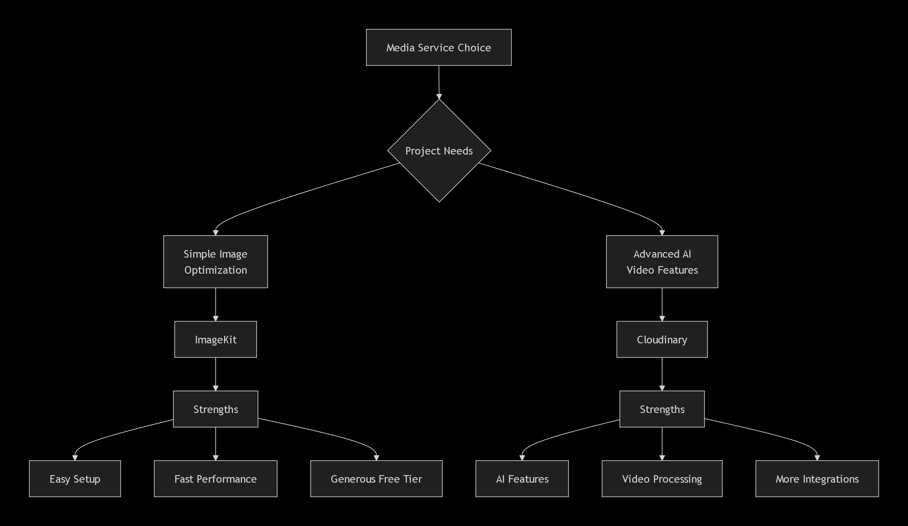

# **Complete ImageKit Workflow Guide with Detailed Explanations**

## **📊 Cloudinary vs ImageKit - Visual Comparison**



**Verdict:** For beginners and most web apps, **ImageKit is simpler and cheaper**. Cloudinary has more features but is more complex.

---

## **🏗️ Project Organization Principles**

### **Why Router Folders?**
Imagine your app as a **shopping mall**:
- **app.js** = Mall directory/map
- **routes/** = Individual shops
- **controllers/** = Shop managers
- **services/** = Stock rooms/workers

```javascript
// app.js - The mall directory
const userStore = require('./routes/users');    // User management shop
const musicStore = require('./routes/music');   // Music shop
const uploadStore = require('./routes/upload'); // File upload shop

app.use('/api/users', userStore);    // Route to user shop
app.use('/api/music', musicStore);   // Route to music shop
app.use('/api/upload', uploadStore); // Route to upload shop
```

---

## **📤 Understanding Form-Data**

### **What Happens When You Upload a File?**
```
User Form → Browser → Postman/App → Backend
    ↓          ↓          ↓           ↓
  Select    Creates    Sends       Receives
  File    → Form-Data → HTTP → → Parses with Multer
```

**In Postman:**
1. Go to **Body tab** → Select **form-data**
2. Add **key-value pairs**:
   - Text field: `title = "My Song"`
   - File field: `audio = [Choose File] song.mp3`

---

## **🔄 Multer Deep Dive**

### **What is Multer?**
Multer is like a **post office worker** who:
1. **Receives** packages (files)
2. **Checks** them (size, type limits)
3. **Stores** them temporarily (memory or disk)
4. **Hands** them to you (in `req.file`)

### **Storage Types Explained:**

```javascript
// 🔵 Option 1: Memory Storage (For cloud uploads)
const multer = require('multer');
const upload = multer({
  storage: multer.memoryStorage(), // File stays in RAM
  limits: { fileSize: 10 * 1024 * 1024 } // 10MB max
  // PRO: Fast, no disk cleanup needed
  // CON: Uses server memory
});

// 🟡 Option 2: Disk Storage (For server storage)
const diskStorage = multer.diskStorage({
  destination: (req, file, cb) => {
    cb(null, './uploads/'); // Save here
  },
  filename: (req, file, cb) => {
    // Create unique filename
    const uniqueName = `${Date.now()}-${file.originalname}`;
    cb(null, uniqueName);
  }
});
// PRO: Permanent storage
// CON: Need to manage disk space
```

### **Why Middleware Pattern?**
```javascript
// ❌ WITHOUT Multer: Can't access file
app.post('/upload', (req, res) => {
  console.log(req.file); // undefined 😞
  // File never got processed!
});

// ✅ WITH Multer: File is processed FIRST
app.post('/upload', 
  upload.single('audio'), // ← MIDDLEWARE: Processes file BEFORE handler
  (req, res) => {
    console.log(req.file); // File object 😊
    console.log(req.body); // Other form data
    // Now ready to upload to cloud!
  }
);
```

**Think of middleware as a security checkpoint** - everyone must pass through it before entering the building.

---

## **🖼️ Complete ImageKit Workflow**

### **Step 1: Project Structure**
```
project/
├── .env                    # Environment variables
├── package.json           # Dependencies
├── app.js                 # Main app setup
├── server.js              # Server entry
├── routes/
│   └── uploadRoutes.js    # Upload endpoints
└── services/
    └── storage.service.js # ImageKit logic
```

### **Step 2: Environment Setup (.env)**
```env
# ImageKit Credentials (from dashboard)
IMAGEKIT_PUBLIC=public_YourPublicKeyHere
IMAGEKIT_PRIVATE=private_YourPrivateKeyHere
IMAGEKIT_URL=https://ik.imagekit.io/your_imagekit_id/

# Server Configuration
PORT=3000
NODE_ENV=development
```

### **Step 3: Service Layer - storage.service.js**
```javascript
// Import ImageKit library
const ImageKit = require("imagekit");
// Load environment variables from .env file
require("dotenv").config();

// 🎯 STEP 1: Initialize ImageKit with credentials
// This connects our app to ImageKit's servers
const imagekit = new ImageKit({
  publicKey: process.env.IMAGEKIT_PUBLIC,     // Public key from .env
  privateKey: process.env.IMAGEKIT_PRIVATE,   // Private key from .env
  urlEndpoint: process.env.IMAGEKIT_URL       // Your ImageKit URL
});

// 🎯 STEP 2: Create upload function that returns a Promise
// Promises handle async operations (uploading takes time)
function uploadFile(file) {
    return new Promise((resolve, reject) => {
        // Call ImageKit's upload method
        imagekit.upload({
            file: file.buffer,          // File data from multer (in memory)
            fileName: file.originalname, // Original filename
            folder: "/uploads",          // Organize in "uploads" folder
            useUniqueFileName: true      // Prevent duplicate names
        }, (error, result) => {
            // Callback function - runs when upload finishes
            if (error) {
                reject(error);  // If error, reject promise with error
            } else {
                resolve(result); // If success, resolve with result
            }
        });
    });
}

// 🎯 STEP 3: Export the function so other files can use it
module.exports = uploadFile;
```

### **Step 4: Route Handler - uploadRoutes.js**
```javascript
// Import required modules
const express = require("express");      // Express framework
const router = express.Router();         // Create router instance
const multer = require("multer");        // File upload middleware
const uploadFile = require('../services/storage.service'); // Our ImageKit service

// 🎯 STEP 1: Configure Multer
// We use memoryStorage because we'll upload directly to ImageKit
const upload = multer({
  storage: multer.memoryStorage(),      // Store file in RAM (not disk)
  limits: { 
    fileSize: 10 * 1024 * 1024,         // Max 10MB file size
    files: 1                            // Max 1 file per request
  },
  fileFilter: (req, file, cb) => {
    // Validate file type
    const allowedTypes = ['audio/mpeg', 'audio/wav', 'audio/mp3'];
    if (allowedTypes.includes(file.mimetype)) {
      cb(null, true);  // Accept file
    } else {
      cb(new Error('Invalid file type'), false); // Reject file
    }
  }
});

// 🎯 STEP 2: Define upload endpoint
// POST /api/upload/songs - Upload a song
router.post('/songs', upload.single('audio'), async (req, res) => {
  try {
    console.log("📝 Form Data:", req.body);     // Text fields (title, artist)
    console.log("📁 File Info:", req.file);     // Uploaded file details
    
    // 🎯 STEP 3: Validate request
    if (!req.file) {
      return res.status(400).json({
        error: "No file uploaded",
        message: "Please select an audio file"
      });
    }
    
    // 🎯 STEP 4: Upload to ImageKit
    console.log("⬆️ Uploading to ImageKit...");
    const fileData = await uploadFile(req.file); // Wait for upload to finish
    
    console.log("✅ Upload Successful:", {
      url: fileData.url,
      fileId: fileData.fileId,
      size: fileData.size
    });
    
    // 🎯 STEP 5: In real app, save to database here
    // Example: await Song.create({
    //   title: req.body.title,
    //   artist: req.body.artist,
    //   audioUrl: fileData.url,
    //   fileId: fileData.fileId
    // });
    
    // 🎯 STEP 6: Send response
    res.status(200).json({
      success: true,
      message: "Song uploaded successfully",
      data: {
        song: req.body,        // Return form data
        file: {
          url: fileData.url,   // ImageKit URL for the file
          fileId: fileData.fileId, // Unique ID for future reference
          name: fileData.name,
          size: fileData.size
        }
      }
    });
    
  } catch (error) {
    console.error("❌ Upload Error:", error);
    
    // Handle different types of errors
    let statusCode = 500;
    let message = "Upload failed";
    
    if (error.message.includes('file size')) {
      statusCode = 400;
      message = "File too large (max 10MB)";
    } else if (error.message.includes('Invalid file type')) {
      statusCode = 400;
      message = "Invalid file type. Use MP3, WAV, or MPEG";
    }
    
    res.status(statusCode).json({
      success: false,
      error: message,
      details: process.env.NODE_ENV === 'development' ? error.message : undefined
    });
  }
});

// 🎯 STEP 7: Export router
module.exports = router;
```

### **Step 5: App Configuration - app.js**
```javascript
const express = require('express');
const cors = require('cors');        // Enable cross-origin requests
const helmet = require('helmet');    // Security headers
const uploadRoutes = require('./routes/uploadRoutes');

// 🎯 Create Express application
const app = express();

// 🎯 Middleware Setup
app.use(helmet());                   // Add security headers
app.use(cors());                     // Allow frontend to call backend
app.use(express.json());             // Parse JSON request bodies
app.use(express.urlencoded({ extended: true })); // Parse form data

// 🎯 Routes
app.use('/api/upload', uploadRoutes); // Mount upload routes

// 🎯 Health Check
app.get('/health', (req, res) => {
  res.json({ 
    status: 'healthy',
    timestamp: new Date().toISOString(),
    service: 'File Upload API'
  });
});

// 🎯 404 Handler
app.use('*', (req, res) => {
  res.status(404).json({
    error: 'Route not found',
    path: req.originalUrl
  });
});

// 🎯 Error Handler
app.use((err, req, res, next) => {
  console.error('Server Error:', err);
  res.status(500).json({
    error: 'Internal server error',
    message: process.env.NODE_ENV === 'development' ? err.message : undefined
  });
});

// 🎯 Export app
module.exports = app;
```

### **Step 6: Server Entry - server.js**
```javascript
// Load environment variables FIRST
require('dotenv').config();

// Import the configured app
const app = require('./app');

// Get port from environment or use default
const PORT = process.env.PORT || 3000;

// Start the server
app.listen(PORT, () => {
  console.log('🚀 Server Information:');
  console.log(`   Port: ${PORT}`);
  console.log(`   Environment: ${process.env.NODE_ENV || 'development'}`);
  console.log(`   URL: http://localhost:${PORT}`);
  console.log(`   Health Check: http://localhost:${PORT}/health`);
  console.log('📤 Upload Endpoint: POST http://localhost:3000/api/upload/songs');
});
```

---

## **🔧 Complete CRUD Operations with ImageKit**

### **1. CREATE (Upload)**
```javascript
// Already implemented above
router.post('/songs', upload.single('audio'), async (req, res) => {
  // Upload logic here
});
```

### **2. READ (Get File URL)**
```javascript
// Add to storage.service.js
function getFileUrl(fileId, options = {}) {
  return imagekit.url({
    path: `/${fileId}`,                // File path in ImageKit
    transformation: [{                 // Optional transformations
      width: options.width || 600,
      quality: options.quality || 80
    }]
  });
}

// In route
router.get('/files/:fileId', async (req, res) => {
  const url = getFileUrl(req.params.fileId, {
    width: req.query.width,
    quality: req.query.quality
  });
  res.json({ url });
});
```

### **3. UPDATE (Replace/Transform)**
```javascript
// ImageKit doesn't update files directly, but:
// Option A: Upload new version
router.put('/files/:fileId', upload.single('file'), async (req, res) => {
  // 1. Delete old file
  await deleteFile(req.params.fileId);
  // 2. Upload new file
  const newFile = await uploadFile(req.file);
  res.json({ newFileId: newFile.fileId });
});

// Option B: Transform existing file (URL-based)
// Just modify the URL parameters:
// Original: https://ik.imagekit.io/your_id/file.jpg
// Transformed: https://ik.imagekit.io/your_id/file.jpg?tr=w-500,h-500
```

### **4. DELETE**
```javascript
// Add to storage.service.js
function deleteFile(fileId) {
  return new Promise((resolve, reject) => {
    imagekit.deleteFile(fileId, (error, result) => {
      if (error) reject(error);
      else resolve(result);
    });
  });
}

// In route
router.delete('/files/:fileId', async (req, res) => {
  try {
    await deleteFile(req.params.fileId);
    res.json({ success: true, message: 'File deleted' });
  } catch (error) {
    res.status(500).json({ error: error.message });
  }
});
```

---

## **🎯 Quick Testing Guide**

### **1. Install Dependencies:**
```bash
npm init -y
npm install express multer imagekit dotenv cors helmet
```

### **2. Run the Server:**
```bash
node server.js
```

### **3. Test with Postman:**

**Request Setup:**
```
POST http://localhost:3000/api/upload/songs
Body → form-data
```

**Add these fields:**
```
Key: title       Value: My Song
Key: artist      Value: John Doe
Key: audio       Value: [Choose File] select-song.mp3
```

**Expected Response:**
```json
{
  "success": true,
  "message": "Song uploaded successfully",
  "data": {
    "song": {
      "title": "My Song",
      "artist": "John Doe"
    },
    "file": {
      "url": "https://ik.imagekit.io/your_id/song.mp3",
      "fileId": "your-file-id-here",
      "name": "song.mp3",
      "size": 5242880
    }
  }
}
```

---

## **📝 Key Takeaways**

1. **ImageKit** is simpler than Cloudinary for beginners
2. **Multer middleware** processes files BEFORE your route handler
3. **Memory storage** is best for cloud uploads (no disk cleanup)
4. **Service files** separate business logic from routes
5. **Promises** handle async operations like file uploads
6. Always use **.env** for sensitive data (API keys)
7. **Modular routing** keeps large projects organized
