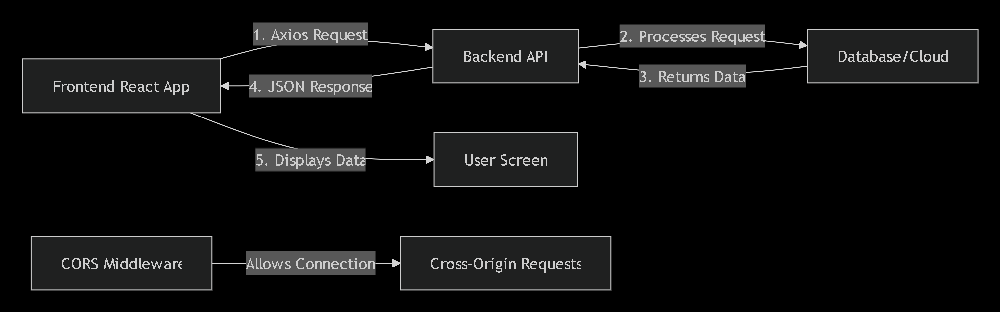

# **Complete Guide: Frontend-Backend Connection with Axios & CORS**

## **🔗 How Frontend & Backend Connect**

### **The Communication Flow:**


### **Simple Analogy:**
- **Frontend** = Customer at restaurant (React app)
- **Backend** = Kitchen staff (Node.js server)
- **Axios** = Waiter taking order to kitchen
- **CORS** = Restaurant allowing customers from outside
- **API Endpoint** = Menu item (`/api/songs?mood=happy`)

---

## **🔧 Backend Setup (Express API)**

### **1. Create Backend Server**
```javascript
// backend/server.js
const express = require('express');
const cors = require('cors');  // Import CORS
const app = express();

// 🎯 Enable CORS for frontend-backend communication
app.use(cors({
  origin: 'http://localhost:3000',  // Allow requests from React app
  credentials: true  // Allow cookies if needed
}));

// 🎯 Mock database (in real app, use MongoDB/PostgreSQL)
const songsDatabase = [
  { id: 1, title: 'Happy Days', artist: 'Sunshine Band', mood: 'happy', url: 'https://...' },
  { id: 2, title: 'Rainy Mood', artist: 'Cloudy Group', mood: 'sad', url: 'https://...' },
  { id: 3, title: 'Energetic Beat', artist: 'Power Crew', mood: 'energetic', url: 'https://...' },
  { id: 4, title: 'Calm Ocean', artist: 'Wave Sound', mood: 'calm', url: 'https://...' },
  { id: 5, title: 'Joyful Times', artist: 'Happy People', mood: 'happy', url: 'https://...' },
  { id: 6, title: 'Blue Mood', artist: 'Sad Melodies', mood: 'sad', url: 'https://...' },
];

// 🎯 API Endpoint: GET /api/songs?mood=happy
app.get('/api/songs', (req, res) => {
  console.log('📨 Request received:', req.query);
  
  // Get mood from query parameter
  const mood = req.query.mood;
  
  // Validate request
  if (!mood) {
    return res.status(400).json({
      success: false,
      error: 'Please provide a mood parameter',
      example: '/api/songs?mood=happy'
    });
  }
  
  // Filter songs by mood
  const filteredSongs = songsDatabase.filter(song => 
    song.mood.toLowerCase() === mood.toLowerCase()
  );
  
  // Check if songs found
  if (filteredSongs.length === 0) {
    return res.status(404).json({
      success: false,
      error: `No songs found for mood: ${mood}`,
      availableMoods: ['happy', 'sad', 'energetic', 'calm']
    });
  }
  
  // Return successful response
  res.json({
    success: true,
    count: filteredSongs.length,
    mood: mood,
    songs: filteredSongs
  });
});

// 🎯 Start server
const PORT = 5000;  // Backend runs on port 5000
app.listen(PORT, () => {
  console.log(`🚀 Backend server running on http://localhost:${PORT}`);
  console.log(`🎵 API Endpoint: http://localhost:${PORT}/api/songs?mood={your_mood}`);
});
```

### **2. Understanding CORS (Cross-Origin Resource Sharing)**
**Problem:** Browsers block requests between different origins (ports, domains) for security.

**Solution:** CORS headers tell browser "It's OK to connect!"

```javascript
// Without CORS:
// Frontend (localhost:3000) → Backend (localhost:5000) ❌ BLOCKED!

// With CORS:
app.use(cors());  // Allows all origins (for development)

// With specific CORS:
app.use(cors({
  origin: 'http://localhost:3000',  // Only allow React app
  methods: ['GET', 'POST', 'PUT', 'DELETE'],  // Allowed HTTP methods
  allowedHeaders: ['Content-Type', 'Authorization']  // Allowed headers
}));
```

---

## **⚛️ Frontend Setup (React + Axios)**

### **1. Install Axios in React App**
```bash
# In your React project folder
npm install axios
```

### **2. Create API Service File**
```javascript
// frontend/src/services/api.js
import axios from 'axios';

// 🎯 Create axios instance with base URL
const api = axios.create({
  baseURL: 'http://localhost:5000/api',  // Backend server URL
  timeout: 10000,  // 10 second timeout
  headers: {
    'Content-Type': 'application/json',  // We're sending JSON
  }
});

// 🎯 Function to fetch songs by mood
export async function getSongsByMood(mood) {
  try {
    console.log(`📤 Requesting songs for mood: ${mood}`);
    
    // Make GET request to backend
    const response = await api.get(`/songs?mood=${mood}`);
    
    console.log('📥 Response received:', response.data);
    return response.data;
    
  } catch (error) {
    console.error('❌ Error fetching songs:', error);
    
    // Handle different error types
    if (error.response) {
      // Server responded with error status (4xx, 5xx)
      throw new Error(error.response.data.error || 'Server error');
    } else if (error.request) {
      // Request made but no response
      throw new Error('No response from server. Is backend running?');
    } else {
      // Something else went wrong
      throw new Error('Network error: ' + error.message);
    }
  }
}

// 🎯 Export the axios instance for other API calls
export default api;
```

### **3. Create Song Component**
```javascript
// frontend/src/components/SongList.jsx
import React, { useState } from 'react';
import { getSongsByMood } from '../services/api';  // Import our API function

function SongList() {
  // 🎯 State variables
  const [mood, setMood] = useState('happy');  // Default mood
  const [songs, setSongs] = useState([]);     // Songs from backend
  const [loading, setLoading] = useState(false);  // Loading state
  const [error, setError] = useState('');     // Error message
  
  // 🎯 Available moods for dropdown
  const availableMoods = ['happy', 'sad', 'energetic', 'calm'];
  
  // 🎯 Function to fetch songs
  const fetchSongs = async () => {
    // Reset previous state
    setLoading(true);
    setError('');
    setSongs([]);
    
    try {
      // Call our API service function
      const result = await getSongsByMood(mood);
      
      // Update state with songs from backend
      setSongs(result.songs);
      
    } catch (err) {
      // Handle any errors
      setError(err.message);
      setSongs([]);
    } finally {
      setLoading(false);
    }
  };
  
  // 🎯 Fetch songs when component mounts or mood changes
  React.useEffect(() => {
    fetchSongs();
  }, []);  // Empty array = run once on mount
  
  return (
    <div style={styles.container}>
      <h2>🎵 Find Songs by Mood</h2>
      
      {/* Mood Selector */}
      <div style={styles.controls}>
        <select 
          value={mood} 
          onChange={(e) => setMood(e.target.value)}
          style={styles.select}
        >
          {availableMoods.map(m => (
            <option key={m} value={m}>
              {m.charAt(0).toUpperCase() + m.slice(1)}
            </option>
          ))}
        </select>
        
        <button 
          onClick={fetchSongs} 
          disabled={loading}
          style={styles.button}
        >
          {loading ? 'Loading...' : 'Get Songs'}
        </button>
      </div>
      
      {/* Error Display */}
      {error && (
        <div style={styles.error}>
          ⚠️ {error}
        </div>
      )}
      
      {/* Loading Indicator */}
      {loading && (
        <div style={styles.loading}>
          🔄 Loading songs from backend...
        </div>
      )}
      
      {/* Songs List */}
      <div style={styles.songsContainer}>
        {songs.length > 0 ? (
          <>
            <p>Found {songs.length} songs for "{mood}" mood:</p>
            <ul style={styles.songList}>
              {songs.map(song => (
                <li key={song.id} style={styles.songItem}>
                  <strong>{song.title}</strong> 
                  <span> by {song.artist}</span>
                  <small style={styles.moodTag}> Mood: {song.mood}</small>
                </li>
              ))}
            </ul>
          </>
        ) : !loading && !error ? (
          <p>No songs found for "{mood}" mood. Try another mood!</p>
        ) : null}
      </div>
      
      {/* Debug Info (visible in development) */}
      <details style={styles.debug}>
        <summary>🔍 Connection Debug Info</summary>
        <pre>
          Frontend: http://localhost:3000
          Backend: http://localhost:5000
          Current Mood: {mood}
          Songs Count: {songs.length}
          Loading: {loading.toString()}
          Error: {error || 'None'}
        </pre>
      </details>
    </div>
  );
}

// 🎯 Component Styles
const styles = {
  container: {
    maxWidth: '600px',
    margin: '0 auto',
    padding: '20px',
    fontFamily: 'Arial, sans-serif'
  },
  controls: {
    display: 'flex',
    gap: '10px',
    marginBottom: '20px'
  },
  select: {
    padding: '10px',
    fontSize: '16px',
    flex: '1'
  },
  button: {
    padding: '10px 20px',
    fontSize: '16px',
    backgroundColor: '#007bff',
    color: 'white',
    border: 'none',
    borderRadius: '4px',
    cursor: 'pointer'
  },
  error: {
    backgroundColor: '#f8d7da',
    color: '#721c24',
    padding: '10px',
    borderRadius: '4px',
    marginBottom: '20px'
  },
  loading: {
    padding: '10px',
    backgroundColor: '#d1ecf1',
    color: '#0c5460',
    borderRadius: '4px',
    marginBottom: '20px'
  },
  songsContainer: {
    marginTop: '30px'
  },
  songList: {
    listStyle: 'none',
    padding: '0'
  },
  songItem: {
    padding: '15px',
    marginBottom: '10px',
    backgroundColor: '#f8f9fa',
    borderRadius: '4px',
    borderLeft: '4px solid #007bff'
  },
  moodTag: {
    display: 'block',
    color: '#6c757d',
    marginTop: '5px'
  },
  debug: {
    marginTop: '30px',
    padding: '10px',
    backgroundColor: '#f5f5f5',
    borderRadius: '4px',
    fontSize: '14px'
  }
};

export default SongList;
```

### **4. Update Main App Component**
```javascript
// frontend/src/App.js
import React from 'react';
import SongList from './components/SongList';
import './App.css';

function App() {
  return (
    <div className="App">
      <header style={styles.header}>
        <h1>🎶 Mood Music Player</h1>
        <p>Connect to backend API to get songs by mood</p>
      </header>
      
      <main style={styles.main}>
        <SongList />
      </main>
      
      <footer style={styles.footer}>
        <p>Frontend: React (Port 3000) ↔ Backend: Node.js (Port 5000)</p>
        <small>Using Axios for HTTP requests & CORS for cross-origin communication</small>
      </footer>
    </div>
  );
}

const styles = {
  header: {
    textAlign: 'center',
    padding: '20px',
    backgroundColor: '#282c34',
    color: 'white'
  },
  main: {
    padding: '20px',
    minHeight: '70vh'
  },
  footer: {
    textAlign: 'center',
    padding: '20px',
    backgroundColor: '#f8f9fa',
    color: '#6c757d',
    borderTop: '1px solid #dee2e6'
  }
};

export default App;
```

---

## **🚀 Running Both Servers**

### **1. Start Backend Server:**
```bash
# Terminal 1 - Backend
cd backend
npm install express cors
node server.js

# Output:
# 🚀 Backend server running on http://localhost:5000
# 🎵 API Endpoint: http://localhost:5000/api/songs?mood={your_mood}
```

### **2. Start Frontend Server:**
```bash
# Terminal 2 - Frontend
cd frontend
npm install axios
npm start

# Output:
# Frontend running on http://localhost:3000
```

### **3. Test API Endpoint Directly:**
Open browser and test:
```
http://localhost:5000/api/songs?mood=happy
```
Should return:
```json
{
  "success": true,
  "count": 2,
  "mood": "happy",
  "songs": [
    {"id":1,"title":"Happy Days","artist":"Sunshine Band","mood":"happy"},
    {"id":5,"title":"Joyful Times","artist":"Happy People","mood":"happy"}
  ]
}
```

---

## **🔍 What's Happening Behind the Scenes?**

### **Step-by-Step Communication:**
1. **User selects mood** → React updates state
2. **Button click** → `fetchSongs()` function called
3. **Axios sends request** → `GET http://localhost:5000/api/songs?mood=happy`
4. **Browser adds CORS check** → Asks backend "Can frontend talk to you?"
5. **Backend responds** → CORS headers say "Yes, allowed!"
6. **Backend processes request** → Filters songs by mood
7. **Backend sends response** → JSON data with songs
8. **Axios receives response** → Returns data to React
9. **React updates state** → `setSongs(data.songs)`
10. **UI re-renders** → Shows songs list

### **Network Tab View (Chrome DevTools):**
```
Request URL: http://localhost:5000/api/songs?mood=happy
Request Method: GET
Status Code: 200 OK

Response Headers:
Access-Control-Allow-Origin: http://localhost:3000  ← CORS header!
Content-Type: application/json
```

---

## **🐛 Common Issues & Solutions**

### **1. CORS Error:**
```
Access to XMLHttpRequest at 'http://localhost:5000/api/songs' 
from origin 'http://localhost:3000' has been blocked by CORS policy
```
**Fix:** Make sure backend has `app.use(cors())`

### **2. Network Error:**
```
Network Error: No response from server
```
**Fix:** 
- Check if backend is running: `node server.js`
- Check ports: Backend 5000, Frontend 3000
- Try direct browser access to backend URL

### **3. Incorrect API Endpoint:**
```
404 Not Found
```
**Fix:** 
- Check endpoint path: `/api/songs` not `/songs`
- Check baseURL in axios setup

### **4. Mixed Content Error (HTTPS vs HTTP):**
```
Mixed Content: The page was loaded over HTTPS but requested...
```
**Fix:** Use same protocol (both HTTP in development)

---

## **📝 Complete Working Example**

### **Minimal Backend (server.js):**
```javascript
const express = require('express');
const cors = require('cors');
const app = express();

app.use(cors());  // Enable CORS

const songs = [
  { id: 1, title: 'Song 1', mood: 'happy' },
  { id: 2, title: 'Song 2', mood: 'sad' }
];

app.get('/api/songs', (req, res) => {
  const mood = req.query.mood;
  const filtered = songs.filter(s => s.mood === mood);
  res.json({ songs: filtered });
});

app.listen(5000, () => console.log('Backend on port 5000'));
```

### **Minimal Frontend (App.js):**
```javascript
import React, { useState } from 'react';
import axios from 'axios';

function App() {
  const [songs, setSongs] = useState([]);
  
  const getSongs = async () => {
    try {
      const response = await axios.get('http://localhost:5000/api/songs?mood=happy');
      setSongs(response.data.songs);
    } catch (error) {
      console.error('Error:', error);
    }
  };
  
  return (
    <div>
      <button onClick={getSongs}>Get Happy Songs</button>
      <ul>
        {songs.map(song => <li key={song.id}>{song.title}</li>)}
      </ul>
    </div>
  );
}

export default App;
```

---

## **🎯 Key Takeaways**

1. **Frontend (React)** and **Backend (Node.js)** run on **different ports**
2. **Axios** is a library to make HTTP requests from frontend to backend
3. **CORS** is a security feature that needs to be enabled on backend
4. **API Endpoints** are URLs that backend exposes for frontend to call
5. **Query Parameters** (`?mood=happy`) pass data to backend
6. **Always handle errors** - network failures, server errors, etc.
7. **Use async/await** for clean asynchronous code
8. **Test API endpoints** directly in browser first

This setup creates a complete, working connection between your React frontend and Node.js backend using Axios and CORS!