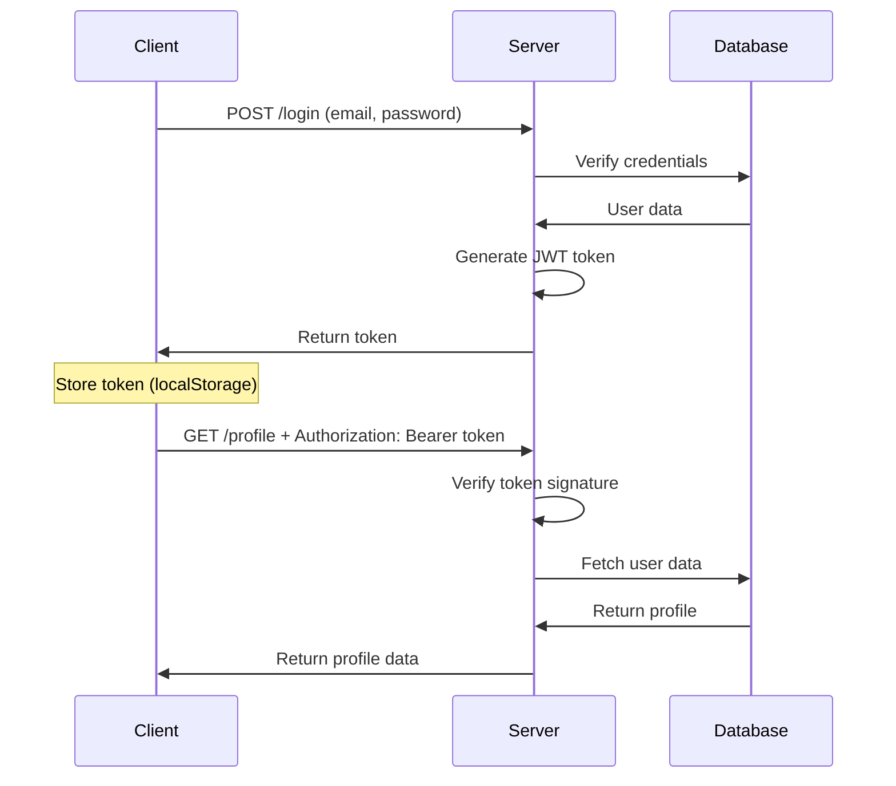
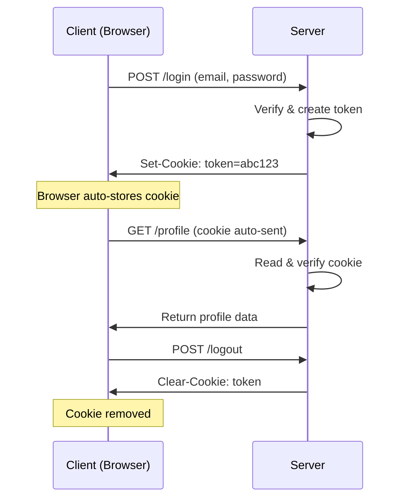

# **Authentication, Tokens & Cookies - Complete Guide**

## **🔐 What is Authentication?**

### **Simple Definition:**
Authentication is the process of **verifying who someone is**. It answers the question: **"Are you who you say you are?"**

### **Real-world Analogy:**
- **Username/Password** = Showing your ID card
- **Token** = Getting a wristband at a concert
- **Cookie** = Getting a stamp on your hand for re-entry

### **Why Authentication?**
1. **Protect user data** - Only you see your profile
2. **Personalize experience** - Your settings, your history
3. **Prevent fraud** - Stop others from acting as you
4. **Track usage** - Analytics per user

---

## **🛡️ Types of Requests Needing Authentication**

### **Requests That NEED Authentication:**
```javascript
// ❌ WITHOUT auth: Anyone can access!
GET /api/profile         // Your personal data
POST /api/transactions   // Your money transfers
PUT /api/settings        // Change your settings
DELETE /api/account      // Delete your account

// ✅ WITH auth: Only YOU can access!
// These should ALWAYS be protected
```

### **Requests That DON'T Need Authentication:**
```javascript
// These are usually public
GET /api/products        // Product catalog
GET /api/blog/posts      // Public blog
POST /api/contact        // Contact form
POST /api/login         // Login endpoint (obviously!)
POST /api/register      // Sign up
```

---

## **🔧 How Authentication Works**

### **Basic Flow:**
```
1. User provides credentials (email/password)
2. Server verifies credentials
3. Server creates a "proof of identity" (token/cookie)
4. Client sends this proof with future requests
5. Server validates proof before allowing access
```

---

## **🎫 What is a Token?**

### **Token = Digital Proof of Identity**
A token is like a **concert wristband**:
- You get it after showing your ticket (login)
- You show it to enter different areas (access APIs)
- It expires after the event (session timeout)

### **JWT (JSON Web Token) - Most Common Type:**
```javascript
// Example JWT structure:
eyJhbGciOiJIUzI1NiIsInR5cCI6IkpXVCJ9.           // HEADER (algorithm, type)
eyJzdWIiOiIxMjM0NTY3ODkwIiwibmFtZSI6IkpvaG4gRG9lIiwiaWF0IjoxNTE2MjM5MDIyfQ.  // PAYLOAD (data)
SflKxwRJSMeKKF2QT4fwpMeJf36POk6yJV_adQssw5c    // SIGNATURE (verification)
```

### **Token Properties:**
```javascript
{
  "userId": "123",
  "email": "user@example.com",
  "role": "user",
  "iat": 1516239022,      // Issued At (timestamp)
  "exp": 1516242622       // Expiration (1 hour later)
}
```

---

## **⚙️ How Tokens Work - Complete Flow**

### **Step 1: User Logs In**
```javascript
// routes/auth.js
const jwt = require('jsonwebtoken');
const bcrypt = require('bcrypt');

router.post('/login', async (req, res) => {
  try {
    const { email, password } = req.body;
    
    // 1. Find user in database
    const user = await User.findOne({ email });
    if (!user) {
      return res.status(401).json({ error: 'Invalid credentials' });
    }
    
    // 2. Check password
    const isMatch = await bcrypt.compare(password, user.password);
    if (!isMatch) {
      return res.status(401).json({ error: 'Invalid credentials' });
    }
    
    // 3. Create token (SERVER creates it!)
    const token = jwt.sign(
      { userId: user._id, email: user.email },  // Payload (data)
      process.env.JWT_SECRET,                    // Secret key (only server knows)
      { expiresIn: '1h' }                       // Expires in 1 hour
    );
    
    // 4. Send token to client
    res.json({
      success: true,
      message: 'Login successful',
      token: token,  // Client stores this
      user: {
        id: user._id,
        name: user.name,
        email: user.email
      }
    });
    
  } catch (error) {
    res.status(500).json({ error: error.message });
  }
});
```

### **Step 2: Client Stores Token**
```javascript
// Frontend (React example) - After login
const response = await fetch('/api/auth/login', {
  method: 'POST',
  headers: { 'Content-Type': 'application/json' },
  body: JSON.stringify({ email, password })
});

const data = await response.json();

// Store token (choose one method)
localStorage.setItem('token', data.token);       // Local storage
// OR
sessionStorage.setItem('token', data.token);    // Session storage
// OR in memory (React state)
setToken(data.token);
```

### **Step 3: Client Sends Token with Requests**
```javascript
// Frontend - Making authenticated requests
async function getProfile() {
  const token = localStorage.getItem('token');
  
  const response = await fetch('/api/profile', {
    method: 'GET',
    headers: {
      'Authorization': `Bearer ${token}`  // Add token to header
    }
  });
  
  return response.json();
}
```

### **Step 4: Server Validates Token**
```javascript
// middleware/authMiddleware.js
const jwt = require('jsonwebtoken');

function authenticateToken(req, res, next) {
  // 1. Get token from header
  const authHeader = req.headers['authorization'];
  const token = authHeader && authHeader.split(' ')[1]; // "Bearer TOKEN"
  
  if (!token) {
    return res.status(401).json({ error: 'Access denied. No token provided.' });
  }
  
  // 2. Verify token
  jwt.verify(token, process.env.JWT_SECRET, (err, user) => {
    if (err) {
      // Token is invalid or expired
      return res.status(403).json({ error: 'Invalid or expired token' });
    }
    
    // 3. Add user data to request
    req.user = user;  // { userId: '123', email: 'user@example.com' }
    next();  // Pass to next middleware/route handler
  });
}

module.exports = authenticateToken;
```

### **Step 5: Use in Protected Routes**
```javascript
// routes/profile.js
const authenticateToken = require('../middleware/authMiddleware');

// Protected route - requires valid token
router.get('/profile', authenticateToken, async (req, res) => {
  // req.user is available from middleware
  const user = await User.findById(req.user.userId);
  res.json({
    success: true,
    profile: {
      name: user.name,
      email: user.email,
      createdAt: user.createdAt
    }
  });
});

// Another protected route
router.post('/update', authenticateToken, (req, res) => {
  // Only authenticated users can update
  // req.user contains their ID
});
```

---

## **🍪 What are Cookies?**

### **Cookie = Small Data Stored by Browser**
Cookies are like **name tags** at a party:
- Server gives you a name tag (cookie)
- Browser automatically wears it (sends with requests)
- Server recognizes you by your name tag

### **Cookies vs Tokens:**
| **Aspect** | **Cookies** | **Tokens (JWT)** |
|------------|-------------|------------------|
| **Storage** | Browser automatically handles | You manually store |
| **Auto-send** | Yes, with every request | No, must add to header |
| **Size Limit** | 4KB | No limit (but keep small) |
| **Security** | HttpOnly, Secure flags | Manual validation |

---

## **🔐 Cookie-Based Authentication**

### **Step 1: Set Cookie on Login**
```javascript
// routes/auth.js - Cookie version
router.post('/login-cookie', async (req, res) => {
  try {
    const { email, password } = req.body;
    const user = await User.findOne({ email });
    
    if (!user || !(await bcrypt.compare(password, user.password))) {
      return res.status(401).json({ error: 'Invalid credentials' });
    }
    
    // Create token
    const token = jwt.sign(
      { userId: user._id, email: user.email },
      process.env.JWT_SECRET,
      { expiresIn: '1h' }
    );
    
    // Set cookie (instead of sending in JSON)
    res.cookie('authToken', token, {
      httpOnly: true,        // Prevents JavaScript access (security)
      secure: process.env.NODE_ENV === 'production', // HTTPS only in production
      sameSite: 'strict',    // Prevents CSRF attacks
      maxAge: 3600000,       // 1 hour in milliseconds
      path: '/'              // Available on all routes
    });
    
    res.json({
      success: true,
      message: 'Login successful (cookie set)',
      user: {
        id: user._id,
        name: user.name,
        email: user.email
      }
    });
    
  } catch (error) {
    res.status(500).json({ error: error.message });
  }
});
```

### **Step 2: Middleware to Read Cookie**
```javascript
// middleware/cookieAuth.js
const jwt = require('jsonwebtoken');

function authenticateCookie(req, res, next) {
  // 1. Get token from cookie (not header)
  const token = req.cookies.authToken;
  
  if (!token) {
    return res.status(401).json({ error: 'Access denied. Please login.' });
  }
  
  // 2. Verify token
  jwt.verify(token, process.env.JWT_SECRET, (err, user) => {
    if (err) {
      // Clear invalid cookie
      res.clearCookie('authToken');
      return res.status(403).json({ error: 'Invalid session. Please login again.' });
    }
    
    // 3. Add user data to request
    req.user = user;
    next();
  });
}

module.exports = authenticateCookie;
```

### **Step 3: Logout (Clear Cookie)**
```javascript
// routes/auth.js
router.post('/logout', (req, res) => {
  // Clear the cookie
  res.clearCookie('authToken', {
    httpOnly: true,
    secure: process.env.NODE_ENV === 'production',
    sameSite: 'strict'
  });
  
  res.json({
    success: true,
    message: 'Logged out successfully'
  });
});
```

---

## **🔧 Complete Backend Setup**

### **1. Install Required Packages**
```bash
npm install express jsonwebtoken bcryptjs cookie-parser dotenv mongoose
```

### **2. Environment Variables (.env)**
```env
# Authentication
JWT_SECRET=your_super_secret_key_change_this_in_production
JWT_EXPIRES_IN=1h

# Database
MONGODB_URI=mongodb://localhost:27017/auth_demo

# Server
PORT=3000
NODE_ENV=development
```

### **3. Complete Server Setup**
```javascript
// server.js - Complete authentication server
require('dotenv').config();
const express = require('express');
const mongoose = require('mongoose');
const bcrypt = require('bcryptjs');
const jwt = require('jsonwebtoken');
const cookieParser = require('cookie-parser');

const app = express();

// Connect to MongoDB
mongoose.connect(process.env.MONGODB_URI)
  .then(() => console.log('✅ MongoDB connected'))
  .catch(err => console.error('❌ MongoDB error:', err));

// Middleware
app.use(express.json());  // Parse JSON bodies
app.use(cookieParser());  // Parse cookies

// User Model (simplified)
const userSchema = new mongoose.Schema({
  name: String,
  email: { type: String, unique: true },
  password: String,
  createdAt: { type: Date, default: Date.now }
});

// Hash password before saving
userSchema.pre('save', async function(next) {
  if (!this.isModified('password')) return next();
  this.password = await bcrypt.hash(this.password, 10);
  next();
});

const User = mongoose.model('User', userSchema);

// Authentication Middleware
const authMiddleware = (req, res, next) => {
  // Check for token in cookies OR authorization header
  const token = req.cookies.authToken || 
                (req.headers.authorization && req.headers.authorization.split(' ')[1]);
  
  if (!token) {
    return res.status(401).json({ error: 'Authentication required' });
  }
  
  jwt.verify(token, process.env.JWT_SECRET, (err, decoded) => {
    if (err) {
      // Clear invalid cookie if exists
      if (req.cookies.authToken) {
        res.clearCookie('authToken');
      }
      return res.status(401).json({ error: 'Invalid or expired token' });
    }
    
    req.user = decoded;  // Add user data to request
    next();
  });
};

// Routes
// 1. Register
app.post('/api/register', async (req, res) => {
  try {
    const { name, email, password } = req.body;
    
    // Check if user exists
    const existing = await User.findOne({ email });
    if (existing) {
      return res.status(400).json({ error: 'User already exists' });
    }
    
    // Create user
    const user = new User({ name, email, password });
    await user.save();
    
    // Generate token
    const token = jwt.sign(
      { userId: user._id, email: user.email },
      process.env.JWT_SECRET,
      { expiresIn: process.env.JWT_EXPIRES_IN }
    );
    
    res.status(201).json({
      success: true,
      message: 'User registered successfully',
      token,  // Send token (client can store as cookie or in localStorage)
      user: { id: user._id, name: user.name, email: user.email }
    });
    
  } catch (error) {
    res.status(500).json({ error: error.message });
  }
});

// 2. Login
app.post('/api/login', async (req, res) => {
  try {
    const { email, password } = req.body;
    
    // Find user
    const user = await User.findOne({ email });
    if (!user) {
      return res.status(401).json({ error: 'Invalid credentials' });
    }
    
    // Check password
    const isValid = await bcrypt.compare(password, user.password);
    if (!isValid) {
      return res.status(401).json({ error: 'Invalid credentials' });
    }
    
    // Generate token
    const token = jwt.sign(
      { userId: user._id, email: user.email },
      process.env.JWT_SECRET,
      { expiresIn: process.env.JWT_EXPIRES_IN }
    );
    
    // Option 1: Send token in response (client stores)
    // Option 2: Set as cookie (automatic with requests)
    
    // For demo, we'll set as cookie AND send in response
    res.cookie('authToken', token, {
      httpOnly: true,
      secure: process.env.NODE_ENV === 'production',
      sameSite: 'strict',
      maxAge: 3600000  // 1 hour
    });
    
    res.json({
      success: true,
      message: 'Login successful',
      token,  // Also send in response for client-side storage
      user: { id: user._id, name: user.name, email: user.email }
    });
    
  } catch (error) {
    res.status(500).json({ error: error.message });
  }
});

// 3. Protected Route - Requires Authentication
app.get('/api/profile', authMiddleware, async (req, res) => {
  try {
    const user = await User.findById(req.user.userId).select('-password');
    if (!user) {
      return res.status(404).json({ error: 'User not found' });
    }
    
    res.json({
      success: true,
      profile: user
    });
    
  } catch (error) {
    res.status(500).json({ error: error.message });
  }
});

// 4. Logout
app.post('/api/logout', (req, res) => {
  res.clearCookie('authToken');
  res.json({
    success: true,
    message: 'Logged out successfully'
  });
});

// Start server
const PORT = process.env.PORT || 3000;
app.listen(PORT, () => {
  console.log(`🚀 Server running on port ${PORT}`);
  console.log(`🔐 Authentication endpoints:`);
  console.log(`   POST http://localhost:${PORT}/api/register`);
  console.log(`   POST http://localhost:${PORT}/api/login`);
  console.log(`   GET  http://localhost:${PORT}/api/profile (protected)`);
  console.log(`   POST http://localhost:${PORT}/api/logout`);
});
```

---

## **📊 Authentication Flow Diagrams**

### **Token-Based Flow:**


### **Cookie-Based Flow:**


---

## **🎯 Key Points Summary**

### **Who Creates Tokens/Cookies?**
- **SERVER creates** tokens/cookies after verifying credentials
- **Why server?** Because only server knows the secret key
- **Client stores** them for future requests

### **Token Creation Process:**
```javascript
// Server-side only!
const token = jwt.sign(
  { userId: '123', role: 'user' },  // Payload (data you want to store)
  'super-secret-key',                // Secret (ONLY server knows this!)
  { expiresIn: '1h' }               // Options (expiry)
);
```

### **When to Use What:**
- **Use Tokens** when:
  - Building mobile apps
  - Multiple clients (web, mobile, desktop)
  - Need stateless authentication
  - Third-party API access (OAuth)

- **Use Cookies** when:
  - Web-only application
  - Want automatic token sending
  - Need protection against XSS (HttpOnly cookies)
  - Simple session management

### **Security Best Practices:**
```javascript
// Always:
1. Use HTTPS in production
2. Set token expiration (1h, 7d, etc.)
3. Store secrets in environment variables
4. Hash passwords with bcrypt
5. Validate ALL user input

// For tokens:
6. Keep payload small
7. Don't store sensitive data in tokens

// For cookies:
8. Use HttpOnly flag
9. Use Secure flag in production
10. Use SameSite attribute
```

---

## **🔄 Complete Working Example**

### **Quick Test with Postman:**
1. **Register User:**
```
POST http://localhost:3000/api/register
Body (JSON):
{
  "name": "John Doe",
  "email": "john@example.com",
  "password": "password123"
}
```

2. **Login:**
```
POST http://localhost:3000/api/login
Body (JSON):
{
  "email": "john@example.com",
  "password": "password123"
}
Response: Get token in response AND cookie set
```

3. **Access Protected Route:**
```
GET http://localhost:3000/api/profile
Headers: 
  Authorization: Bearer YOUR_TOKEN_HERE
OR
Cookies: authToken=YOUR_TOKEN_HERE
```

4. **Logout:**
```
POST http://localhost:3000/api/logout
```

=