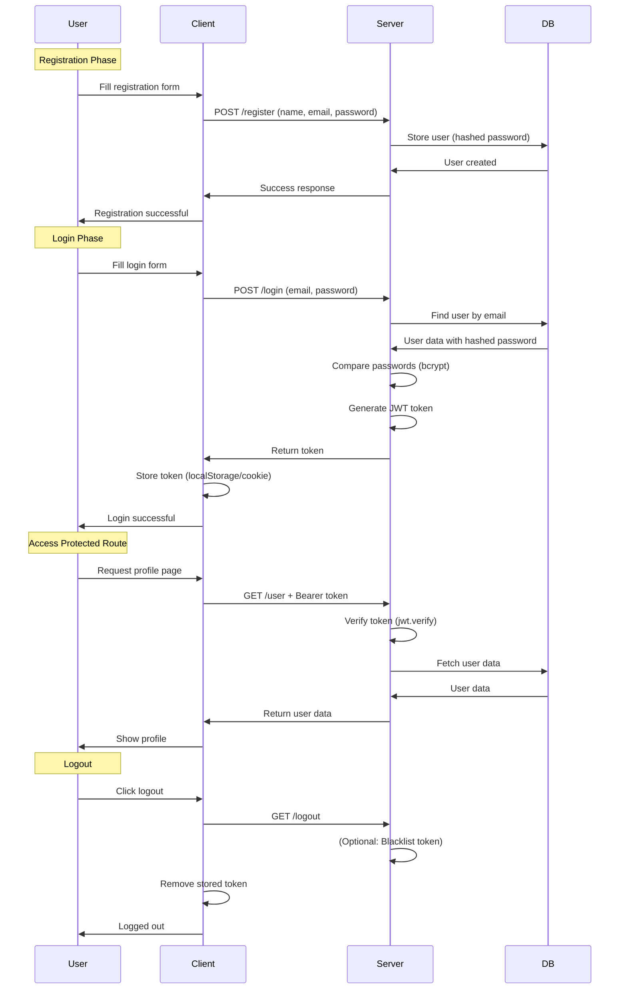

# **Authentication Flow - Minimal & Clear Explanation**

## **📊 Authentication Flow Diagram**



---

## **🧱 Minimal Code Structure**

### **File Structure:**
```
auth-app/
├── server.js          # Main server file
├── .env              # Environment variables
├── package.json
└── node_modules/
```

### **Install Packages:**
```bash
npm install express bcryptjs jsonwebtoken dotenv
```

### **Environment Variables (.env):**
```env
JWT_SECRET=your_super_secret_key_123
PORT=3000
```

---

## **📝 Complete Minimal Code**

### **server.js - Complete Authentication Server**
```javascript
// Import required packages
const express = require('express');
const bcrypt = require('bcryptjs');
const jwt = require('jsonwebtoken');
require('dotenv').config();

// Initialize Express app
const app = express();

// Middleware to parse JSON requests
app.use(express.json());

// In-memory database (for demo - use real DB in production)
let users = [];
let nextId = 1;

// 🔐 1. POST /register - Create new user
app.post('/register', async (req, res) => {
  try {
    const { name, email, password } = req.body;
    
    // Check if user already exists
    const existingUser = users.find(user => user.email === email);
    if (existingUser) {
      return res.status(400).json({
        success: false,
        error: 'User already exists with this email'
      });
    }
    
    // Hash the password (for security)
    const hashedPassword = await bcrypt.hash(password, 10);
    
    // Create user object
    const newUser = {
      id: nextId++,
      name,
      email,
      password: hashedPassword,  // Store hashed password, NOT plain text
      createdAt: new Date()
    };
    
    // Save user to "database"
    users.push(newUser);
    console.log(`✅ User registered: ${email}`);
    
    // Return success (without password)
    res.status(201).json({
      success: true,
      message: 'User registered successfully',
      user: {
        id: newUser.id,
        name: newUser.name,
        email: newUser.email
      }
    });
    
  } catch (error) {
    console.error('Registration error:', error);
    res.status(500).json({
      success: false,
      error: 'Registration failed'
    });
  }
});

// 🔐 2. POST /login - Authenticate user
app.post('/login', async (req, res) => {
  try {
    const { email, password } = req.body;
    
    // Find user by email
    const user = users.find(user => user.email === email);
    if (!user) {
      return res.status(401).json({
        success: false,
        error: 'Invalid email or password'
      });
    }
    
    // Compare password with hashed password in database
    const isPasswordValid = await bcrypt.compare(password, user.password);
    if (!isPasswordValid) {
      return res.status(401).json({
        success: false,
        error: 'Invalid email or password'
      });
    }
    
    // Create JWT token (digital signature)
    const token = jwt.sign(
      { userId: user.id, email: user.email },  // Payload (data to store in token)
      process.env.JWT_SECRET,                   // Secret key (from .env)
      { expiresIn: '1h' }                       // Token expires in 1 hour
    );
    
    console.log(`✅ User logged in: ${email}`);
    
    // Return token to client
    res.json({
      success: true,
      message: 'Login successful',
      token,  // Client will store this token
      user: {
        id: user.id,
        name: user.name,
        email: user.email
      }
    });
    
  } catch (error) {
    console.error('Login error:', error);
    res.status(500).json({
      success: false,
      error: 'Login failed'
    });
  }
});

// Middleware to verify JWT token (protects routes)
const verifyToken = (req, res, next) => {
  // Get token from Authorization header
  const authHeader = req.headers['authorization'];
  
  // Format: "Bearer TOKEN"
  const token = authHeader && authHeader.split(' ')[1];
  
  if (!token) {
    return res.status(401).json({
      success: false,
      error: 'Access denied. No token provided.'
    });
  }
  
  // Verify token
  jwt.verify(token, process.env.JWT_SECRET, (err, decoded) => {
    if (err) {
      return res.status(403).json({
        success: false,
        error: 'Invalid or expired token'
      });
    }
    
    // Add user info from token to request
    req.user = decoded;
    next();  // Move to next middleware/route handler
  });
};

// 🔐 3. GET /user - Get user data (PROTECTED route)
app.get('/user', verifyToken, (req, res) => {
  // At this point, verifyToken middleware has already run
  // req.user contains { userId, email } from the token
  
  // Find user by ID from token
  const user = users.find(u => u.id === req.user.userId);
  
  if (!user) {
    return res.status(404).json({
      success: false,
      error: 'User not found'
    });
  }
  
  // Return user data (without password)
  res.json({
    success: true,
    user: {
      id: user.id,
      name: user.name,
      email: user.email,
      createdAt: user.createdAt
    }
  });
});

// 🔐 4. GET /logout - Log user out
app.get('/logout', (req, res) => {
  // Note: Since JWT is stateless, we don't store tokens on server
  // Logout happens on client side by removing the token
  
  // In production, you might:
  // 1. Add token to blacklist (requires database)
  // 2. Use shorter expiration times
  // 3. Use refresh token system
  
  console.log(`🔓 User logged out`);
  
  res.json({
    success: true,
    message: 'Logout successful. Please remove token from client.'
  });
});

// Start server
const PORT = process.env.PORT || 3000;
app.listen(PORT, () => {
  console.log(`🚀 Server running on port ${PORT}`);
  console.log(`
🔐 Authentication Endpoints:
  POST http://localhost:${PORT}/register    - Register new user
  POST http://localhost:${PORT}/login       - Login user
  GET  http://localhost:${PORT}/user        - Get user data (protected)
  GET  http://localhost:${PORT}/logout      - Logout
  `);
});
```

---

## **📖 Step-by-Step Explanation**

### **POST /register - User Registration**

**What happens:**
```javascript
// 1. User sends: { name, email, password }
// 2. Check if email already exists (prevent duplicates)
// 3. Hash password (NEVER store plain passwords!)
// 4. Create user object with hashed password
// 5. Save to database
// 6. Return success response (without password)

// 🔒 Security: bcrypt.hash(password, 10)
// Why hash? If database is hacked, passwords are unreadable
```

### **POST /login - User Login**

**What happens:**
```javascript
// 1. User sends: { email, password }
// 2. Find user by email
// 3. Compare password with hashed password in DB
// 4. If match, create JWT token
// 5. Send token to client

// 🔒 Security: bcrypt.compare(password, hashedPassword)
// Creates secure token with: jwt.sign(payload, secret, options)
```

### **Token Structure (JWT):**
```javascript
// Token = Encoded data that proves user identity
const token = jwt.sign(
  { userId: 1, email: 'john@email.com' },  // Data stored in token
  'secret-key',                            // Only server knows this
  { expiresIn: '1h' }                      // Expires in 1 hour
);

// Token looks like: eyJhbGciOiJIUzI1NiIsInR5cCI6IkpXVCJ9...
```

### **verifyToken Middleware:**

**How it protects routes:**
```javascript
// 1. Checks if request has Authorization header
// 2. Extracts token from "Bearer TOKEN"
// 3. Verifies token using jwt.verify()
// 4. If valid, adds user data to req.user
// 5. Calls next() to allow access to route
// 6. If invalid, returns 403 error
```

### **GET /user - Protected Route:**

**How it works:**
```javascript
// Route definition:
app.get('/user', verifyToken, (req, res) => {
  // 1. verifyToken middleware runs FIRST
  // 2. If token valid, req.user contains { userId, email }
  // 3. Then this handler runs
  // 4. Fetch user data using userId from token
  // 5. Return user data
});

// Client must send: Authorization: Bearer YOUR_TOKEN
```

### **GET /logout - User Logout:**

**Important note:**
```javascript
// JWT tokens are STATELESS - server doesn't store them
// Logout = Client removes token from storage

// Client-side logout:
// 1. Remove token from localStorage/sessionStorage
// 2. Remove token from cookies
// 3. Redirect to login page

// Optionally: Implement token blacklist if needed
```

---

## **🔧 Client-Side Usage (Frontend Example)**

### **Registration:**
```javascript
// POST /register
fetch('http://localhost:3000/register', {
  method: 'POST',
  headers: { 'Content-Type': 'application/json' },
  body: JSON.stringify({
    name: 'John Doe',
    email: 'john@example.com',
    password: 'password123'
  })
});
```

### **Login:**
```javascript
// POST /login
fetch('http://localhost:3000/login', {
  method: 'POST',
  headers: { 'Content-Type': 'application/json' },
  body: JSON.stringify({
    email: 'john@example.com',
    password: 'password123'
  })
})
.then(response => response.json())
.then(data => {
  // Store token for future requests
  localStorage.setItem('token', data.token);
  console.log('Logged in!');
});
```

### **Access Protected Route:**
```javascript
// GET /user (with token)
const token = localStorage.getItem('token');

fetch('http://localhost:3000/user', {
  method: 'GET',
  headers: {
    'Authorization': `Bearer ${token}`  // Send token in header
  }
})
.then(response => response.json())
.then(data => {
  console.log('User data:', data.user);
});
```

### **Logout:**
```javascript
// GET /logout (optional)
fetch('http://localhost:3000/logout')
  .then(() => {
    // Remove token from client
    localStorage.removeItem('token');
    console.log('Logged out!');
  });
```

---

## **🎯 Key Concepts Explained**

### **1. Hashing Passwords (bcrypt)**
```javascript
// Why hash? Security!
// Hash = One-way encryption (can't reverse)
const hashedPassword = await bcrypt.hash('password123', 10);
// Result: "$2a$10$N9qo8uLOickgx2ZMRZoMye..."

// Compare later:
const isMatch = await bcrypt.compare('password123', hashedPassword);
// Result: true (if password matches)
```

### **2. JWT Token Components:**
```
Token = Header.Payload.Signature

Header:    { "alg": "HS256", "typ": "JWT" }
Payload:   { "userId": 1, "email": "john@email.com", "iat": 1516239022 }
Signature: Secret key signature (prevents tampering)
```

### **3. Token Verification:**
```javascript
// Server verifies:
jwt.verify(token, JWT_SECRET, (err, decoded) => {
  // decoded = { userId: 1, email: "john@email.com" }
});
// If signature doesn't match or token expired → ERROR
```

### **4. Middleware Flow:**
```
Request → verifyToken → If valid → Route Handler → Response
              ↓
        If invalid → Error Response
```

---

## **📊 Testing with Postman**

### **Test 1: Register**
```
POST http://localhost:3000/register
Body (raw JSON):
{
  "name": "John Doe",
  "email": "john@example.com",
  "password": "password123"
}
```

### **Test 2: Login**
```
POST http://localhost:3000/login
Body (raw JSON):
{
  "email": "john@example.com",
  "password": "password123"
}
Response: Save the token from response
```

### **Test 3: Get User (Protected)**
```
GET http://localhost:3000/user
Headers:
  Key: Authorization
  Value: Bearer YOUR_TOKEN_HERE
```

### **Test 4: Logout**
```
GET http://localhost:3000/logout
```

---

## **✅ Summary**

### **The 4-Step Authentication Flow:**

1. **Register** → Create account with hashed password
2. **Login** → Verify credentials → Generate token
3. **Access** → Send token → Server verifies → Grant access
4. **Logout** → Client removes token

### **Security Essentials:**
- **Never store plain passwords** → Always hash with bcrypt
- **Tokens expire** → Prevents indefinite access
- **HTTPS in production** → Encrypts all communication
- **Validate all inputs** → Prevent injection attacks

This minimal implementation gives you the complete authentication flow with all necessary security measures!