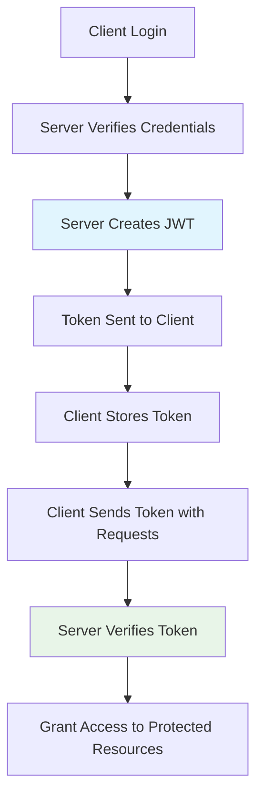

# **Complete Guide: JWT, MongoDB Methods & Browser Storage**

## **🔐 JSON Web Tokens (JWT) - Complete Guide**

### **What is JWT?**
JWT (JSON Web Token) is a **compact, URL-safe way to securely transmit information** between parties as a JSON object. Think of it as a **digital ID card** that proves who you are without needing to check the database every time.

### **Real-world Analogy:**
- **Password login** = Showing your passport at airport security (checks database)
- **JWT token** = Getting a boarding pass (proves you've been verified already)
- **Verifying token** = Scanning boarding pass at gate (quick check)

---

## **🔄 JWT Workflow Diagram**



---

## **📦 Install & Basic Setup**
```bash
# Install jsonwebtoken
npm install jsonwebtoken
```

```javascript
// Import the library
const jwt = require('jsonwebtoken');

// You'll need a SECRET key (store in .env!)
const JWT_SECRET = process.env.JWT_SECRET || 'your-secret-key-change-in-production';
```

---

## **🔧 JWT Methods Explained**

### **1. `jwt.sign()` - Create a Token**
```javascript
// Method to CREATE a token
const token = jwt.sign(
  payload,       // Data to store in token (object)
  secret,        // Secret key (string)
  options        // Optional settings (object)
);

// Example:
const user = { id: '123', email: 'john@example.com' };
const token = jwt.sign(
  {
    userId: user.id,
    email: user.email,
    role: 'user'
  },
  JWT_SECRET,
  {
    expiresIn: '1h',           // Token expires in 1 hour
    issuer: 'your-app-name',   // Who issued the token
    audience: 'web-client'     // Who the token is for
  }
);
```

### **What goes in payload?**
```javascript
// GOOD payload (public data):
{
  userId: '123',
  email: 'user@example.com',
  role: 'user',
  iat: 1516239022,  // Auto-added: issued at
  exp: 1516242622   // Auto-added: expires at
}

// BAD payload (never include):
{
  password: 'secret123',      // ❌ NEVER include passwords!
  creditCard: '1234-5678',    // ❌ NEVER sensitive data
  ssn: '123-45-6789'          // ❌ NEVER personal IDs
}
```

### **2. `jwt.verify()` - Validate a Token**
```javascript
// Method to VERIFY a token
jwt.verify(
  token,     // The token to verify (string)
  secret,    // Same secret used to sign
  callback   // Function to handle result
);

// Example with callback:
jwt.verify(token, JWT_SECRET, (err, decoded) => {
  if (err) {
    // Token invalid or expired
    console.error('Token error:', err.message);
    // err.name can be:
    // - 'TokenExpiredError'
    // - 'JsonWebTokenError'
    // - 'NotBeforeError'
  } else {
    // Token valid
    console.log('Decoded token:', decoded);
    // decoded = { userId: '123', email: 'john@example.com', ... }
  }
});

// Example with Promise/async-await:
try {
  const decoded = jwt.verify(token, JWT_SECRET);
  console.log('Valid token:', decoded);
} catch (error) {
  console.error('Invalid token:', error.message);
}
```

### **3. `jwt.decode()` - Read Token WITHOUT Verification**
```javascript
// DECODE without verifying (use carefully!)
const decoded = jwt.decode(token);
console.log(decoded);

// ⚠️ WARNING: This doesn't verify signature!
// Anyone can create a fake token and you'll decode it
// Only use for debugging or when you trust the source
```

---

## **🔑 JWT_SECRET - The Most Important Part**

### **What is JWT_SECRET?**
```javascript
// The "secret sauce" that makes tokens secure
const JWT_SECRET = 'super-secret-key-123';

// How it works:
const token = jwt.sign({ data: 'hello' }, JWT_SECRET);
// Creates: HEADER.PAYLOAD.SIGNATURE
//                           ↑
//                 Signature = HMACSHA256(
//                   base64UrlEncode(header) + "." +
//                   base64UrlEncode(payload),
//                   JWT_SECRET  // ← Secret creates unique signature
//                 )
```

### **Why It's CRITICAL:**
1. **Signature creation** - Secret + Token data = Unique signature
2. **Tamper detection** - If token changes, signature won't match
3. **Forgery prevention** - Without secret, can't create valid tokens

### **Best Practices for JWT_SECRET:**

#### **✅ DO:**
```javascript
// 1. Store in environment variables
require('dotenv').config();
const JWT_SECRET = process.env.JWT_SECRET;

// 2. Use strong, random strings
// Generate with: openssl rand -base64 32
// Result: JWT_SECRET=8c9f8d3e2a1b5c7d9e0f2a4b6c8d0e1f...

// 3. Use different secrets per environment
// .env.development
JWT_SECRET=dev-secret-123
// .env.production  
JWT_SECRET=production-super-strong-secret-456
```

#### **❌ DON'T:**
```javascript
// 1. Never hardcode in code
const JWT_SECRET = 'mysecret';  // ❌ BAD!

// 2. Never use simple/guessable strings
const JWT_SECRET = 'password123';  // ❌ BAD!

// 3. Never commit to version control
// Add .env to .gitignore!
```

---

## **🚀 Complete JWT Authentication Workflow**

### **Step 1: Login & Create Token**
```javascript
// authController.js
const jwt = require('jsonwebtoken');

exports.login = async (req, res) => {
  try {
    const { email, password } = req.body;
    
    // 1. Find user and verify password
    const user = await User.findOne({ email });
    if (!user || !(await bcrypt.compare(password, user.password))) {
      return res.status(401).json({ error: 'Invalid credentials' });
    }
    
    // 2. Create token payload
    const payload = {
      userId: user._id,
      email: user.email,
      role: user.role || 'user'
    };
    
    // 3. Generate token
    const token = jwt.sign(
      payload,
      process.env.JWT_SECRET,
      { expiresIn: '24h' }  // Expires in 24 hours
    );
    
    // 4. Send response
    res.json({
      success: true,
      token,
      user: {
        id: user._id,
        name: user.name,
        email: user.email
      }
    });
    
  } catch (error) {
    res.status(500).json({ error: error.message });
  }
};
```

### **Step 2: Protect Routes with Middleware**
```javascript
// middleware/auth.js
const jwt = require('jsonwebtoken');

const authenticate = (req, res, next) => {
  // 1. Get token from header
  const authHeader = req.headers.authorization;
  if (!authHeader || !authHeader.startsWith('Bearer ')) {
    return res.status(401).json({ error: 'No token provided' });
  }
  
  const token = authHeader.split(' ')[1];
  
  try {
    // 2. Verify token
    const decoded = jwt.verify(token, process.env.JWT_SECRET);
    
    // 3. Add user to request
    req.user = decoded;  // { userId: '123', email: '...', role: '...' }
    
    // 4. Continue to route handler
    next();
    
  } catch (error) {
    // Handle different JWT errors
    if (error.name === 'TokenExpiredError') {
      return res.status(401).json({ error: 'Token expired' });
    }
    if (error.name === 'JsonWebTokenError') {
      return res.status(401).json({ error: 'Invalid token' });
    }
    res.status(500).json({ error: 'Authentication failed' });
  }
};

module.exports = authenticate;
```

### **Step 3: Use in Routes**
```javascript
// routes/protected.js
const express = require('express');
const router = express.Router();
const authenticate = require('../middleware/auth');

// Protected route - requires valid token
router.get('/profile', authenticate, async (req, res) => {
  // req.user is available from middleware
  const user = await User.findById(req.user.userId)
    .select('-password')  // Don't send password
    .lean();             // Convert to plain JavaScript object
  
  res.json({ user });
});

// Admin-only route
router.get('/admin', authenticate, (req, res) => {
  // Check role from token
  if (req.user.role !== 'admin') {
    return res.status(403).json({ error: 'Admin access required' });
  }
  res.json({ message: 'Welcome admin!' });
});
```

---

## **📊 MongoDB Methods Explained**

### **`.select("-password")` - Field Selection**
```javascript
// What it does: Selects/Excludes specific fields from query results

// ❌ WITHOUT select (returns ALL fields including password)
const user = await User.findById(userId);
// Returns: { _id: '...', name: '...', email: '...', password: 'hashedpass', ... }

// ✅ WITH select (exclude password)
const user = await User.findById(userId).select('-password');
// Returns: { _id: '...', name: '...', email: '...' }
// Password field is REMOVED from response

// Select specific fields:
const user = await User.findById(userId)
  .select('name email createdAt');  // ONLY these fields

// Exclude multiple fields:
const user = await User.findById(userId)
  .select('-password -__v -updatedAt');  // Remove these

// Combine include/exclude:
const user = await User.findById(userId)
  .select('name email -_id');  // Get name & email, exclude _id
```

### **`.lean()` - Performance Optimization**
```javascript
// What it does: Returns plain JavaScript objects instead of Mongoose documents

// ❌ WITHOUT lean (Mongoose Document - heavier)
const user = await User.findById(userId);
// Returns: Mongoose document with methods
console.log(user.save);     // Function exists
console.log(user.toJSON);   // Function exists
// Memory: ~5KB per document
// Performance: Slower (has Mongoose overhead)

// ✅ WITH lean (Plain Object - lighter)
const user = await User.findById(userId).lean();
// Returns: Plain JavaScript object
console.log(user.save);     // undefined
console.log(user.toJSON);   // undefined
// Memory: ~1KB per document  
// Performance: 2-5x faster

// When to use .lean():
// 1. Read-only operations (GET requests)
// 2. When you don't need Mongoose methods
// 3. Performance-critical queries
// 4. Large datasets

// Example with both:
const users = await User.find({ active: true })
  .select('-password -__v')
  .lean()
  .limit(10);
// Fast, secure, minimal memory
```

---

## **💾 Browser Storage - Complete Guide**

### **Storage Options Comparison:**
| **Feature** | **LocalStorage** | **SessionStorage** | **Cookies** | **IndexedDB** |
|-------------|------------------|-------------------|-------------|---------------|
| **Capacity** | 5-10MB | 5-10MB | 4KB | 50MB+ |
| **Persistence** | Forever (until cleared) | Tab session | Set expiry | Forever |
| **Auto-send** | No | No | Yes (with requests) | No |
| **Server Access** | No | No | Yes | No |
| **Structure** | Key-value | Key-value | Text | Database |
| **Best For** | User preferences | Temporary data | Authentication | Large data |

### **1. LocalStorage**
```javascript
// Stores data with NO expiration (until user clears)

// Save data
localStorage.setItem('token', 'jwt-token-here');
localStorage.setItem('user', JSON.stringify({ name: 'John', id: 123 }));

// Read data
const token = localStorage.getItem('token');
const user = JSON.parse(localStorage.getItem('user'));

// Remove data
localStorage.removeItem('token');

// Clear all
localStorage.clear();

// Check if exists
if (localStorage.getItem('token')) {
  console.log('User is logged in');
}

// Limitations:
// - Only strings (use JSON.stringify/parse)
// - Same-origin policy (domain specific)
// - No automatic expiry
// - NOT secure for sensitive data
```

### **2. SessionStorage**
```javascript
// Same API as localStorage, but cleared when tab closes

// Save for current session
sessionStorage.setItem('cartItems', JSON.stringify(['item1', 'item2']));

// Read
const cart = JSON.parse(sessionStorage.getItem('cartItems'));

// Use cases:
// - Shopping cart items
// - Form data before submission
// - Multi-step wizard data
// - Temporary user preferences
```

### **3. Cookies**
```javascript
// Small data sent with every HTTP request

// Set cookie (client-side)
document.cookie = "token=jwt-token-here; max-age=3600; path=/; Secure; SameSite=Strict";

// Read all cookies
const allCookies = document.cookie; // "token=jwt-token-here; theme=dark"

// Server-set cookies (Node.js/Express):
res.cookie('token', 'jwt-token-here', {
  httpOnly: true,      // Can't be accessed by JavaScript (security)
  secure: true,        // Only sent over HTTPS
  sameSite: 'strict',  // Prevent CSRF attacks
  maxAge: 24 * 60 * 60 * 1000, // 24 hours in milliseconds
  path: '/'            // Available on all routes
});

// Clear cookie
res.clearCookie('token');

// Cookie attributes explained:
// - httpOnly: Prevents XSS attacks (JavaScript can't access)
// - secure: HTTPS only (production)
// - sameSite: CSRF protection ('strict', 'lax', 'none')
// - maxAge/expires: When cookie expires
// - domain/path: Where cookie is valid
```

### **4. IndexedDB**
```javascript
// Client-side database for large amounts of structured data

// Use cases:
// - Offline web apps
// - Caching large datasets
// - File storage
// - Complex querying needed

// Example (simplified):
const request = indexedDB.open('MyDatabase', 1);

request.onsuccess = function(event) {
  const db = event.target.result;
  const transaction = db.transaction(['users'], 'readwrite');
  const store = transaction.objectStore('users');
  
  // Add data
  store.add({ id: 1, name: 'John', email: 'john@example.com' });
  
  // Get data
  const getRequest = store.get(1);
  getRequest.onsuccess = function() {
    console.log(getRequest.result);
  };
};
```

---

## **🔐 Security Best Practices**

### **JWT Security Checklist:**
```javascript
// 1. Always use HTTPS in production
//    - Tokens sent over HTTP can be intercepted

// 2. Set reasonable expiration times
const token = jwt.sign(payload, secret, { expiresIn: '24h' }); // Good
// Not: { expiresIn: '30d' } // Too long!

// 3. Store tokens securely on client
// ✅ Good: HttpOnly cookies (for web apps)
// ⚠️ Okay: localStorage (for SPAs, but risk XSS)
// ❌ Bad: JavaScript-accessible cookies

// 4. Implement token refresh mechanism
// Short-lived access token + Long-lived refresh token
const accessToken = jwt.sign(payload, secret, { expiresIn: '15m' });
const refreshToken = jwt.sign({ userId: user.id }, secret, { expiresIn: '7d' });

// 5. Blacklist compromised tokens (optional)
const tokenBlacklist = new Set();
function isTokenBlacklisted(token) {
  return tokenBlacklist.has(token);
}

// 6. Use strong algorithms (default HS256 is fine)
const token = jwt.sign(payload, secret, { algorithm: 'HS256' });
```

### **Browser Storage Security:**
```javascript
// For Authentication Tokens:

// ✅ RECOMMENDED: HttpOnly Cookies
res.cookie('token', jwtToken, {
  httpOnly: true,    // JavaScript can't access
  secure: true,      // HTTPS only
  sameSite: 'strict' // Prevent CSRF
});

// ⚠️ ACCEPTABLE (with caution): localStorage
// Pros: Easy for SPAs, works across tabs
// Cons: Vulnerable to XSS attacks
// Mitigation: Use Content Security Policy (CSP), sanitize inputs

// ❌ AVOID: sessionStorage for auth tokens
// Lost on tab close = bad user experience

// NEVER store in plain text:
localStorage.setItem('password', 'plaintext123'); // ❌ TERRIBLE!
```

---

## **📝 Quick Reference Examples**

### **Complete Auth Setup:**
```javascript
// .env
JWT_SECRET=your-256-bit-secret-key-here
JWT_EXPIRES_IN=24h

// authMiddleware.js
const jwt = require('jsonwebtoken');

module.exports = (req, res, next) => {
  const token = req.cookies?.token || req.headers.authorization?.split(' ')[1];
  
  if (!token) return res.status(401).json({ error: 'No token' });
  
  try {
    req.user = jwt.verify(token, process.env.JWT_SECRET);
    next();
  } catch (error) {
    res.status(401).json({ error: 'Invalid token' });
  }
};

// userController.js
exports.getProfile = async (req, res) => {
  const user = await User.findById(req.user.userId)
    .select('-password -__v')
    .lean();
  
  res.json({ user });
};
```

### **Frontend Token Management:**
```javascript
// authService.js
class AuthService {
  // Save token (choose one method)
  static setToken(token) {
    // Method 1: localStorage (SPA)
    localStorage.setItem('token', token);
    
    // Method 2: Cookie (if server sets HttpOnly, skip this)
    document.cookie = `token=${token}; path=/; max-age=86400`;
  }
  
  // Get token
  static getToken() {
    return localStorage.getItem('token') || 
           this.getCookie('token');
  }
  
  // Remove token (logout)
  static removeToken() {
    localStorage.removeItem('token');
    document.cookie = 'token=; path=/; max-age=0';
  }
  
  // Check if logged in
  static isLoggedIn() {
    return !!this.getToken();
  }
  
  // Helper: Parse cookie
  static getCookie(name) {
    const cookies = document.cookie.split(';');
    for (let cookie of cookies) {
      const [key, value] = cookie.trim().split('=');
      if (key === name) return value;
    }
    return null;
  }
}
```

---

## **🎯 Summary**

### **JWT Key Points:**
1. **`.sign()`** creates tokens with payload + secret
2. **`.verify()`** validates tokens (MOST IMPORTANT)
3. **Secret key** must be protected at all costs
4. **Tokens expire** - set reasonable time limits

### **MongoDB Performance:**
- **`.select("-password")`** - removes sensitive fields
- **`.lean()`** - faster queries, less memory (for read-only)

### **Browser Storage:**
- **localStorage** - permanent, same-domain
- **sessionStorage** - tab-specific, temporary  
- **Cookies** - sent with requests, server-readable
- **IndexedDB** - large structured data

### **Golden Rules:**
1. **Never store passwords in tokens**
2. **Always validate tokens on server**
3. **Use HttpOnly cookies for web apps**
4. **Set token expiration**
5. **Use .select() to exclude sensitive data**
6. **Use .lean() for better performance**

# **🍪 cookie-parser Complete Guide**

## **🤔 What is cookie-parser?**

### **Simple Definition:**
`cookie-parser` is an **Express middleware** that parses cookies attached to the client's request object. It makes cookies readable in your Node.js server.

### **Analogy:**
- **Without cookie-parser** = Receiving a sealed envelope (you see it but can't read inside)
- **With cookie-parser** = Opening the envelope and reading the letter (accessing cookie data)

---

## **📦 Installation & Basic Setup**

```bash
# Install the package
npm install cookie-parser
```

```javascript
// Basic setup in Express app
const express = require('express');
const cookieParser = require('cookie-parser'); // Import
const app = express();

// Use cookie-parser middleware
app.use(cookieParser());

// Now you can access cookies via req.cookies
```

---

## **🔍 Why Do We Need cookie-parser?**

### **The Problem:**
When a browser sends cookies to your server, they come as a **raw string** in the `Cookie` header:
```
Cookie: token=abc123; theme=dark; userId=789
```

**Without cookie-parser:**
```javascript
app.get('/', (req, res) => {
  console.log(req.headers.cookie); 
  // Output: "token=abc123; theme=dark; userId=789"
  // You have to manually parse this string!
});
```

**With cookie-parser:**
```javascript
app.get('/', (req, res) => {
  console.log(req.cookies);
  // Output: { token: 'abc123', theme: 'dark', userId: '789' }
  // Already parsed as an object! 🎉
});
```

---

## **📊 How cookie-parser Works - Diagram**


**Flow:**
1. Browser sends request with `Cookie` header
2. `cookie-parser` middleware intercepts the request
3. Parses the cookie string into a JavaScript object
4. Attaches it to `req.cookies`
5. Your route handler can easily access cookie values

---

## **🔧 Basic Usage Examples**

### **Example 1: Reading Cookies**
```javascript
const express = require('express');
const cookieParser = require('cookie-parser');
const app = express();

app.use(cookieParser()); // Enable cookie parsing

app.get('/', (req, res) => {
  // Access cookies from request
  console.log('All cookies:', req.cookies);
  
  // Access specific cookie
  const theme = req.cookies.theme || 'light';
  const token = req.cookies.authToken;
  
  res.send(`
    <h1>Cookie Demo</h1>
    <p>Current theme: ${theme}</p>
    <p>Token exists: ${!!token}</p>
  `);
});

app.listen(3000, () => {
  console.log('Server running on http://localhost:3000');
});
```

### **Example 2: Setting Cookies (Server-side)**
```javascript
// You DON'T need cookie-parser to SET cookies
// But you DO need it to READ them

app.get('/set-cookie', (req, res) => {
  // Set a cookie
  res.cookie('username', 'john_doe', {
    maxAge: 24 * 60 * 60 * 1000, // 1 day in milliseconds
    httpOnly: true, // Prevents JavaScript access (security)
    secure: process.env.NODE_ENV === 'production', // HTTPS only in production
    sameSite: 'strict' // Prevents CSRF attacks
  });
  
  res.send('Cookie has been set!');
});

app.get('/read-cookie', (req, res) => {
  // This requires cookie-parser to read
  const username = req.cookies.username || 'Guest';
  res.send(`Hello, ${username}!`);
});
```

---

## **🔐 Advanced Usage: JWT Authentication with Cookies**

### **Complete Authentication Flow with Cookies**

```javascript
const express = require('express');
const cookieParser = require('cookie-parser');
const jwt = require('jsonwebtoken');
const bcrypt = require('bcryptjs');
const app = express();

app.use(express.json());
app.use(cookieParser()); // Essential for reading auth cookies

const JWT_SECRET = process.env.JWT_SECRET || 'your-secret-key';

// Mock database
const users = [
  {
    id: 1,
    email: 'john@example.com',
    password: '$2a$10$hashedpassword123', // Hashed: 'password123'
    name: 'John Doe'
  }
];

// 🟢 1. Login & Set Auth Cookie
app.post('/api/login', async (req, res) => {
  const { email, password } = req.body;
  
  // Find user
  const user = users.find(u => u.email === email);
  if (!user) {
    return res.status(401).json({ error: 'Invalid credentials' });
  }
  
  // Verify password (in real app, use bcrypt.compare)
  const isValid = password === 'password123'; // Simplified for demo
  
  if (!isValid) {
    return res.status(401).json({ error: 'Invalid credentials' });
  }
  
  // Create JWT token
  const token = jwt.sign(
    { userId: user.id, email: user.email },
    JWT_SECRET,
    { expiresIn: '1h' }
  );
  
  // Set cookie with token
  res.cookie('authToken', token, {
    httpOnly: true,      // Can't be accessed by JavaScript (security)
    secure: process.env.NODE_ENV === 'production', // HTTPS in production
    sameSite: 'strict',  // Prevent CSRF attacks
    maxAge: 60 * 60 * 1000, // 1 hour (in milliseconds)
    path: '/'            // Available on all routes
  });
  
  res.json({
    success: true,
    message: 'Login successful',
    user: { id: user.id, name: user.name, email: user.email }
  });
});

// 🟢 2. Authentication Middleware
const authenticate = (req, res, next) => {
  // Read token from cookie (thanks to cookie-parser!)
  const token = req.cookies.authToken;
  
  if (!token) {
    return res.status(401).json({ error: 'Authentication required' });
  }
  
  try {
    // Verify JWT token
    const decoded = jwt.verify(token, JWT_SECRET);
    req.user = decoded; // Add user info to request
    next(); // Continue to route handler
  } catch (error) {
    // Clear invalid cookie
    res.clearCookie('authToken');
    res.status(401).json({ error: 'Invalid or expired token' });
  }
};

// 🟢 3. Protected Route
app.get('/api/profile', authenticate, (req, res) => {
  // req.user is available from middleware
  const user = users.find(u => u.id === req.user.userId);
  
  res.json({
    success: true,
    profile: {
      name: user.name,
      email: user.email
    }
  });
});

// 🟢 4. Logout (Clear Cookie)
app.post('/api/logout', (req, res) => {
  res.clearCookie('authToken', {
    httpOnly: true,
    secure: process.env.NODE_ENV === 'production',
    sameSite: 'strict',
    path: '/'
  });
  
  res.json({ success: true, message: 'Logged out successfully' });
});

// 🟢 5. Check Login Status
app.get('/api/check-auth', (req, res) => {
  const token = req.cookies.authToken;
  
  if (!token) {
    return res.json({ isAuthenticated: false });
  }
  
  try {
    jwt.verify(token, JWT_SECRET);
    res.json({ isAuthenticated: true });
  } catch {
    res.json({ isAuthenticated: false });
  }
});

app.listen(3000, () => {
  console.log('Server running on http://localhost:3000');
  console.log('\n🔐 Authentication Endpoints:');
  console.log('POST /api/login     - Login (sets cookie)');
  console.log('GET  /api/profile   - Protected profile');
  console.log('POST /api/logout    - Logout (clears cookie)');
  console.log('GET  /api/check-auth - Check auth status');
});
```

---

## **🎛️ cookie-parser Options & Configuration**

### **1. Basic Configuration**
```javascript
// Parse cookies with no options
app.use(cookieParser());

// Parse cookies with a secret for signed cookies
app.use(cookieParser('your-secret-key'));

// The secret is used to sign cookies (HMAC)
// Signed cookies are prefixed with 's:'
// Example: 's:token.abc123signature'
```

### **2. Signed Cookies (Advanced Security)**
```javascript
// Initialize with secret
app.use(cookieParser('my-secret-123'));

// Set a signed cookie
app.get('/set-signed', (req, res) => {
  res.cookie('sensitiveData', 'confidential123', {
    signed: true  // Cookie will be signed
  });
  res.send('Signed cookie set');
});

// Read signed cookie
app.get('/read-signed', (req, res) => {
  // Use req.signedCookies instead of req.cookies
  const data = req.signedCookies.sensitiveData;
  
  if (data) {
    res.send(`Signed cookie value: ${data}`);
  } else {
    res.send('Cookie was tampered with or not set');
  }
});
```

### **3. JSON Cookie Parsing**
```javascript
// Cookies can store JSON strings
app.get('/set-json-cookie', (req, res) => {
  const userPrefs = {
    theme: 'dark',
    language: 'en',
    notifications: true
  };
  
  res.cookie('preferences', JSON.stringify(userPrefs));
  res.send('JSON cookie set');
});

app.get('/read-json-cookie', (req, res) => {
  // Parse the JSON string from cookie
  const prefs = req.cookies.preferences;
  const userPrefs = prefs ? JSON.parse(prefs) : {};
  
  res.json({
    preferences: userPrefs
  });
});
```

---

## **🔐 Security Best Practices**

### **Cookie Security Attributes:**
```javascript
res.cookie('authToken', token, {
  // 🔒 SECURITY ESSENTIALS:
  httpOnly: true,      // Prevents JavaScript access (XSS protection)
  secure: true,        // HTTPS only (in production)
  sameSite: 'strict',  // CSRF protection
  
  // ⏱️ EXPIRATION:
  maxAge: 60 * 60 * 1000, // 1 hour (in milliseconds)
  // OR
  expires: new Date(Date.now() + 60 * 60 * 1000),
  
  // 📍 SCOPE:
  path: '/',           // Available on all routes
  domain: '.example.com', // Available on subdomains (optional)
  
  // 🔐 SIGNING (extra security):
  signed: true         // Requires cookieParser(secret)
});
```

### **Production vs Development Configuration:**
```javascript
// Configure based on environment
const cookieOptions = {
  httpOnly: true,
  sameSite: 'strict',
  // Secure only in production (localhost won't work with secure: true)
  secure: process.env.NODE_ENV === 'production',
  maxAge: 24 * 60 * 60 * 1000 // 24 hours
};

app.post('/login', (req, res) => {
  // ... authentication logic
  
  res.cookie('authToken', token, cookieOptions);
  res.json({ success: true });
});
```

---

## **📁 Where to Place cookie-parser in Your App**

### **Correct Middleware Order:**
```javascript
const express = require('express');
const cookieParser = require('cookie-parser');
const helmet = require('helmet');
const cors = require('cors');

const app = express();

// 1️⃣ SECURITY middleware first
app.use(helmet());
app.use(cors({
  origin: 'http://localhost:3000',
  credentials: true // Allow cookies to be sent
}));

// 2️⃣ PARSING middleware
app.use(express.json());     // Parse JSON bodies
app.use(express.urlencoded({ extended: true })); // Parse URL-encoded
app.use(cookieParser());     // Parse cookies (AFTER body parsers)

// 3️⃣ CUSTOM middleware
app.use((req, res, next) => {
  console.log('Cookies:', req.cookies);
  next();
});

// 4️⃣ ROUTES
app.use('/api/auth', authRoutes);
app.use('/api/users', userRoutes);

// 5️⃣ ERROR handling (last)
app.use((err, req, res, next) => {
  console.error(err);
  res.status(500).json({ error: 'Something went wrong' });
});

app.listen(3000);
```

**Why this order?**
1. Security first (helmet, CORS)
2. Parse incoming data (body, cookies)
3. Your custom logic
4. Route handling
5. Error handling

---

## **🔍 How to Test cookie-parser**

### **Testing with Postman:**
1. **Set Cookie from Server:**
```
GET http://localhost:3000/set-cookie
Response Headers will contain:
Set-Cookie: username=john_doe; Path=/; HttpOnly
```

2. **Send Request with Cookies:**
```
GET http://localhost:3000/read-cookie
Headers:
Cookie: username=john_doe
```

### **Testing with Browser Console:**
```javascript
// Set cookie (client-side)
document.cookie = "test=value; path=/";

// Check if cookie-parser reads it
fetch('/api/test')
  .then(res => res.json())
  .then(data => console.log(data));
```

---

## **🔄 Complete Real-World Example: E-commerce App**

```javascript
const express = require('express');
const cookieParser = require('cookie-parser');
const app = express();

app.use(express.json());
app.use(cookieParser());

// Shopping cart in cookie
app.post('/add-to-cart', (req, res) => {
  const { productId, quantity } = req.body;
  
  // Get existing cart or create new
  const cart = req.cookies.cart ? JSON.parse(req.cookies.cart) : [];
  
  // Add item
  const existingItem = cart.find(item => item.productId === productId);
  if (existingItem) {
    existingItem.quantity += quantity;
  } else {
    cart.push({ productId, quantity, addedAt: new Date() });
  }
  
  // Save cart in cookie (max 4KB)
  res.cookie('cart', JSON.stringify(cart), {
    maxAge: 7 * 24 * 60 * 60 * 1000, // 7 days
    httpOnly: true
  });
  
  res.json({ success: true, cart });
});

// User preferences
app.post('/save-preferences', (req, res) => {
  const { theme, currency, language } = req.body;
  
  const preferences = {
    theme: theme || 'light',
    currency: currency || 'USD',
    language: language || 'en',
    updatedAt: new Date()
  };
  
  res.cookie('preferences', JSON.stringify(preferences), {
    maxAge: 365 * 24 * 60 * 60 * 1000, // 1 year
    httpOnly: true
  });
  
  res.json({ success: true, preferences });
});

// Analytics - track user visits
app.use((req, res, next) => {
  // Get or create visitor ID
  let visitorId = req.cookies.visitorId;
  
  if (!visitorId) {
    visitorId = 'visitor_' + Date.now() + '_' + Math.random().toString(36).substr(2, 9);
    res.cookie('visitorId', visitorId, {
      maxAge: 365 * 24 * 60 * 60 * 1000, // 1 year
      httpOnly: true
    });
  }
  
  // Track page views
  const pageViews = parseInt(req.cookies.pageViews || '0') + 1;
  res.cookie('pageViews', pageViews.toString(), {
    maxAge: 24 * 60 * 60 * 1000, // 24 hours
    httpOnly: true
  });
  
  console.log(`Visitor ${visitorId} - Page view ${pageViews}`);
  next();
});

app.get('/', (req, res) => {
  const preferences = req.cookies.preferences 
    ? JSON.parse(req.cookies.preferences) 
    : { theme: 'light', currency: 'USD' };
  
  res.send(`
    <h1>Welcome</h1>
    <p>Theme: ${preferences.theme}</p>
    <p>Currency: ${preferences.currency}</p>
    <p>Page views today: ${req.cookies.pageViews || 0}</p>
  `);
});

app.listen(3000);
```

---

## **⚠️ Common Issues & Solutions**

### **1. Cookies Not Being Set/Read**
```javascript
// Problem: Cookies work locally but not in production
// Solution: Configure CORS and secure flag

app.use(cors({
  origin: 'https://yourdomain.com',
  credentials: true  // MUST include this!
}));

// Set cookie with proper secure flag
res.cookie('token', value, {
  secure: process.env.NODE_ENV === 'production', // true in production
  sameSite: process.env.NODE_ENV === 'production' ? 'none' : 'lax'
});
```

### **2. Cookie Size Limit**
```javascript
// Problem: Cookies have 4KB limit
// Solution: Store only essential data

// ❌ BAD: Storing large data
const largeData = { /* 5KB of data */ };
res.cookie('bigData', JSON.stringify(largeData)); // Won't work!

// ✅ GOOD: Store only IDs, store data in database
res.cookie('cartId', 'cart_123', { maxAge: 3600000 });
// Then fetch cart data from database using cartId
```

### **3. Third-party Cookies**
```javascript
// For cross-domain cookies (if your frontend and backend are on different domains)
res.cookie('token', value, {
  secure: true,
  sameSite: 'none',  // Allows cross-site
  domain: '.yourdomain.com' // Available on all subdomains
});

// Frontend must include credentials
fetch('https://api.yourdomain.com/login', {
  method: 'POST',
  credentials: 'include'  // Important!
});
```

---

## **📝 Quick Reference**

### **When to Use cookie-parser:**
✅ **Use when:**
- Storing authentication tokens (JWT)
- Saving user preferences
- Session management
- Shopping carts
- Analytics/tracking

❌ **Don't use when:**
- Storing sensitive data (use server sessions)
- Large data storage (use localStorage/IndexedDB)
- Critical security tokens without HTTPS

### **Key Methods:**
```javascript
// Reading cookies
req.cookies.name           // Regular cookie
req.signedCookies.name     // Signed cookie

// Setting cookies
res.cookie(name, value, options)  // Set cookie
res.clearCookie(name, options)    // Remove cookie
```

### **Cookie Options Summary:**
| Option | Purpose | Example |
|--------|---------|---------|
| `maxAge` | Lifetime in ms | `maxAge: 3600000` (1 hour) |
| `expires` | Expiry Date | `expires: new Date('2024-12-31')` |
| `httpOnly` | JS access prevention | `httpOnly: true` |
| `secure` | HTTPS only | `secure: true` |
| `sameSite` | CSRF protection | `sameSite: 'strict'` |
| `path` | Cookie path | `path: '/api'` |
| `domain` | Domain scope | `domain: '.example.com'` |
| `signed` | Sign cookie | `signed: true` |

---

## **🎯 Summary**

### **Key Takeaways:**
1. **cookie-parser** is middleware that parses cookies into `req.cookies`
2. **Essential for authentication** when using cookie-based auth
3. **Always use security options**: `httpOnly`, `secure`, `sameSite`
4. **Place it after security middleware** but before your routes
5. **Cookies are limited to 4KB** - store minimal data
6. **For JWT tokens**, cookies are more secure than localStorage

### **Simple Rule:**
```javascript
// Always include in Express apps that read cookies
app.use(cookieParser());

// Use for auth tokens (secure way)
res.cookie('token', jwtToken, {
  httpOnly: true,
  secure: true,
  sameSite: 'strict'
});

// Read in middleware/controllers
const token = req.cookies.token;
```

This makes `cookie-parser` an essential tool for any Express application that needs to handle cookies securely!


