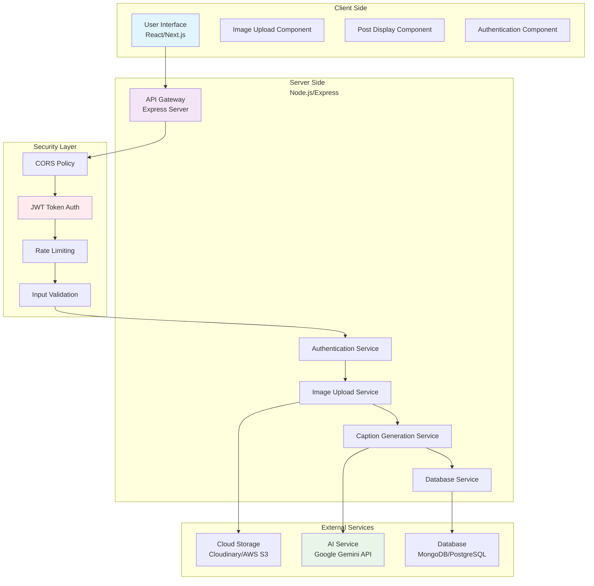
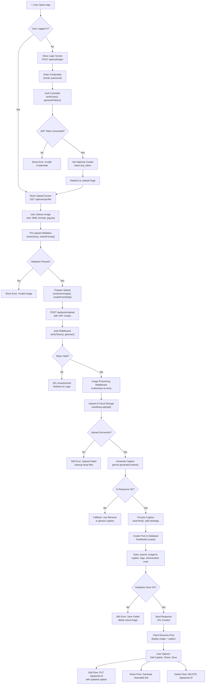
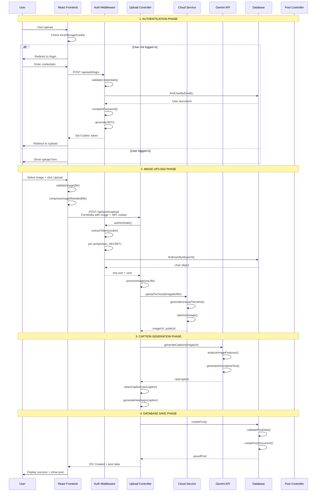
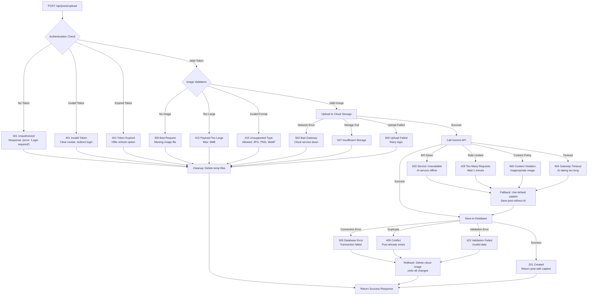
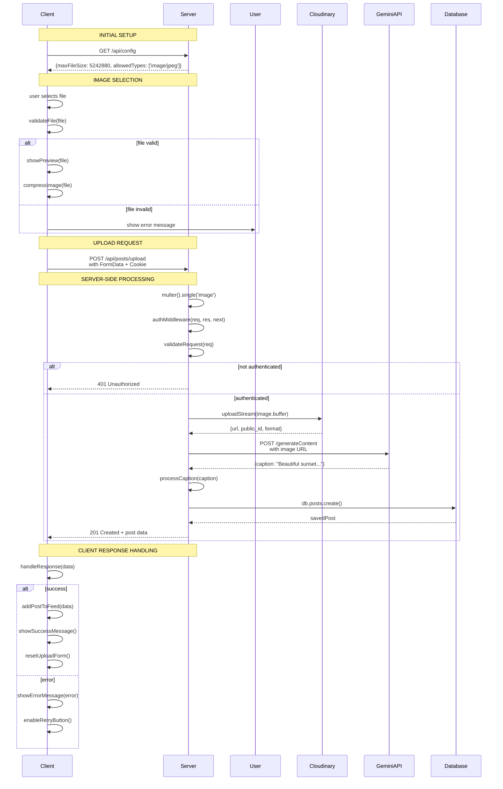
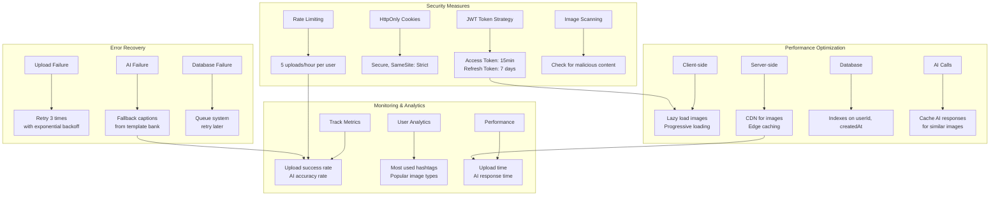

# Image to Caption App Workflow with Gemini AI

## **Complete System Architecture Diagram**




## **Complete Request Flow Diagram**




## **Detailed Component Flow with Functions**




## **API Endpoints Flow Diagram**

```mermaid
flowchart TD
    subgraph "Authentication Routes"
        A1[POST /api/auth/register] --> A2[validateInputs<br>hashPassword<br>createUser]
        A3[POST /api/auth/login] --> A4[verifyCredentials<br>generateTokens<br>setCookies]
        A5[POST /api/auth/logout] --> A6[clearCookies<br>invalidateToken]
        A7[GET /api/auth/profile] --> A8[verifyToken<br>getUserData]
    end
    
    subgraph "Post Routes"
        P1[POST /api/posts/upload] --> P2[authenticateUser<br>uploadImage<br>generateCaption]
        P3[GET /api/posts] --> P4[getAllPosts<br>paginateResults]
        P5[GET /api/posts/:id] --> P6[getSinglePost<br>checkPermissions]
        P7[PUT /api/posts/:id] --> P8[authenticateUser<br>verifyOwner<br>updatePost]
        P9[DELETE /api/posts/:id] --> P10[authenticateUser<br>verifyOwner<br>deletePost]
    end
    
    subgraph "User Routes"
        U1[GET /api/users/:id/posts] --> U2[getUserPosts<br>with pagination]
        U3[PUT /api/users/profile] --> U4[updateProfile<br>uploadAvatar]
        U5[GET /api/users/search] --> U6[searchUsers<br>by name/email]
    end
    
    subgraph "Admin Routes"
        AD1[GET /api/admin/posts] --> AD2[getAllPosts<br>with filters]
        AD3[DELETE /api/admin/posts/:id] --> AD4[deleteAnyPost<br>admin only]
    end
    
    A2 --> DB[(Database)]
    A4 --> DB
    P2 --> DB
    P4 --> DB
    U2 --> DB
    AD2 --> DB
    
    style A1 fill:#ffcccb
    style P1 fill:#cbe4ff
    style U1 fill:#d0f0c0
    style AD1 fill:#f0e6ff
```




## **Error Handling & Edge Cases Flow**




## **Complete Component Structure with Functions**


```mermaid
graph TD
    subgraph "Frontend Components"
        FC1[App.jsx] --> FC2[Routes Configuration]
        FC2 --> FC3[AuthProvider Context]
        FC2 --> FC4[ProtectedRoute Wrapper]
        
        FC5[LoginPage.jsx] --> FC6[handleLogin()<br>Form validation]
        FC5 --> FC7[handleGoogleAuth()<br>OAuth flow]
        
        FC8[UploadPage.jsx] --> FC9[ImageUploader Component]
        FC9 --> FC10[handleFileSelect()<br>Preview image]
        FC9 --> FC11[handleUpload()<br>Progress bar]
        
        FC12[FeedPage.jsx] --> FC13[PostList Component]
        FC13 --> FC14[fetchPosts()<br>Infinite scroll]
        FC13 --> FC15[handleLike()<br>Optimistic updates]
        
        FC16[ProfilePage.jsx] --> FC17[UserStats Component]
        FC16 --> FC18[UserPosts Component]
    end
    
    subgraph "Backend Controllers"
        BC1[authController.js] --> BC2[registerUser()<br>loginUser()<br>logoutUser()]
        BC3[uploadController.js] --> BC4[uploadImage()<br>generateCaption()<br>createPost()]
        BC5[postController.js] --> BC6[getPosts()<br>updatePost()<br>deletePost()]
        BC7[userController.js] --> BC8[getProfile()<br>updateProfile()<br>getUserPosts()]
    end
    
    subgraph "Middleware"
        MW1[authMiddleware.js] --> MW2[verifyToken()<br>checkPermissions()]
        MW3[uploadMiddleware.js] --> MW4[multer config<br>fileFilter()<br>limits()]
        MW5[validationMiddleware.js] --> MW6[validateImage()<br>validateCaption()]
        MW7[errorMiddleware.js] --> MW8[handleErrors()<br>logErrors()]
    end
    
    subgraph "Services"
        SV1[geminiService.js] --> SV2[generateImageCaption()<br>cleanResponse()]
        SV3[cloudinaryService.js] --> SV4[uploadImage()<br>deleteImage()<br>optimizeImage()]
        SV5[emailService.js] --> SV6[sendWelcomeEmail()<br>sendNotification()]
    end
    
    subgraph "Models"
        MD1[User Model] --> MD2[Schema:<br>email, password, posts]
        MD3[Post Model] --> MD4[Schema:<br>imageUrl, caption, userId, likes]
        MD5[Token Model] --> MD6[Schema:<br>refresh tokens<br>for logout all]
    end
    
    FC4 --> MW1
    FC11 --> BC3
    BC4 --> SV3
    BC4 --> SV1
    BC2 --> MD1
    BC6 --> MD3
    MW4 --> MW5
```

## **Image Processing Pipeline**


```mermaid
flowchart LR
    subgraph "Input Phase"
        I1[User Image<br>Original] --> I2[Client-side Validation<br>checkSize()<br>checkType()]
        I2 --> I3[Client-side Compression<br>compressImage()<br>max 1024px]
    end
    
    subgraph "Upload Phase"
        U1[FormData + Headers] --> U2[Multer Middleware<br>memoryStorage()<br>fileFilter()]
        U2 --> U3[Temporary Buffer<br>in memory]
    end
    
    subgraph "Processing Phase"
        P1[Read Image Buffer] --> P2[Resize & Optimize<br>sharp.resize()<br>quality: 80%]
        P2 --> P3[Convert to WebP<br>better compression]
        P3 --> P4[Generate Thumbnail<br>200x200 for preview]
    end
    
    subgraph "Storage Phase"
        S1[Upload to Cloudinary] --> S2[Generate Unique ID<br>timestamp + random]
        S2 --> S3[Store Original + Thumb<br>two versions]
        S3 --> S4[Get CDN URLs<br>optimized delivery]
    end
    
    subgraph "AI Phase"
        AI1[Send to Gemini] --> AI2[Image Analysis<br>detect objects,<br>scene, colors]
        AI2 --> AI3[Caption Generation<br>creative or literal]
        AI3 --> AI4[Post-processing<br>add hashtags,<br>emoji, clean text]
    end
    
    subgraph "Database Phase"
        DB1[Create Post Record] --> DB2[Store: userId,<br>imageUrl, caption,<br>thumbnailUrl, metadata]
        DB2 --> DB3[Update User Stats<br>postCount++]
        DB3 --> DB4[Create Timeline Entry<br>for followers]
    end
    
    I3 --> U1
    U3 --> P1
    P4 --> S1
    S4 --> AI1
    AI4 --> DB1
```

## **Real-time Implementation Flow with Code Blocks**




## **Security & Optimization Flow**


