# **Complete Backend Workflow Analysis**

## **📁 File-by-File Breakdown**

### **1. `app.js` - The Application Orchestrator**

```javascript
const express = require("express")
const authRoutes = require("./routes/auth.routes")
const postRoutes = require("./routes/post.routes")
const cookieParser = require("cookie-parser")

const app = express()

// 🔧 MIDDLEWARE PIPELINE SETUP (Order matters!)
app.use(express.json())        // 1st: Parse JSON bodies (Content-Type: application/json)
app.use(cookieParser())        // 2nd: Parse cookies (req.cookies = {...})

// 🎯 COMMENTED-OUT GLOBAL MIDDLEWARE (concept example)
// app.use((req,res,next)=>{
//     console.log("middleware between app and route")
//     next()  // ⚠️ Critical: Without next(), request STOPS here
// })

// 🗺️ ROUTE MOUNTING (API namespace)
app.use('/api/auth', authRoutes)  // All /api/auth/* → authRoutes
app.use('/api/post', postRoutes)  // All /api/post/* → postRoutes

module.exports = app
```

**Backend Engineer Perspective:**
- This is your **application entry point** after `server.js`
- **Middleware order is sequential**: JSON parsing must happen before route handlers can access `req.body`
- The `/api` prefix creates a **clean API namespace** separating API endpoints from static assets
- `express.json()` is a **built-in middleware** that transforms raw JSON strings into JavaScript objects

---

### **2. `post.routes.js` - The Traffic Controller**

```javascript
const express = require("express")
const multer = require("multer")
const router = express.Router()  // 🎯 Creates isolated routing context

const authMiddleware = require("../middlewares/auth.middleware")
const createPostController = require("../controllers/post.controller")

// 🖼️ MULTER CONFIGURATION: Memory Storage Strategy
const upload = multer({
    storage: multer.memoryStorage()  // ⚡ File stays in RAM, not disk
    // Alternative: diskStorage({ destination: 'uploads/' })
})

// 🔗 REQUEST FLOW CHAIN (Middleware Pipeline)
router.post('/',              // POST /api/post/
    authMiddleware,           // 1️⃣ Security: Verify JWT → sets req.user
    upload.single("image"),   // 2️⃣ File Handling: Process 'image' field → sets req.file
    createPostController      // 3️⃣ Business Logic: Handle the actual request
)

module.exports = router
```

**Key Insights:**
- `router.post()` defines a **POST endpoint handler chain**
- Middleware executes **left-to-right** (auth → upload → controller)
- `upload.single("image")` expects form field named `"image"` containing file
- **Memory storage vs Disk storage tradeoff**:
  - **Memory**: Faster for immediate processing (like AI analysis)
  - **Disk**: Better for large files or delayed processing

---

### **3. `post.model.js` - The Data Blueprint**

```javascript
const mongoose = require("mongoose")

const postSchema = new mongoose.Schema({
    image: String,      // URL or path to stored image
    caption: String,    // Generated/edited caption
    user: {             // 🎯 RELATIONSHIP FIELD (Foreign Key concept)
        type: mongoose.Schema.Types.ObjectId,  // MongoDB's unique ID type
        ref: "user"     // ⚠️ REFERENCE to "user" collection name (case-sensitive)
        // This enables .populate('user') to fetch user details
    }
})

// 🏗️ MODEL CREATION (Collection: "posts" - auto-pluralized)
const postModel = mongoose.model("post", postSchema)
// Mongoose auto-creates collection: "posts" (plural of "post")
module.exports = postModel
```

**Database Relationship Theory:**
- `ref: "user"` creates a **document reference** (like foreign key in SQL)
- Not an **embedded document** - just stores user's `_id`
- Enables **lazy loading**: Fetch post first, then user details if needed
- **Collection naming**: Mongoose lowercases and pluralizes: `"post"` → `"posts"`

---

### **4. `post.controller.js` - The Business Logic Brain**

```javascript
const postModel = require("../models/post.model")
const generateContent = require("../service/ai.service")

const createPostController = async (req, res) => {
    // 📁 FILE FROM MULTER MIDDLEWARE
    const file = req.file  // Contains: buffer, originalname, mimetype, size
    
    // 🔄 BINARY → TEXT CONVERSION (For JSON/HTTP transmission)
    const base64Image = Buffer.from(file.buffer).toString('base64')
    // Why? AI APIs accept base64 in JSON payloads
    
    // 🤖 AI SERVICE CALL (External dependency)
    const caption = await generateContent(base64Image)
    
    // 🚨 ERROR HANDLING (Service failure)
    if (!caption) {
        return res.status(500).json({ 
            message: "AI failed, try again" 
        })
        // ⚠️ Missing: Cleanup (what about the uploaded file?)
    }
    
    console.log("Generated caption : ", caption)
    
    // 📤 RESPONSE (But incomplete - no DB save!)
    res.json({Generated_caption: caption})
    // ❗ PROBLEM: Post not saved to database!
    // ❗ PROBLEM: Image not stored permanently!
}

module.exports = createPostController
```

**Critical Observations:**
1. **Missing database persistence** - Caption generated but not saved
2. **Missing image storage** - File in memory, will be lost on server restart
3. **No user association** - `req.user` (from auth) not used to link post to user
4. **No validation** - File type/size not verified

**What should happen:**
```javascript
// Complete flow should be:
1. Validate file (type, size)
2. Upload to cloud storage (S3/Cloudinary)
3. Generate caption via AI
4. Create post in DB with: {image: url, caption, user: req.user.id}
5. Return created post object
```

---

### **5. `ai.service.js` - The AI Integration Layer**

```javascript
require("dotenv").config();  // ⚙️ Loads .env file variables
const { GoogleGenerativeAI } = require("@google/generative-ai");

// 🏭 SINGLETON PATTERN: One AI client for entire app
const ai = new GoogleGenerativeAI(process.env.GEMINI_API_KEY);

const generateContent = async (base64ImageFile) => {
    try {
        // 🤖 MODEL SELECTION (Different models for different tasks)
        const model = ai.getGenerativeModel({ 
            model: "gemini-2.5-flash"  // Fast, cheap, good for images
            // Alternatives: "gemini-pro" (text-only), "gemini-pro-vision"
        })

        // 💬 PROMPT ENGINEERING (Structured conversation)
        const prompt = {
            contents: [
                {
                    role: "user",  // System message equivalent
                    parts: [
                        {
                            text: "You are an AI that creates short, clean captions for images. Do NOT describe unrelated details. use hashtags in captions, total of 2 captions only"
                            // 🎯 Clear instructions = Better results
                        }
                    ]
                },
                {
                    role: "user",  // Actual user request
                    parts: [
                        {
                            inlineData: {  // 🖼️ Image data
                                mimeType: "image/jpeg",  // Assumes JPEG always
                                data: base64ImageFile    // The encoded image
                            }
                        },
                        {
                            text: "Caption this image."  // Simple instruction
                        }
                    ]
                }
            ],
        };
        
        // 📡 AI API CALL (Network request to Google)
        const result = await model.generateContent(prompt)
        
        // 📦 EXTRACTING RESPONSE
        return result.response.text()  // AI-generated text
        
    } catch (e) {
        // ❌ ERROR HANDLING (But could be better)
        console.log(e)  // ⚠️ Logs to console, not monitoring system
        return null  // ⚠️ Silent failure pattern
    }
}

module.exports = generateContent
```

---

## **🔬 Deep Dive: Core Concepts**

### **1. Base64: The Translation Layer**

```javascript
// ORIGINAL: Binary Buffer (Raw image data)
file.buffer = <Buffer ff d8 ff e0 00 10 4a 46 49 46 00 01...>

// CONVERSION: Binary → Text
const base64Image = Buffer.from(file.buffer).toString('base64')

// RESULT: ASCII-safe string
base64Image = "/9j/4AAQSkZJRgABAQAAAQABAAD/2wBDAAYEBQYFBAYG..."

// 🎯 WHY Base64?
// 1. JSON Compatibility: JSON only supports strings
// 2. HTTP Safe: No special characters that break HTTP
// 3. Universal: Every language can decode it
// 4. Self-contained: No need for separate file upload
```

### **2. Package Import Differences**

```javascript
// OLD/NEW PACKAGE STRUCTURES
const { GoogleGenerativeAI } = require("@google/generative-ai")
// vs
import { GoogleGenAI } from "@google/genai"  // Old/deprecated

// 🤔 WHY THE CHANGE?
// Google released new SDK with breaking changes
// Always check: npm trends, GitHub, official docs
```

### **3. Buffer.from() Mystery Explained**

```javascript
// Even though file.buffer IS a Buffer:
console.log(file.buffer.constructor.name)  // "Buffer"

// Buffer.from() is STILL needed because:
// 1. Safety: Creates new Buffer copy (immutable operation)
// 2. Consistency: Works with ArrayBuffers, Uint8Array, etc.
// 3. Encoding: .toString('base64') only works on Buffer instances

// Buffer.from() behavior:
Buffer.from(existingBuffer) === existingBuffer  // FALSE (new copy)
```

---

## **🎯 Production Improvements Needed**

### **Current Issues & Fixes**

| **Issue** | **Problem** | **Solution** |
|-----------|------------|--------------|
| **No DB Save** | Caption lost after response | Save to MongoDB with `postModel.create()` |
| **No Image Storage** | File lost on restart | Upload to Cloudinary/S3 |
| **Hardcoded MIME** | Assumes JPEG always | Use `file.mimetype` |
| **Weak Error Handling** | `return null` on failure | Proper error propagation |
| **No Validation** | Accepts any file | File type/size validation middleware |
| **Missing User Link** | Post not linked to creator | Use `req.user.id` from auth |

### **Improved Controller Code**

```javascript
const createPostController = async (req, res) => {
    try {
        // 1️⃣ VALIDATION (should be middleware, but here for safety)
        if (!req.file) {
            return res.status(400).json({ error: "No image provided" });
        }
        
        if (!req.user) {
            return res.status(401).json({ error: "Not authenticated" });
        }
        
        // 2️⃣ CONVERT TO BASE64
        const base64Image = Buffer.from(req.file.buffer).toString('base64');
        
        // 3️⃣ CALL AI SERVICE
        const caption = await generateContent(base64Image);
        if (!caption) {
            return res.status(503).json({ error: "AI service unavailable" });
        }
        
        // 4️⃣ UPLOAD TO CLOUD STORAGE (Example: Cloudinary)
        const cloudinary = require('cloudinary').v2;
        const uploadResult = await new Promise((resolve) => {
            const stream = cloudinary.uploader.upload_stream(
                { folder: 'posts' },
                (error, result) => error ? reject(error) : resolve(result)
            );
            stream.end(req.file.buffer);
        });
        
        // 5️⃣ SAVE TO DATABASE
        const post = await postModel.create({
            image: uploadResult.secure_url,  // Cloudinary URL
            caption: caption,
            user: req.user.id  // From auth middleware
        });
        
        // 6️⃣ RESPONSE
        res.status(201).json({
            success: true,
            post: post,
            message: "Post created successfully"
        });
        
    } catch (error) {
        console.error("Post creation error:", error);
        res.status(500).json({ 
            error: "Failed to create post",
            details: process.env.NODE_ENV === 'development' ? error.message : undefined
        });
    }
};
```

---

## **📊 Complete Workflow Diagram**

```mermaid
flowchart TD
    A[📱 Client Request] --> B["POST /api/post/<br>with JWT Cookie + FormData"]
    
    B --> C{Express Router}
    C --> D["🛡️ authMiddleware<br>jwt.verify() → req.user"]
    
    D --> E{"Auth Valid?"}
    E -->|No| F["401 Unauthorized<br>Return Error"]
    E -->|Yes| G["📤 upload.single('image')<br>Multer: req.file = {buffer, mimetype}"]
    
    G --> H{Multer Success?}
    H -->|No| I["400 Bad Request<br>Invalid file"]
    H -->|Yes| J["🧠 postController"]
    
    subgraph J[Controller Logic]
        K["Convert: Buffer → Base64<br>file.buffer → base64 string"]
        L["🤖 AI Service Call<br>send base64 to Gemini API"]
        M["📦 Process Response<br>extract caption text"]
        N["☁️ Cloud Upload<br>buffer → Cloudinary/S3"]
        O["💾 Database Save<br>postModel.create()"]
        P["📤 Send Response"]
    end
    
    K --> L
    L --> M
    M --> N
    N --> O
    O --> P
    
    P --> Q["✅ 201 Created<br>{post: {...}}"]
    
    F --> R[📭 Client]
    I --> R
    Q --> R
    
    subgraph "External Services"
        S[🛡️ Auth Service]
        T[🤖 Gemini AI]
        U[☁️ Cloud Storage]
        V[🗄️ MongoDB]
    end
    
    D -.-> S
    L -.-> T
    N -.-> U
    O -.-> V
```



---

## **💡 Key Architecture Insights**

### **1. The Middleware Chain Concept**
```javascript
// Visualizing the pipeline:
Request → [express.json()] → [cookieParser()] → [authMiddleware] → 
[upload.single()] → [controller] → Response

// Each middleware TRANSFORMS the request
// Auth adds: req.user
// Multer adds: req.file
// Your controller CONSUMES these additions
```

### **2. Service Layer Purpose**
- **AI Service** = Isolates external API calls
- **Separation**: Controller doesn't know HOW AI works, just WHAT it does
- **Testability**: Can mock `generateContent()` in tests
- **Reusability**: Same service can be used from different controllers

### **3. File Processing Strategy**
```javascript
// CURRENT: Memory buffer → Base64 → AI
// PROBLEM: Image stuck in memory, not stored

// BETTER: Memory buffer → AI + Cloud upload (parallel)
// OR: Memory buffer → Cloud → Get URL → AI with URL

// BEST: Stream processing for large files
```

### **4. Missing Pieces in Current Code**
1. **Error logging** (not just console.log)
2. **Rate limiting** (prevent AI API abuse)
3. **Input validation** (file size, type, dimensions)
4. **Retry logic** (AI might fail temporarily)
5. **Progress tracking** (for large uploads)
6. **Cleanup** (delete temp files on error)

---

## **🎓 Final Backend Engineering Wisdom**

**Your code is 70% complete** - it demonstrates solid understanding of:
- ✅ Middleware chaining
- ✅ JWT authentication flow
- ✅ File upload handling
- ✅ External service integration
- ✅ Route organization

**To reach production quality**, add:
1. **Persistence layer** (database + cloud storage)
2. **Error resilience** (retries, fallbacks)
3. **Monitoring** (logs, metrics, alerts)
4. **Security hardening** (validation, sanitization)
5. **Performance optimization** (streaming, caching)

**Remember**: Backend engineering is about building **reliable systems**, not just working code. Each piece should handle failure gracefully and provide clear observability when things go wrong.