# **ImageKit Integration - Complete Workflow & Code Analysis**

## **🔄 Complete Workflow with ImageKit**

```mermaid
graph TB
    subgraph "Request Flow"
        A[📱 User Uploads Image] --> B["POST /api/post<br>with JWT + FormData"]
        B --> C["🔐 Auth Middleware<br>Verify JWT → req.user"]
        C --> D["📤 Multer Middleware<br>Store in memory → req.file"]
        D --> E["🧠 Controller Processing"]
    end
    
    subgraph "Controller Processing"
        E --> F["🔤 Convert to Base64<br>Buffer → String"]
        F --> G["🤖 Call AI Service<br>Generate Caption"]
        G --> H["☁️ Upload to ImageKit<br>Buffer → Cloud Storage"]
        
        F --> I["📝 Parallel Execution<br>AI & Upload run simultaneously"]
        G --> I
        H --> I
        
        I --> J["💾 Create Post Document<br>with Image URL + Caption"]
    end
    
    subgraph "ImageKit Upload"
        K["Generate UUID Filename<br>e.g., 'f47ac10b-58cc-4372-a567-0e02b2c3d479'"]
        L["Configure ImageKit Client<br>with API Keys"]
        M["Upload with Parameters<br>file, fileName, folder"]
        N["Return Response<br>url, fileId, etc."]
        
        K --> M
        L --> M
        M --> N
    end
    
    H --> K
    H --> L
    N --> J
    J --> O["✅ Response to User<br>Post created successfully"]
    
    O --> P[📱 Client Receives Response]
```




## **🔬 Detailed Code Analysis**

### **1. Controller Code Breakdown**

```javascript
const postModel = require("../models/post.model")
const generateContent = require("../service/ai.service")

const createPostController = async (req, res) => {
    const file = req.file  // 🎯 From multer middleware
    
    // 🔄 CONVERT BUFFER TO BASE64 (For AI Service)
    const base64Image = Buffer.from(file.buffer).toString('base64')
    // file.buffer = binary data from memory
    // Buffer.from() = creates Buffer wrapper
    // .toString('base64') = encodes to ASCII string
    
    // ⏱️ PARALLEL EXECUTION (AI + Upload)
    const [caption, imagekitResult] = await Promise.all([
        // 🤖 TASK 1: AI Caption Generation
        generateContent(base64Image),
        // ⚠️ If AI fails, this promise rejects
        // ⚠️ We need error handling for this
        
        // ☁️ TASK 2: ImageKit Upload
        uploadImage(
            file.buffer,          // Original binary image data
            `${uuidv4()}`         // 🎯 Unique filename generation
        )
        // Why pass buffer AND base64? 
        // - Buffer → ImageKit (binary upload)
        // - Base64 → Gemini AI (text encoding)
    ])
    
    // 🚨 ERROR HANDLING (AI might fail)
    if (!caption) {
        // ⚠️ Problem: Image already uploaded to ImageKit!
        // ⚠️ We should delete it to avoid orphaned files
        return res.status(500).json({ message: "AI failed, try again" })
    }
    
    // 💾 DATABASE SAVE
    const post = await postModel.create({
        caption: caption,               // From AI service
        image: imagekitResult.url,      // 🎯 ImageKit CDN URL
        user: req.user._id             // From auth middleware
    })
    // post = {_id: "...", image: "https://ik.imagekit.io/...", ...}
}
```

### **2. ImageKit Service File Breakdown**

```javascript
const ImageKit = require("imagekit")

// 🏢 IMAGEKIT CLIENT INITIALIZATION (Singleton Pattern)
const imagekit = new ImageKit({
    publicKey: process.env.IMAGEKIT_PUBLIC_KEY,      // 🎯 For frontend operations
    privateKey: process.env.IMAGEKIT_PRIVATE_KEY,    // 🔐 For backend operations (KEEP SECRET!)
    urlEndpoint: process.env.IMAGEKIT_URL_ENDPOINT   // 🌐 Your ImageKit CDN URL
})

// 📤 UPLOAD FUNCTION
const uploadImage = async (file, filename) => {
    // ⚙️ IMAGEKIT UPLOAD CONFIGURATION
    const response = await imagekit.upload({
        file: file,                    // 🎯 Binary buffer (not base64!)
        fileName: filename,            // 🎯 Unique filename (UUID)
        folder: "cohort-ai-caption-generation"  // 📂 Organizes files in ImageKit dashboard
    })
    
    // 📦 IMAGEKIT RESPONSE STRUCTURE
    // response = {
    //     fileId: "unique_id",           // 🎯 For future operations (delete, update)
    //     name: "f47ac10b-58cc-4372-a567-0e02b2c3d479",
    //     url: "https://ik.imagekit.io/your-endpoint/f47ac10b-58cc...",
    //     thumbnailUrl: "...",           // 🎯 Auto-generated thumbnail
    //     height: 1200,                  // 🎯 Auto-extracted metadata
    //     width: 800,
    //     size: 102345,                  // In bytes
    //     filePath: "/cohort-ai-caption-generation/f47ac10b-...",
    //     tags: [],                      // 🎯 Can add tags for organization
    //     isPrivateFile: false,
    //     customCoordinates: null,
    //     ...
    // }
    
    return response
}

module.exports = uploadImage
```

## **🎯 Key Concepts Explained**

### **1. Why UUID for Filenames?**

```javascript
// ❌ PROBLEMATIC: Original filename
`${Date.now()}-${file.originalname}`
// Example: "1639876543210-user_photo.jpg"
// Issues: 
// 1. Users might upload same filename → overwrite
// 2. Special characters might break URLs
// 3. Predictable naming → security concern

// ✅ BETTER: UUID (Universally Unique Identifier)
const { v4: uuidv4 } = require('uuid')
const filename = `${uuidv4()}`  
// Example: "f47ac10b-58cc-4372-a567-0e02b2c3d479"
// Result URL: https://ik.imagekit.io/your-endpoint/f47ac10b-58cc...

// ✅ EVEN BETTER: UUID + Extension
const extension = file.originalname.split('.').pop()
const filename = `${uuidv4()}.${extension}`
// Example: "f47ac10b-58cc-4372-a567-0e02b2c3d479.jpg"
```

**UUID Benefits:**
- **Guaranteed uniqueness** (even across different servers)
- **No collisions** (statistically impossible for duplicate)
- **URL-safe** (no special characters)
- **No information leakage** (doesn't reveal original filename)

### **2. ImageKit Configuration Parameters**

```javascript
// 🏗️ THREE CRITICAL COMPONENTS:

// 1. PUBLIC KEY (Safe to expose)
// Used by: Frontend SDK for uploads from browser
// Purpose: Identify your account
process.env.IMAGEKIT_PUBLIC_KEY = "public_AbC123..."

// 2. PRIVATE KEY (NEVER expose!)
// Used by: Backend for server-side operations
// Purpose: Sign requests, authenticate API calls
process.env.IMAGEKIT_PRIVATE_KEY = "private_XyZ789..."
// ⚠️ If leaked: Anyone can upload/delete from your account!

// 3. URL ENDPOINT (Your CDN domain)
// Format: https://ik.imagekit.io/{your_imagekit_id}/
process.env.IMAGEKIT_URL_ENDPOINT = "https://ik.imagekit.io/your_id/"
```

### **3. Buffer vs Base64: The Dual Nature**

```javascript
// 🖼️ SAME IMAGE, TWO FORMATS:

// ORIGINAL: Binary Buffer (from multer)
file.buffer = <Buffer ff d8 ff e0 00 10 4a 46 49 46 00...>
// Size: 1MB (actual file size)
// Use: ImageKit upload (efficient, preserves quality)

// CONVERTED: Base64 String (for AI)
base64Image = "/9j/4AAQSkZJRgABAQAAAQABAAD/2wBDAAYEBQYFBAYG..."
// Size: ~1.33MB (33% larger due to encoding)
// Use: Gemini API (text-based protocol requirement)

// ⚡ PERFORMANCE IMPACT:
// Converting 1MB buffer → base64: ~2-5ms
// Memory usage: Doubles temporarily (buffer + base64)
```

### **4. Promise.all() - Parallel Execution Magic**

```javascript
// ⏱️ SEQUENTIAL (Slower - ~AI time + Upload time)
const caption = await generateContent(base64Image)  // Wait 2s
const result = await uploadImage(file.buffer, filename) // Wait 1s
// Total: ~3 seconds

// ⚡ PARALLEL (Faster - ~max(AI time, Upload time))
const [caption, result] = await Promise.all([
    generateContent(base64Image),   // Starts immediately
    uploadImage(file.buffer, filename) // Starts immediately
])
// Total: ~2 seconds (runs concurrently!)

// ⚠️ ERROR HANDLING CHALLENGE:
// If AI fails but upload succeeds → orphaned image in ImageKit
// If upload fails but AI succeeds → wasted AI credits
```

## **🔧 Production-Ready Improvements**

### **1. Robust Controller with Error Handling**

```javascript
const createPostController = async (req, res) => {
    try {
        if (!req.file) {
            return res.status(400).json({ error: "No image provided" })
        }
        
        if (!req.user) {
            return res.status(401).json({ error: "Not authenticated" })
        }
        
        const base64Image = Buffer.from(req.file.buffer).toString('base64')
        const filename = `${uuidv4()}.${req.file.originalname.split('.').pop()}`
        
        // ⚡ PARALLEL WITH ERROR HANDLING
        let caption, imagekitResult
        
        try {
            [caption, imagekitResult] = await Promise.all([
                generateContent(base64Image),
                uploadImage(req.file.buffer, filename)
            ])
        } catch (parallelError) {
            // 🧹 CLEANUP: If one succeeded, rollback
            if (!caption && imagekitResult) {
                await deleteImage(imagekitResult.fileId)  // Need delete function
            }
            throw new Error("Processing failed: " + parallelError.message)
        }
        
        // 🚨 AI SPECIFIC FAILURE
        if (!caption) {
            if (imagekitResult) {
                await deleteImage(imagekitResult.fileId)
            }
            return res.status(503).json({ error: "AI service unavailable" })
        }
        
        // 💾 SAVE TO DATABASE
        const post = await postModel.create({
            caption: caption.trim(),
            image: imagekitResult.url,
            user: req.user._id,
            imageKitId: imagekitResult.fileId,  // 🎯 Store for future operations
            metadata: {
                format: req.file.mimetype,
                size: req.file.size,
                originalName: req.file.originalname
            }
        })
        
        // 📤 RESPONSE
        res.status(201).json({
            success: true,
            post: {
                id: post._id,
                caption: post.caption,
                imageUrl: post.image,
                createdAt: post.createdAt
            }
        })
        
    } catch (error) {
        console.error("Post creation error:", error)
        res.status(500).json({ 
            error: "Failed to create post",
            ...(process.env.NODE_ENV === 'development' && { 
                details: error.message 
            })
        })
    }
}
```

### **2. Enhanced ImageKit Service**

```javascript
const ImageKit = require("imagekit")

class ImageKitService {
    constructor() {
        this.imagekit = new ImageKit({
            publicKey: process.env.IMAGEKIT_PUBLIC_KEY,
            privateKey: process.env.IMAGEKIT_PRIVATE_KEY,
            urlEndpoint: process.env.IMAGEKIT_URL_ENDPOINT
        })
    }
    
    async uploadImage(buffer, filename, options = {}) {
        try {
            const response = await this.imagekit.upload({
                file: buffer,
                fileName: filename,
                folder: options.folder || "ai-captions",
                tags: options.tags || ["ai-generated"],
                useUniqueFileName: false, // We provide our own UUID
                isPrivateFile: options.isPrivate || false,
                customCoordinates: options.coordinates,
                responseFields: ["url", "thumbnailUrl", "fileId", "name", "size"]
            })
            
            // 🎯 OPTIMIZATION: Auto-create transformations
            const transformations = {
                thumbnail: `${response.url}?tr=w-300,h-300`,
                medium: `${response.url}?tr=w-800,h-600`,
                optimized: `${response.url}?tr=q-80`
            }
            
            return {
                ...response,
                transformations
            }
            
        } catch (error) {
            console.error("ImageKit upload error:", error)
            throw new Error(`Upload failed: ${error.message}`)
        }
    }
    
    async deleteImage(fileId) {
        try {
            await this.imagekit.deleteFile(fileId)
            return true
        } catch (error) {
            console.error("ImageKit delete error:", error)
            // ⚠️ Don't throw - might be already deleted
            return false
        }
    }
    
    async getImageDetails(fileId) {
        return await this.imagekit.getFileDetails(fileId)
    }
}

module.exports = new ImageKitService()  // Singleton instance
```

## **💡 Advanced Tips & Tricks**

### **1. Folder Organization Strategy**

```javascript
// 📁 HIERARCHICAL FOLDING (Scales better)
const folderStructure = {
    daily: `posts/${new Date().toISOString().split('T')[0]}`,
    // Result: "posts/2024-01-15/f47ac10b-...jpg"
    
    userBased: `users/${req.user._id}/posts`,
    // Result: "users/507f1f77bcf86cd799439011/posts/..."
    
    monthly: `posts/${new Date().getFullYear()}/${new Date().getMonth()+1}`,
    // Result: "posts/2024/1/f47ac10b-...jpg"
}

// 🏷️ TAGGING FOR SEARCH
const tags = [
    "ai-generated",
    `user-${req.user._id}`,
    `date-${new Date().toISOString().split('T')[0]}`
]
```

### **2. Image Optimization Before Upload**

```javascript
const sharp = require('sharp')

const optimizeImage = async (buffer) => {
    return await sharp(buffer)
        .resize(1200, 1200, {  // Max dimensions
            fit: 'inside',
            withoutEnlargement: true
        })
        .jpeg({ 
            quality: 80,
            progressive: true  // Better loading
        })
        .toBuffer()
}

// Usage:
const optimizedBuffer = await optimizeImage(req.file.buffer)
const result = await uploadImage(optimizedBuffer, filename)
// Benefits: Smaller file, faster upload, less storage cost
```

### **3. CDN Benefits You Automatically Get**

```javascript
// 🚀 IMAGEKIT AS CDN PROVIDES:

// 1. Auto-optimization
`${imageUrl}?tr=w-800,q-80`  // Resize + compress

// 2. Format conversion
`${imageUrl}?tr=f-webp`      // Convert to WebP automatically

// 3. Watermarking
`${imageUrl}?tr=w-800,l-image/i/watermark.png,pa-10`

// 4. Smart cropping
`${imageUrl}?tr=w-400,h-400,fo-face`  // Face detection crop

// 5. Responsive images
`${imageUrl}?tr=w-400 400w, w-800 800w, w-1200 1200w`
```

### **4. Monitoring & Cost Control**

```javascript
// 📊 TRACK USAGE METRICS
const metrics = {
    userId: req.user._id,
    fileSize: req.file.size,
    uploadTime: Date.now() - startTime,
    aiCost: estimateAICost(caption), // Based on tokens
    storageCost: calculateStorageCost(req.file.size),
    timestamp: new Date().toISOString()
}

// Save to analytics database or send to monitoring service
```

## **🎯 Workflow Summary**

### **The Complete Journey:**
1. **User uploads** → Multer stores in memory buffer
2. **Buffer splits** → Base64 for AI, Binary for ImageKit
3. **Parallel execution** → AI generates caption while image uploads
4. **ImageKit stores** → Returns CDN URL + metadata
5. **Database saves** → Post with caption + URL + user reference
6. **User receives** → Created post with AI-generated caption

### **Critical Success Factors:**
1. **UUID prevents collisions** → No overwritten files
2. **Parallel execution** → Better user experience
3. **ImageKit CDN** → Fast global delivery + optimizations
4. **Database reference** → Links post to user for querying
5. **Error handling** → Clean up failed uploads

### **Common Pitfalls to Avoid:**
1. **Missing cleanup** → Orphaned images if AI fails
2. **No file extension** → Browsers might not render correctly
3. **Buffer memory leak** → Process large files in streams
4. **No usage limits** → Users could upload unlimited images
5. **Missing metadata** → Hard to debug issues later

This integration transforms your app from a local prototype to a cloud-ready production system with global image delivery, automatic optimizations, and scalable architecture.