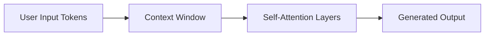
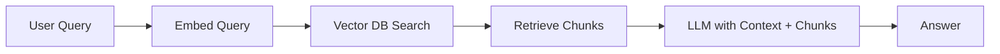
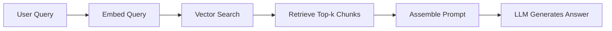
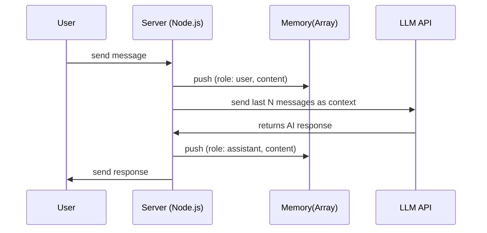

# **What is an LLM? (Large Language Model)**

A Large Language Model is a type of artificial neural network designed to understand and generate human language. It is trained on massive datasets containing books, articles, code, conversations, and more. During training, the model learns **patterns of language**, relationships between words, grammar structures, factual associations, and reasoning patterns. It works by converting text into **tokens**, transforming tokens into **embeddings** (vectors of numbers), and passing those embeddings through layers of **self-attention** where the model weighs how much each part of the input should influence the output. By repeatedly predicting the next token, the model gradually learns how to answer questions, write passages, translate languages, summarize information, or follow instructions. An LLM doesn’t “understand” like a human; instead, it learns extremely complex statistical representations of text, which create the illusion of understanding.

---

# **Memories in AI (LLM Memory Systems)**

## **1) Short-Term Memory — The Context Window**

This is the temporary memory an LLM uses during a single interaction. Everything you type in the prompt — plus any retrieved documents — stays inside the model’s **context window**. The transformer architecture allows the model to compute relationships between tokens using **self-attention**, meaning it can connect ideas across the window. Once the conversation moves on or the window is full, older information gets dropped. Short-term memory is fast, cheap, and gives immediate reasoning ability, but it cannot be stored permanently.

### **Mermaid.js Diagram — Short-Term Memory**



---

## **2) Long-Term Memory — Learned in Model Weights**

Long-term memory is encoded in the LLM’s **parameters** after training on massive datasets. These weights store facts, language rules, world knowledge, and reasoning patterns. When the model is used, it retrieves this built-in knowledge automatically without external lookup. This memory is stable but **not easily updated**; changing it requires fine-tuning or retraining. Because weights compress huge datasets into mathematical relationships, the memory is dense, distributed, and not directly interpretable by humans.

### **ASCII Diagram — Long-Term Memory**

```
           +-------------------+
           |  Model Weights    |
           | (Stored Knowledge)|
           +---------+---------+
                     |
                     v
              Used During Output
```

---

## **3) Retrieval-Augmented Memory (External Memory / RAG)**

This memory sits **outside** the LLM. When the model needs information it doesn’t have — such as recent documents, personal notes, or updates — a retrieval system searches a **vector database**. Each document is converted into an embedding, stored, and fetched when the user asks something relevant. This extends the LLM’s ability without altering its weights. It also allows the system to remain accurate on knowledge **after** the model’s training date. Retrieval memory is searchable, updatable, and modular.

### **Mermaid.js Diagram — Retrieval Memory**



---

## **4) Specialized Memory Modules (Neural Memory Systems)**

Some AI systems use explicit memory mechanisms such as **Key-Value Memory**, **Memory Networks**, **Neural Turing Machines (NTM)**, or **Differentiable Neural Computers (DNC)**. These structures allow the model to **write** and **read** memory slots during computation. They work like a digital notebook the neural network can edit. While not common in consumer chatbots, these architectures are important in research for algorithmic reasoning, planning, and long sequences.

### **ASCII Diagram — Specialized Memory**

```
+----------+       read/write       +-----------+
|  LLM     | <--------------------> | Memory    |
| Processor|                        | Slots     |
+----------+                        +-----------+
```

---

## **5) Episodic vs Semantic vs Procedural Memory (Human-Inspired Mapping)**

LLMs do not have human memories, but we map concepts for clarity:

* **Semantic memory** → knowledge in weights (facts, language rules).
* **Episodic memory** → previous interactions stored externally (conversation logs, RAG).
* **Procedural memory** → learned abilities (reasoning style, coding patterns).

LLMs simulate these memory types through architectures and training strategies rather than biological processes.

---

## **6) Memory Limits and Failure Modes**

Memory in LLMs is limited by context window size. When the window overflows, older tokens are forgotten. Long-term memory can become outdated because model weights cannot update themselves. Retrieval memory may return irrelevant documents if embeddings or chunking are poor. Specialized memory modules can be hard to train. Overall, memory failures cause hallucinations, loss of context, or outdated answers.

---

## **7) One Combined Big Picture Diagram**

### **Mermaid.js — Full Memory Ecosystem**

```mermaid
flowchart TD
A[User Input] --> B[Context Window (Short-Term)]
A --> C[Query Embedder]
C --> D[Vector DB (External Memory)]
D --> E[Retrieved Context]
B --> F[LLM Core Processor]
E --> F
F --> G[Output]

subgraph LLM Weights
H[Long-Term Knowledge]
end
H --> F
```

---

# **What is RAG? (Retrieval-Augmented Generation)**

RAG is an AI technique where a language model generates answers **using both** its built-in knowledge **and** **retrieved external information**. Instead of relying only on the model’s training data, RAG fetches relevant documents from a **vector database** or search engine and injects them into the model’s context window. This allows the system to stay updated, accurate, and grounded in real data without needing to retrain the LLM. The core idea: *retrieve first, generate second*. The LLM becomes less of a memory store and more of a reasoning engine over retrieved evidence.

---

# **Why RAG Exists (Core Purpose)**

LLMs have two major limitations:

1. They cannot store unlimited knowledge in their weights.
2. Their knowledge becomes outdated after training.

RAG fixes both by giving the model on-demand memory access. Instead of storing everything inside the LLM, we store knowledge externally and allow the model to **pull** what it needs.

---

# **How RAG Works — Step-by-Step**

1. **User asks a question.**
2. Question is converted into an **embedding** (vector representation).
3. The vector is used to search a **vector DB** for semantically similar chunks.
4. The retrieved chunks (documents, paragraphs, facts) are inserted into the model’s context window.
5. The LLM reads the question + retrieved information and generates an answer based on evidence.

This pipeline is simple but extremely powerful because it gives the LLM a live memory system.

---

# **Mermaid.js — Core RAG Flow**



---

# **Types of RAG**

## **1) Naive RAG (Basic RAG)**

This is the simplest form.

* Convert documents into embeddings
* Store them in a vector DB
* At query time, do a semantic search
* Return the top-k results
* Feed them into the model

Strength: easy to build
Weakness: can return irrelevant or noisy results

---

## **2) Chunk-Based RAG**

Large documents are split into smaller “chunks” (paragraphs, sections).
Each chunk is embedded individually.
This increases retrieval accuracy because the system finds *specific* passages.

---

## **3) Advanced RAG (Multi-Step / Multi-Hop)**

For complex questions requiring reasoning across multiple pieces of information:

* The system performs **multiple retrieval rounds**
* It may query with follow-up questions
* It combines information from different chunks

Used in research and advanced search tools.

---

## **4) Reranker-Enhanced RAG**

After the initial retrieval, a reranking model scores the relevance of each document.
Only the most relevant ones are sent to the LLM.
This improves accuracy dramatically.

---

## **5) Structured RAG**

Instead of retrieving plain text, the system retrieves structured data:

* APIs
* SQL rows
* JSON objects
* Knowledge graphs

This helps the LLM produce precise, consistent answers.

---

## **6) Agentic RAG**

The LLM acts as an **agent** that decides:

* Which queries to search
* How many times to retrieve
* How to refine its questions

It creates a loop: think → search → think → search → answer.

---

# **ASCII Summary Diagram**

```
User Query
     |
 [Embedder]
     v
[Vector DB] ---> Top-k Chunks
     |                |
     v                v
  Retrieval --> Inject into Prompt
                     |
                     v
                 [LLM Answer]
```

---

# **Core Components of a RAG System**

## **1) Embedding Model**

Turns text into dense vectors that capture meaning.
Higher-quality embeddings → better retrieval accuracy.

## **2) Vector Database**

Stores vectors and allows fast similarity search.
Examples: FAISS, Milvus, Pinecone, Chroma.

## **3) Chunking Strategy**

Documents must be split into manageable pieces (200–500 tokens).
Bad chunking = poor answers.

## **4) Prompt Formatting**

Retrieved chunks must be added cleanly inside the prompt, usually like:
“Here are relevant documents: … Now answer: …”

## **5) LLM Processing**

The model uses both the question and the retrieved evidence to answer.

---

# **Why RAG Works So Well**

It reduces hallucinations by grounding answers in real text.
It keeps the system updated without retraining the LLM.
It gives AI access to private, domain-specific data.
It makes responses explainable (“source-based answers”).

---

# **Limitations of RAG**

* Retrieval may bring irrelevant or outdated chunks
* Chunking mistakes lead to incomplete information
* LLM may ignore retrieved data if the prompt is poorly structured
* Embedding quality varies by model

---

# **When to Use RAG**

* When you need **current information**
* When you need **domain-specific knowledge**
* When responses must be **grounded in real documents**
* When fine-tuning is too expensive or unnecessary

---


1. **Everything about short-term memory in chatbots**
2. **Exactly the necessary Node.js structures, routes, file relations, and integration flow**
3. **No full application code, only essential snippets + architecture**
4. **Mermaid + ASCII diagrams included**
5. **Beginner-friendly but research-oriented explanation**

---

# ✅ **SHORT-TERM MEMORY IN A CHATBOT (LLM SYSTEMS)**

## **1) What Short-Term Memory Actually Is**

Short-term memory in a chatbot refers to the **temporary context** the model uses during a single conversation session. It is not stored permanently and disappears when:

* the user closes the session,
* you clear the memory array,
* the session expires,
* the chat resets.

It is implemented by **feeding the conversation history back into the LLM** every time the user sends a message.
The LLM does not “remember”; **you supply the memory manually**.

Short-term memory = **an array/list of messages** stored *in RAM* or *in-memory cache*.

---

## **2) Why Short-Term Memory Is Needed**

Without short-term memory, every user message is treated as a NEW message with no context.
With short-term memory:

* The bot remembers the last few user queries
* Maintains conversational coherence
* Handles follow-up questions
* Preserves tone, references, corrections

However:

* It has a **token limit** (model’s context window).
* It must be **summarized or truncated** when it becomes too long.

---

## **3) How Short-Term Memory Flows in a Chatbot**

**Flow:**

1. User sends a message
2. Server stores this message in a **session memory array**
3. Server builds a prompt using the last N messages
4. Server calls the LLM with that history
5. LLM responds
6. Server adds the LLM response to the memory array
7. Send response back to user

---

## **4) Mermaid.js — Short-Term Memory Flow**



---

# ✅ **NODE.JS ARCHITECTURE FOR SHORT-TERM MEMORY**

# **Project Structure**

```
/chatbot
  /routes
     chat.route.js
  /controllers
     chat.controller.js
  /services
     llm.service.js
  /memory
     sessionMemory.js
  app.js
```

Each file has ONLY the necessary logic — no full code.

---

# ✅ **1) sessionMemory.js (stores short-term memory)**

```js
// sessionMemory.js
const memory = new Map(); 
// key: sessionId, value: array of messages

function getSessionMemory(sessionId) {
    if (!memory.has(sessionId)) memory.set(sessionId, []);
    return memory.get(sessionId);
}

function addToMemory(sessionId, role, content) {
    const session = getSessionMemory(sessionId);
    session.push({ role, content });

    // Optional: limit memory to last 10 messages
    if (session.length > 10) session.shift();
}

module.exports = { getSessionMemory, addToMemory };
```

This file handles **short-term memory**.
Each user/session gets its own temporary memory array.

---

# ✅ **2) llm.service.js (calls the AI API with memory)**

```js
const axios = require("axios");

async function generateReply(messages) {
    const response = await axios.post("https://api.openai.com/v1/chat/completions", {
        model: "gpt-4o-mini",
        messages: messages
    },
    {
        headers: { Authorization: `Bearer ${process.env.OPENAI_KEY}` }
    });

    return response.data.choices[0].message.content;
}

module.exports = { generateReply };
```

Receives **messages[]** from memory + current user input.

---

# ✅ **3) chat.controller.js (core logic connecting memory + LLM)**

```js
const { getSessionMemory, addToMemory } = require("../memory/sessionMemory");
const { generateReply } = require("../services/llm.service");

exports.chat = async (req, res) => {
    const { sessionId, message } = req.body;

    addToMemory(sessionId, "user", message);

    const memory = getSessionMemory(sessionId);

    const reply = await generateReply(memory);

    addToMemory(sessionId, "assistant", reply);

    return res.json({ reply });
};
```

This file handles:

* receiving input
* updating short-term memory
* sending memory to LLM
* adding LLM output back to memory

---

# ✅ **4) chat.route.js (route setup)**

```js
const router = require("express").Router();
const { chat } = require("../controllers/chat.controller");

router.post("/chat", chat);

module.exports = router;
```

---

# ✅ **5) app.js (main server)**

```js
const express = require("express");
const app = express();

app.use(express.json());
app.use("/api", require("./routes/chat.route"));

app.listen(3000, () => console.log("Chatbot running..."));
```

---

# **ASCII Diagram — File Relationship**

```
User
  |
  v
/chat (POST)
  |
  v
chat.controller.js
  |        \
  |         \
memory <---> llm.service
  |
  |
response -> User
```

---

# **HOW ALL FILES WORK TOGETHER**

1. **User sends message → /chat route**
2. `chat.controller.js` receives it
3. Controller updates **short-term memory array** in `sessionMemory.js`
4. Controller sends **entire memory** to `llm.service.js`
5. LLM responds
6. Controller stores LLM response in memory
7. Controller returns AI answer to user

Short-term memory lives **only in sessionMemory.js**, nowhere else.

---

# **OPTIONAL UPGRADES FOR SHORT-TERM MEMORY**

* Limit memory to last N messages
* Auto-summarize old memory
* Use Redis instead of Map (for multi-user scalable apps)
* Implement session expiration

---

