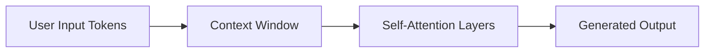
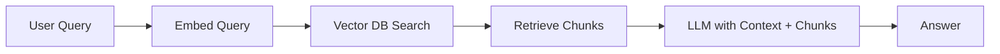
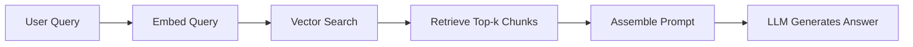
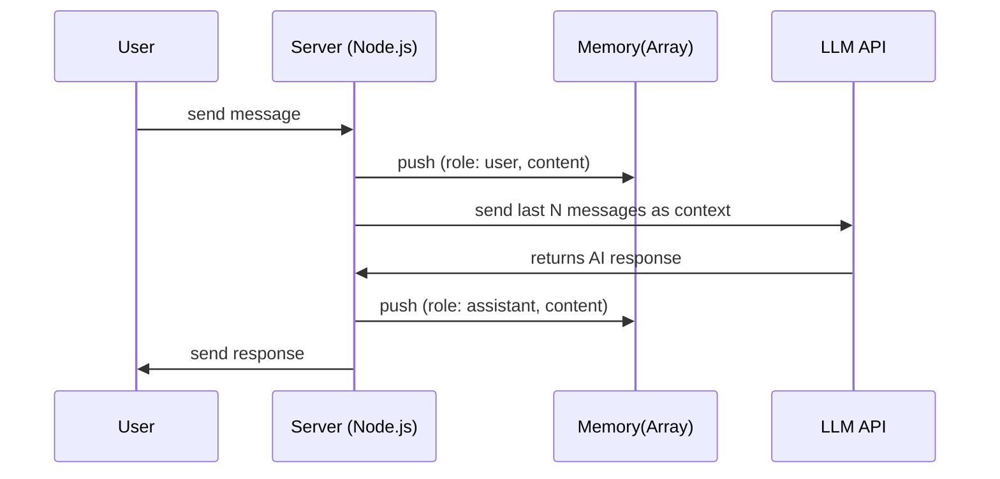
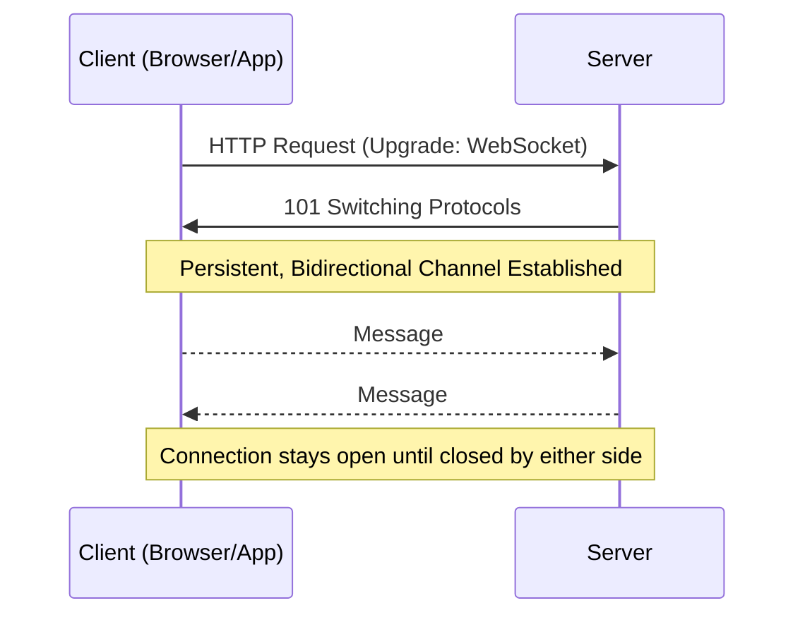
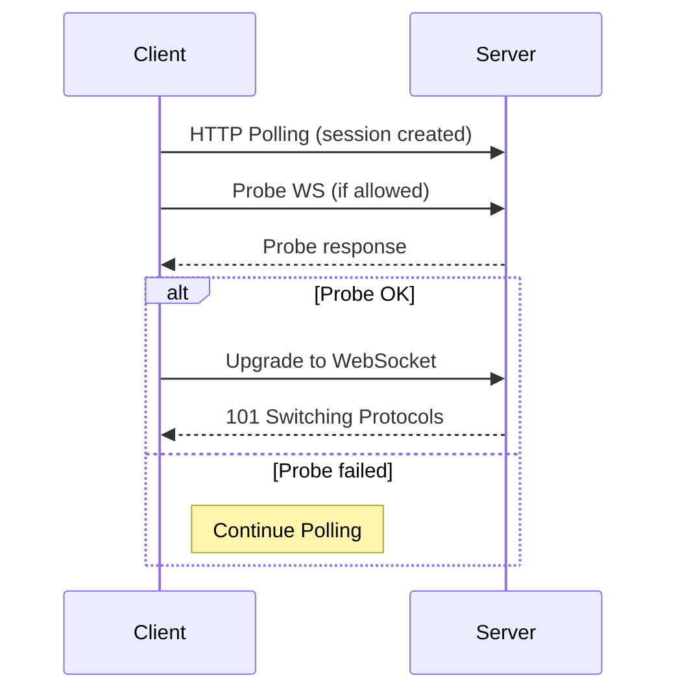

# **What is an LLM? (Large Language Model)**

A Large Language Model is a type of artificial neural network designed to understand and generate human language. It is trained on massive datasets containing books, articles, code, conversations, and more. During training, the model learns **patterns of language**, relationships between words, grammar structures, factual associations, and reasoning patterns. It works by converting text into **tokens**, transforming tokens into **embeddings** (vectors of numbers), and passing those embeddings through layers of **self-attention** where the model weighs how much each part of the input should influence the output. By repeatedly predicting the next token, the model gradually learns how to answer questions, write passages, translate languages, summarize information, or follow instructions. An LLM doesn’t “understand” like a human; instead, it learns extremely complex statistical representations of text, which create the illusion of understanding.

---

# **Memories in AI (LLM Memory Systems)**

## **1) Short-Term Memory — The Context Window**

This is the temporary memory an LLM uses during a single interaction. Everything you type in the prompt — plus any retrieved documents — stays inside the model’s **context window**. The transformer architecture allows the model to compute relationships between tokens using **self-attention**, meaning it can connect ideas across the window. Once the conversation moves on or the window is full, older information gets dropped. Short-term memory is fast, cheap, and gives immediate reasoning ability, but it cannot be stored permanently.

### **Mermaid.js Diagram — Short-Term Memory**



---

## **2) Long-Term Memory — Learned in Model Weights**

Long-term memory is encoded in the LLM’s **parameters** after training on massive datasets. These weights store facts, language rules, world knowledge, and reasoning patterns. When the model is used, it retrieves this built-in knowledge automatically without external lookup. This memory is stable but **not easily updated**; changing it requires fine-tuning or retraining. Because weights compress huge datasets into mathematical relationships, the memory is dense, distributed, and not directly interpretable by humans.

### **ASCII Diagram — Long-Term Memory**

```
           +-------------------+
           |  Model Weights    |
           | (Stored Knowledge)|
           +---------+---------+
                     |
                     v
              Used During Output
```

---

## **3) Retrieval-Augmented Memory (External Memory / RAG)**

This memory sits **outside** the LLM. When the model needs information it doesn’t have — such as recent documents, personal notes, or updates — a retrieval system searches a **vector database**. Each document is converted into an embedding, stored, and fetched when the user asks something relevant. This extends the LLM’s ability without altering its weights. It also allows the system to remain accurate on knowledge **after** the model’s training date. Retrieval memory is searchable, updatable, and modular.

### **Mermaid.js Diagram — Retrieval Memory**



---

## **4) Specialized Memory Modules (Neural Memory Systems)**

Some AI systems use explicit memory mechanisms such as **Key-Value Memory**, **Memory Networks**, **Neural Turing Machines (NTM)**, or **Differentiable Neural Computers (DNC)**. These structures allow the model to **write** and **read** memory slots during computation. They work like a digital notebook the neural network can edit. While not common in consumer chatbots, these architectures are important in research for algorithmic reasoning, planning, and long sequences.

### **ASCII Diagram — Specialized Memory**

```
+----------+       read/write       +-----------+
|  LLM     | <--------------------> | Memory    |
| Processor|                        | Slots     |
+----------+                        +-----------+
```

---

## **5) Episodic vs Semantic vs Procedural Memory (Human-Inspired Mapping)**

LLMs do not have human memories, but we map concepts for clarity:

* **Semantic memory** → knowledge in weights (facts, language rules).
* **Episodic memory** → previous interactions stored externally (conversation logs, RAG).
* **Procedural memory** → learned abilities (reasoning style, coding patterns).

LLMs simulate these memory types through architectures and training strategies rather than biological processes.

---

## **6) Memory Limits and Failure Modes**

Memory in LLMs is limited by context window size. When the window overflows, older tokens are forgotten. Long-term memory can become outdated because model weights cannot update themselves. Retrieval memory may return irrelevant documents if embeddings or chunking are poor. Specialized memory modules can be hard to train. Overall, memory failures cause hallucinations, loss of context, or outdated answers.

---

## **7) One Combined Big Picture Diagram**

### **Mermaid.js — Full Memory Ecosystem**

```mermaid
flowchart TD
A[User Input] --> B[Context Window (Short-Term)]
A --> C[Query Embedder]
C --> D[Vector DB (External Memory)]
D --> E[Retrieved Context]
B --> F[LLM Core Processor]
E --> F
F --> G[Output]

subgraph LLM Weights
H[Long-Term Knowledge]
end
H --> F
```

---

# **What is RAG? (Retrieval-Augmented Generation)**

RAG is an AI technique where a language model generates answers **using both** its built-in knowledge **and** **retrieved external information**. Instead of relying only on the model’s training data, RAG fetches relevant documents from a **vector database** or search engine and injects them into the model’s context window. This allows the system to stay updated, accurate, and grounded in real data without needing to retrain the LLM. The core idea: *retrieve first, generate second*. The LLM becomes less of a memory store and more of a reasoning engine over retrieved evidence.

---

# **Why RAG Exists (Core Purpose)**

LLMs have two major limitations:

1. They cannot store unlimited knowledge in their weights.
2. Their knowledge becomes outdated after training.

RAG fixes both by giving the model on-demand memory access. Instead of storing everything inside the LLM, we store knowledge externally and allow the model to **pull** what it needs.

---

# **How RAG Works — Step-by-Step**

1. **User asks a question.**
2. Question is converted into an **embedding** (vector representation).
3. The vector is used to search a **vector DB** for semantically similar chunks.
4. The retrieved chunks (documents, paragraphs, facts) are inserted into the model’s context window.
5. The LLM reads the question + retrieved information and generates an answer based on evidence.

This pipeline is simple but extremely powerful because it gives the LLM a live memory system.

---

# **Mermaid.js — Core RAG Flow**



---

# **Types of RAG**

## **1) Naive RAG (Basic RAG)**

This is the simplest form.

* Convert documents into embeddings
* Store them in a vector DB
* At query time, do a semantic search
* Return the top-k results
* Feed them into the model

Strength: easy to build
Weakness: can return irrelevant or noisy results

---

## **2) Chunk-Based RAG**

Large documents are split into smaller “chunks” (paragraphs, sections).
Each chunk is embedded individually.
This increases retrieval accuracy because the system finds *specific* passages.

---

## **3) Advanced RAG (Multi-Step / Multi-Hop)**

For complex questions requiring reasoning across multiple pieces of information:

* The system performs **multiple retrieval rounds**
* It may query with follow-up questions
* It combines information from different chunks

Used in research and advanced search tools.

---

## **4) Reranker-Enhanced RAG**

After the initial retrieval, a reranking model scores the relevance of each document.
Only the most relevant ones are sent to the LLM.
This improves accuracy dramatically.

---

## **5) Structured RAG**

Instead of retrieving plain text, the system retrieves structured data:

* APIs
* SQL rows
* JSON objects
* Knowledge graphs

This helps the LLM produce precise, consistent answers.

---

## **6) Agentic RAG**

The LLM acts as an **agent** that decides:

* Which queries to search
* How many times to retrieve
* How to refine its questions

It creates a loop: think → search → think → search → answer.

---

# **ASCII Summary Diagram**

```
User Query
     |
 [Embedder]
     v
[Vector DB] ---> Top-k Chunks
     |                |
     v                v
  Retrieval --> Inject into Prompt
                     |
                     v
                 [LLM Answer]
```

---

# **Core Components of a RAG System**

## **1) Embedding Model**

Turns text into dense vectors that capture meaning.
Higher-quality embeddings → better retrieval accuracy.

## **2) Vector Database**

Stores vectors and allows fast similarity search.
Examples: FAISS, Milvus, Pinecone, Chroma.

## **3) Chunking Strategy**

Documents must be split into manageable pieces (200–500 tokens).
Bad chunking = poor answers.

## **4) Prompt Formatting**

Retrieved chunks must be added cleanly inside the prompt, usually like:
“Here are relevant documents: … Now answer: …”

## **5) LLM Processing**

The model uses both the question and the retrieved evidence to answer.

---

# **Why RAG Works So Well**

It reduces hallucinations by grounding answers in real text.
It keeps the system updated without retraining the LLM.
It gives AI access to private, domain-specific data.
It makes responses explainable (“source-based answers”).

---

# **Limitations of RAG**

* Retrieval may bring irrelevant or outdated chunks
* Chunking mistakes lead to incomplete information
* LLM may ignore retrieved data if the prompt is poorly structured
* Embedding quality varies by model

---

# **When to Use RAG**

* When you need **current information**
* When you need **domain-specific knowledge**
* When responses must be **grounded in real documents**
* When fine-tuning is too expensive or unnecessary

---


1. **Everything about short-term memory in chatbots**
2. **Exactly the necessary Node.js structures, routes, file relations, and integration flow**
3. **No full application code, only essential snippets + architecture**
4. **Mermaid + ASCII diagrams included**
5. **Beginner-friendly but research-oriented explanation**

---

# ✅ **SHORT-TERM MEMORY IN A CHATBOT (LLM SYSTEMS)**

## **1) What Short-Term Memory Actually Is**

Short-term memory in a chatbot refers to the **temporary context** the model uses during a single conversation session. It is not stored permanently and disappears when:

* the user closes the session,
* you clear the memory array,
* the session expires,
* the chat resets.

It is implemented by **feeding the conversation history back into the LLM** every time the user sends a message.
The LLM does not “remember”; **you supply the memory manually**.

Short-term memory = **an array/list of messages** stored *in RAM* or *in-memory cache*.

---

## **2) Why Short-Term Memory Is Needed**

Without short-term memory, every user message is treated as a NEW message with no context.
With short-term memory:

* The bot remembers the last few user queries
* Maintains conversational coherence
* Handles follow-up questions
* Preserves tone, references, corrections

However:

* It has a **token limit** (model’s context window).
* It must be **summarized or truncated** when it becomes too long.

---

## **3) How Short-Term Memory Flows in a Chatbot**

**Flow:**

1. User sends a message
2. Server stores this message in a **session memory array**
3. Server builds a prompt using the last N messages
4. Server calls the LLM with that history
5. LLM responds
6. Server adds the LLM response to the memory array
7. Send response back to user

---

## **4) Mermaid.js — Short-Term Memory Flow**



---

# ✅ **NODE.JS ARCHITECTURE FOR SHORT-TERM MEMORY**

# **Project Structure**

```
/chatbot
  /routes
     chat.route.js
  /controllers
     chat.controller.js
  /services
     llm.service.js
  /memory
     sessionMemory.js
  app.js
```

Each file has ONLY the necessary logic — no full code.

---

# ✅ **1) sessionMemory.js (stores short-term memory)**

```js
// sessionMemory.js
const memory = new Map(); 
// key: sessionId, value: array of messages

function getSessionMemory(sessionId) {
    if (!memory.has(sessionId)) memory.set(sessionId, []);
    return memory.get(sessionId);
}

function addToMemory(sessionId, role, content) {
    const session = getSessionMemory(sessionId);
    session.push({ role, content });

    // Optional: limit memory to last 10 messages
    if (session.length > 10) session.shift();
}

module.exports = { getSessionMemory, addToMemory };
```

This file handles **short-term memory**.
Each user/session gets its own temporary memory array.

---

# ✅ **2) llm.service.js (calls the AI API with memory)**

```js
const axios = require("axios");

async function generateReply(messages) {
    const response = await axios.post("https://api.openai.com/v1/chat/completions", {
        model: "gpt-4o-mini",
        messages: messages
    },
    {
        headers: { Authorization: `Bearer ${process.env.OPENAI_KEY}` }
    });

    return response.data.choices[0].message.content;
}

module.exports = { generateReply };
```

Receives **messages[]** from memory + current user input.

---

# ✅ **3) chat.controller.js (core logic connecting memory + LLM)**

```js
const { getSessionMemory, addToMemory } = require("../memory/sessionMemory");
const { generateReply } = require("../services/llm.service");

exports.chat = async (req, res) => {
    const { sessionId, message } = req.body;

    addToMemory(sessionId, "user", message);

    const memory = getSessionMemory(sessionId);

    const reply = await generateReply(memory);

    addToMemory(sessionId, "assistant", reply);

    return res.json({ reply });
};
```

This file handles:

* receiving input
* updating short-term memory
* sending memory to LLM
* adding LLM output back to memory

---

# ✅ **4) chat.route.js (route setup)**

```js
const router = require("express").Router();
const { chat } = require("../controllers/chat.controller");

router.post("/chat", chat);

module.exports = router;
```

---

# ✅ **5) app.js (main server)**

```js
const express = require("express");
const app = express();

app.use(express.json());
app.use("/api", require("./routes/chat.route"));

app.listen(3000, () => console.log("Chatbot running..."));
```

---

# **ASCII Diagram — File Relationship**

```
User
  |
  v
/chat (POST)
  |
  v
chat.controller.js
  |        \
  |         \
memory <---> llm.service
  |
  |
response -> User
```

---

# **HOW ALL FILES WORK TOGETHER**

1. **User sends message → /chat route**
2. `chat.controller.js` receives it
3. Controller updates **short-term memory array** in `sessionMemory.js`
4. Controller sends **entire memory** to `llm.service.js`
5. LLM responds
6. Controller stores LLM response in memory
7. Controller returns AI answer to user

Short-term memory lives **only in sessionMemory.js**, nowhere else.

---

# **OPTIONAL UPGRADES FOR SHORT-TERM MEMORY**

* Limit memory to last N messages
* Auto-summarize old memory
* Use Redis instead of Map (for multi-user scalable apps)
* Implement session expiration

---


# ✅ **WHAT IS A WEB SOCKET? (Proper Definition)**

A **WebSocket** is a communication protocol that creates a **persistent, bi-directional, full-duplex connection** between a client (usually browser/app) and a server.
Unlike HTTP — where the client must send a request for every piece of data — a WebSocket keeps the connection open so **both** the client and the server can send messages to each other **at any time**, without repeated handshakes.

This makes WebSockets ideal for **real-time applications** such as chat apps, multiplayer games, live dashboards, trading platforms, and IoT systems.

---

# 📘 **Main Concept of WebSockets — In One Paragraph**

The main concept is: after one initial HTTP handshake, the connection “upgrades” to a WebSocket, which becomes a **continuous channel**. From that moment, communication is **instant**, **event-driven**, and **stateful**. The server doesn’t wait for requests — it can push updates whenever they happen. The client doesn’t need to reconnect for every message. This dramatically reduces latency and makes real-time communication smooth.

---

# 🧠 **Mermaid Diagram — WebSocket Lifecycle**



---

# 🟦 **ASCII Diagram — How WebSockets Differ from HTTP**

```
HTTP (Request/Response):
Client ---> Server : Request
Client <--- Server : Response
(Ends immediately)

WebSocket (Persistent Channel):
Client ========OPEN CHANNEL======== Server
      <------ Messages Both Ways ------>
```

---

# 🔄 **Bidirectional Communication**

Both client and server can **send messages anytime** without waiting for each other.
Examples:

* Server → Client: “New chat message arrived”
* Client → Server: “User is typing…”

HTTP cannot do this without hacks like long polling.

---

# ♾ **Persistent Connection**

After the handshake, the connection stays open until:

* client disconnects
* server disconnects
* network breaks
* heartbeat/ping fails
* server restarts
* idle timeout kills the connection

No repeated handshakes → **low overhead** → faster messaging.

---

# ⚡ **Real-Time Communication**

Because the connection is always open, events can be delivered instantly.
This is how:

* WhatsApp Web
* Trading websites
* Live dashboards
* Multiplayer games

achieve real-time behavior.

---

# ⚡ **Lower Latency: Why WebSockets Are Faster**

Latency is reduced because:

1. No repeated HTTP handshakes
2. No TCP reconnect overhead
3. No HTTP headers for every message
4. Messages are small and event-driven
5. Communication flows both ways immediately

Typical latency: **< 10ms** for local networks.

---

# 📉 **When WebSockets Go Down (Failure Scenarios)**

A WebSocket connection breaks when:

* WiFi/mobile network switches
* Internet momentarily drops
* Server load balancer closes idle connections
* Heartbeat/ping-pong timeout
* Server restarts
* Browser tab sleeps
* Firewall kills long connections

WebSocket clients usually **auto-reconnect** to solve this.

---

# 🏢 **What Big Tech Companies Use Instead of Plain WebSockets**

Most big companies **don’t use raw WebSockets directly** — they use **higher-level real-time frameworks** built **on top of WebSockets**, because they offer reliability, scaling, fallback protocols, and load balancing.

---

## **1) Netflix**

Uses **WebSockets + Server-Sent Events + Custom TCP** depending on features.
Their real-time telemetry uses **WS** internally.

---

## **2) WhatsApp Web (Meta)**

Uses **WebSocket-based binary protocol** for real-time message sync.

---

## **3) Discord**

Massive real-time system built on **WebSockets** with heartbeat, resume tokens, and sharding for scale.

---

## **4) Slack**

Uses WebSockets for message delivery ("RTM API").

---

## **5) Binance / Coinbase / Stock Exchanges**

Use **WebSockets** for market feeds (extremely low latency).

---

## **6) YouTube Live / Twitch**

Use combinations of WebSockets + WebRTC for real-time chat & low-latency streaming.

---

## **7) Games (Fortnite, PUBG, Roblox)**

Use **custom UDP protocols**, but WebSockets for cross-platform features.

---

## **8) Microsoft Azure / AWS**

Provide managed WebSocket services:

* **Amazon API Gateway WebSockets**
* **Azure Web PubSub**

---

# 🔧 **Popular WebSocket Libraries Used by Developers**

* **Socket.IO** (WebSocket + fallback + rooms + auto-reconnect)
* **ws** (pure WebSocket for Node.js)
* **uWebSockets.js** (ultra-fast WebSocket server)
* **SignalR (Microsoft)** (enterprise WebSocket abstraction)
* **Primus** (multi-protocol abstraction layer)

Big companies use **custom frameworks inspired by these**.

---

# Express + Socket.IO — Deep, exhaustive reference (theory, internals, production patterns, code snippets, diagrams)

---

## Core idea (one-line summary)

Socket.IO = an evented realtime engine built on top of transport layers (WebSocket primary, polling fallback) with features for reconnection, rooms/namespaces, ack callbacks, binary support, and scaling adapters — tightly pluggable into an Express HTTP server so REST + realtime coexist.

---

## Internal stack & components

* **HTTP server (Node)** — created from Express app (`http.createServer(app)`). Handles standard HTTP and upgrades.
* **Engine.IO** — transport layer used by Socket.IO. Manages low-level transports (polling, websocket), upgrade logic, ping/pong heartbeats, and reconnection state.
* **Socket.IO server** — builds on engine.io; provides higher-level features: events, namespaces, rooms, middleware, ack callbacks, broadcasting, binary transports.
* **Socket (server-side)** — per-connection object (`socket`) with `id`, `handshake`, `rooms`, `emit/on`, and methods `join/leave/broadcast`.
* **Client socket** — `io()` client library that handles reconnection/backoff, fallback transports, and event API.
* **Adapter** — module used for horizontal scaling (default: in-memory). For clusters use `socket.io-redis` adapter (or `@socket.io/redis-adapter`) to publish/subscribe events across nodes.

---

## Connection lifecycle (sequence)

```mermaid
sequenceDiagram
    participant C as Client Browser
    participant LB as Load Balancer
    participant S as HTTP Server + Express + Socket.IO
    C->>S: HTTP GET /socket.io/?EIO=4&transport=polling
    S->>C: HTTP 200 (polling transport established)
    C->>S: Poll with upgrades
    C->>S: WebSocket upgrade request (if supported)
    S->>C: 101 Switching Protocols (upgrade accepted)
    Note over C,S: Engine.IO handles ping/pong, upgrade, session id
    C->>S: socket.io "connect" event
    S->>C: handshake completed (socket object created)
    C<->S: bidirectional events (emit/on)
```

---

## Transport strategy & fallback (how it works)

* **Initial transport** is often XHR-polling (HTTP long-poll). Client sends polling request; server replies asynchronously.
* **Upgrade**: once the WebSocket handshake is possible, Engine.IO performs upgrade (probe + switch). After successful upgrade, polling stops and WebSocket is used.
* **Fallbacks**: if WebSocket fails due to proxies/firewalls, Socket.IO continues with polling. This guarantees connectivity across restrictive networks.
* **Why necessary**: many corporate networks block raw WebSocket or terminate long-lived TCP; fallback ensures resilient connectivity.

---

## Ping / Pong (heartbeats)

* Engine.IO sends periodic pings; client must reply (`pong`). If pongs stop, server marks socket as disconnected and triggers reconnection logic on client. Default intervals/timeouts configurable (`pingInterval`, `pingTimeout`).

---

## Namespaces vs Rooms

* **Namespace** (`io.of('/chat')`): logical separation — different connection endpoints with their own middleware/events. Useful to split domain logic (e.g., `/notifications`, `/game`).
* **Room** (`socket.join('room-123')`): grouping inside a namespace for targeted broadcasting. A socket can join multiple rooms. Rooms are ephemeral, exist only in-memory unless adapter replicates them.

---

## Acknowledgements (acks) & Binary support

* **Acks**: when emitting, you can pass a callback as the last argument; server calls it when done (`socket.emit('event', data, (response) => {})`). Guarantees request/response semantics over events.
* **Binary**: Socket.IO supports binary payloads (ArrayBuffers, Buffers, Blobs) — it automatically switches to binary frames when needed.

---

## Middleware & Authentication

* **Server-side middleware** runs on handshake: `io.use((socket, next) => { /* validate */ next(); })`. Use to authenticate JWT/cookies. `socket.handshake` contains headers, auth info, and cookies.
* **Sharing Express session**: store sessions in a shared store (Redis) and access sessionId from cookies in `socket.handshake.headers.cookie` (parse with `cookie` or `cookie-parser`) then fetch session data from store.
* **Example (JWT auth in handshake)**:

```js
io.use((socket, next) => {
  const token = socket.handshake.auth?.token;
  if (!token) return next(new Error("Auth error"));
  try {
    const user = jwt.verify(token, process.env.JWT_SECRET);
    socket.user = user;
    next();
  } catch (err) {
    next(new Error("Auth error"));
  }
});
```

---

## Example: Express + Socket.IO integration (robust pattern)

```js
const express = require('express');
const http = require('http');
const { createServer } = http;
const { Server } = require('socket.io');
const cookie = require('cookie');
const jwt = require('jsonwebtoken');

const app = express();
const httpServer = createServer(app);
const io = new Server(httpServer, {
  cors: { origin: 'https://yourdomain.com', methods: ['GET','POST'] },
  pingInterval: 25000,
  pingTimeout: 60000,
  maxHttpBufferSize: 1e6 // limit payload
});

// Handshake auth example (JWT)
io.use((socket, next) => {
  const rawCookie = socket.handshake.headers.cookie;
  // custom: token could be in auth or cookie
  const token = socket.handshake.auth?.token || (rawCookie && cookie.parse(rawCookie).token);
  if (!token) return next(new Error('Auth error'));
  try {
    const user = jwt.verify(token, process.env.JWT_SECRET);
    socket.user = user;
    next();
  } catch (e) {
    next(new Error('Auth error'));
  }
});

io.on('connection', (socket) => {
  // ready: socket.user available
  socket.join(`user:${socket.user.id}`);
  socket.on('msg', (payload, ack) => {
    // handle message; ack optional
    ack?.({ status: 'ok' });
  });
});
httpServer.listen(3000);
```

---

## Client-side connection & reconnection options

```js
import { io } from "socket.io-client";
const socket = io("https://api.yourdomain.com", {
  transports: ["websocket", "polling"],
  reconnection: true,
  reconnectionAttempts: 10,
  reconnectionDelay: 1000,
  reconnectionDelayMax: 5000,
  auth: { token: YOUR_JWT }
});
socket.on("connect", () => console.log(socket.id));
socket.on("connect_error", (err) => console.error(err));
```

* **reconnectionDelayMax** and **randomization** produce jitter to avoid thundering herd.

---

## Rooms & Broadcasting patterns

* `io.to(room).emit('event', data)` → send to everyone in room.
* `socket.to(room).emit('event', data)` → send to everyone except sender.
* `socket.broadcast.emit('event', data)` → broadcast to all except sender.
* **Efficient pattern**: minimize broadcast scope (target rooms) to reduce network and CPU overhead.

---

## Scaling: clustering, adapters, and sticky sessions

* **Problem**: multiple Node instances each hold in-memory sockets. Broadcasting to a room must reach sockets on all nodes.
* **Solution**: use an adapter (Redis adapter) — it uses Pub/Sub to propagate events across nodes.

### Redis Adapter Example

```js
const { createAdapter } = require("@socket.io/redis-adapter");
const { createClient } = require("redis");
const pubClient = createClient({ url: "redis://..."});
const subClient = pubClient.duplicate();
await pubClient.connect(); await subClient.connect();
io.adapter(createAdapter(pubClient, subClient));
```

### Sticky sessions / Load balancer

* For the initial WebSocket upgrade, the handshake must route to the same node for subsequent connection frames (unless adapter used for resuming). Usually configure LB with **session affinity** (sticky) or use a proxy that supports WebSockets (Nginx, ELB with sticky). Without sticky, reconnections might land on different servers and require token/session validation.

### Architecture diagram (scale)

```mermaid
flowchart LR
  Client1 --> LB[Load Balancer]
  Client2 --> LB
  LB --> NodeA[Node A (Socket.IO)]
  LB --> NodeB[Node B (Socket.IO)]
  NodeA <--> Redis[Redis Pub/Sub]
  NodeB <--> Redis
```

ASCII:

```
Client1  -> LB -> NodeA -> Redis
Client2  -> LB -> NodeB -> Redis
Broadcast from NodeA -> Redis -> NodeB -> deliver
```

---

## Load balancer & proxy notes (Nginx, AWS ALB)

* Use `proxy_set_header Upgrade $http_upgrade; proxy_set_header Connection "Upgrade";` for Nginx.
* For AWS ALB, enable **TCP** or HTTP/1.1 with sticky sessions that support WebSocket.
* Timeouts: increase proxy timeouts (to avoid idle socket close): `proxy_read_timeout`, `proxy_send_timeout`, `keepalive_timeout`.
* TLS termination: often at LB; ensure `ws` vs `wss` configured correctly.

---

## Message durability, ordering, and QoS

* Socket.IO does not provide guaranteed delivery semantics beyond connection acknowledgement and ack callbacks.
* Ordering: messages over a single socket are ordered. Across nodes with adapter and Pub/Sub, ordering is best-effort and can interleave; design for idempotency.
* QoS: implement application-level retries and deduplication (message IDs, idempotency tokens) for crucial operations (payments, critical commands).

---

## Backpressure & rate-limiting

* High-frequency events can overwhelm server or network. Implement:

  * Client-side throttling/debouncing (e.g., typing events).
  * Server-side rate-limiting per-socket (count events per second).
  * Drop or sample low-value events.
* Use `maxHttpBufferSize` to limit size of inbound payloads.

---

## Persistence and session integration

* If you need to persist chat history, store every message to DB (Mongo/Postgres) upon reception; short-term memory (in-memory) for context plus persisted store for long-term.
* For auth/session sharing: store sessions in Redis (connect-redis) and read session inside handshake to authorize socket.

---

## Security considerations

* **Auth**: never accept unauthenticated sockets; validate tokens in handshake.
* **CSRF/XSS**: token-based auth (JWT) preferred for sockets; cookies require CSRF protection in HTTP endpoints.
* **Injection**: avoid eval’ing socket payloads; sanitize input.
* **Access control**: validate user-room membership on every join/emit.
* **Rate-limiting**: prevent DoS from a single socket.
* **Transport security**: use TLS (wss).
* **Resource limits**: limit simultaneous connections per user/IP, enforce max rooms/sockets per user.

---

## Observability & monitoring

* Track metrics: active connections, events/sec, avg latency, reconnection rate, failed connections, dropped messages.
* Integrate with Prometheus/Grafana.
* Use logs: connect/disconnect reason (`socket.on('disconnect', (reason) => {})`), handshake errors.
* Health checks: monitor ping/pong timeouts; expose metrics endpoint.

---

## Practical patterns & anti-patterns

**Patterns**

* Use rooms for targeted broadcast (game rooms, chat rooms).
* Use namespaces to separate logic and enforce different auth rules.
* Use Redis adapter for multi-node scaling.
* Persist important events to DB immediately (append-only log).
* Use ack callbacks for confirmation of critical messages.

**Anti-patterns**

* Broadcasting globally without limits.
* Keeping huge in-memory message histories (memory leaks). Use sliding window + DB.
* Relying on single node in production (no redundancy).
* Storing sensitive info inside handshake without encryption.

---

## Example patterns: rooms, namespaces, ack, join/leave

```js
// namespace
const chat = io.of('/chat');
chat.use((socket, next) => { /* namespace auth */ next(); });

chat.on('connection', (socket) => {
  socket.on('joinRoom', (roomId, ack) => {
    // server-side room membership check (ACL)
    if (!allowed(socket.user, roomId)) return ack({error: 'forbidden'});
    socket.join(roomId);
    ack({ok: true});
    chat.to(roomId).emit('userJoined', {userId: socket.user.id});
  });

  socket.on('sendMessage', async ({roomId, text}, ack) => {
    // save to DB
    const msg = await saveMessage({roomId, userId: socket.user.id, text});
    // broadcast with msgId for dedupe
    chat.to(roomId).emit('message', msg);
    ack({status: 'sent', id: msg.id});
  });
});
```

---

## When to use Socket.IO vs alternatives

* **Socket.IO**: best for general realtime apps needing robust fallback, rooms/namespaces, reconnection, and simple scaling. Excellent developer ergonomics.
* **Raw WebSocket**: lower-level, less overhead, good if you control environment and don’t need fallback or extra features.
* **SSE (Server-Sent Events)**: uni-directional (server→client), simple, good for live feeds where client doesn’t need to push often.
* **WebRTC**: peer-to-peer, low-latency audio/video and large binary streams; uses signaling that can be implemented via Socket.IO.
* **Managed services**: AWS AppSync, Azure Web PubSub, Pusher — pick when you want managed scaling and less infra.

---

## Advanced: integrating with WebRTC (signalling example)

* Use Socket.IO for signaling (offer/answer/ICE candidates), then establish direct P2P WebRTC for media.

```js
socket.on('webrtc-offer', ({to, offer}) => {
  io.to(to).emit('webrtc-offer', { from: socket.id, offer });
});
```

---

## Debugging checklist

* Check handshake response and headers.
* Confirm `Upgrade` header and `Connection: Upgrade` in upgrade request.
* Inspect `socket.handshake` server-side for auth fields.
* Monitor ping/pong and reconnect events.
* Verify LB supports WebSocket and sticky sessions or use adapter.
* Use browser devtools > Network > WS frames to view messages.

---

## Diagrams

### WebSocket upgrade + engine.io probes



### Scaling with Redis adapter (message broadcast across nodes)

```mermaid
flowchart LR
  subgraph Clients
    C1[Client A] --> LB
    C2[Client B] --> LB
  end
  LB --> Node1
  LB --> Node2
  Node1 -->|emit('room')| RedisPubSub
  Node2 -->|sub| RedisPubSub
  RedisPubSub --> Node2
  Node2 --> ClientB
```

### ASCII: sticky sessions vs adapter

```
Without adapter:
ClientA -> LB -> Node1 (joins room)
ClientB -> LB -> Node2
Node1emit -> only Node1 sockets get it (ClientA)
=> missing ClientB

With Redis adapter:
Node1publish -> Redis -> Node2 -> Node2deliver to ClientB
```

---

## Production checklist (must-dos)

* Use HTTPS/WSS (TLS).
* Configure LB/proxy for WebSocket and sticky sessions or use adapter.
* Use Redis adapter for horizontal scaling.
* Authenticate in handshake and re-validate on sensitive actions.
* Persist important events to DB.
* Implement rate-limiting and max buffer sizes.
* Monitor metrics, logs, pings, and reconnection rates.
* Limit number of rooms per user and connection count per IP.
* Use token rotation and short-lived tokens where possible.

---

## Common pitfalls & mitigation

* **Connection storm on deploy**: clients reconnect simultaneously → use exponential backoff and random jitter.
* **Memory growth**: leak via references to sockets/rooms — audit `Map`s and caches.
* **Message duplication**: design idempotent handlers and dedupe by messageId.
* **Dropped messages during scaling**: ensure adapter configured and events are published reliably (Redis persistence optional).

---

## Useful libraries & tooling

* `socket.io` (server), `socket.io-client` (browser/node client).
* `@socket.io/redis-adapter` or `socket.io-redis` for scaling.
* `uWebSockets.js` (ultra-high performance alternative, but not socket.io-compatible).
* `Prometheus` / `Grafana` for metrics.
* `nginx` / `haproxy` / cloud LB for proxying.
* `pm2` / `kubernetes` for process management.

---

## Short sample checklist for implementing a robust Socket.IO service

1. Deploy Express + Socket.IO on HTTP server.
2. Authenticate via JWT in `io.use()`.
3. Store user session in Redis and read it in handshake if needed.
4. Use Redis adapter for multi-node pub/sub.
5. Configure LB for WebSocket upgrades or sticky sessions.
6. Harden: TLS, rate limits, input validation.
7. Persist messages/events to DB.
8. Monitor metrics & add alerting for high disconnect/reconnect rates.

---
