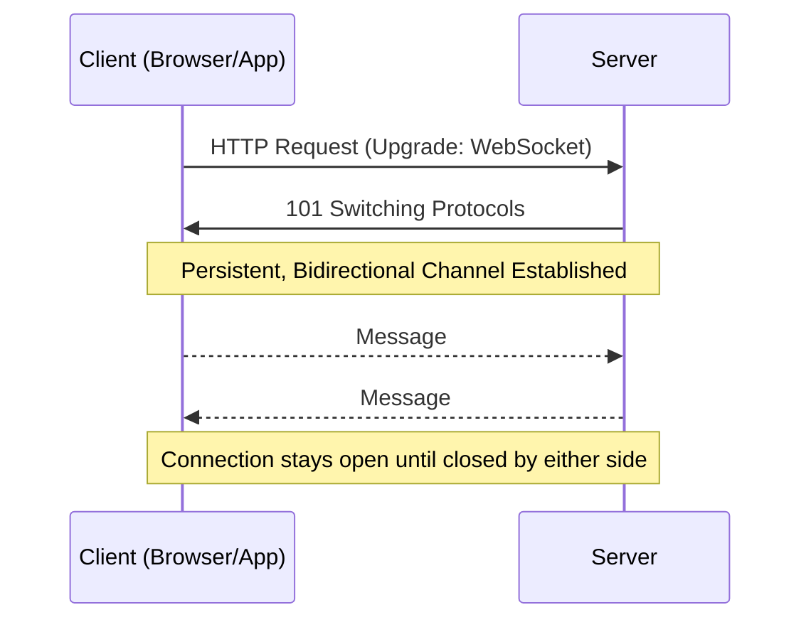
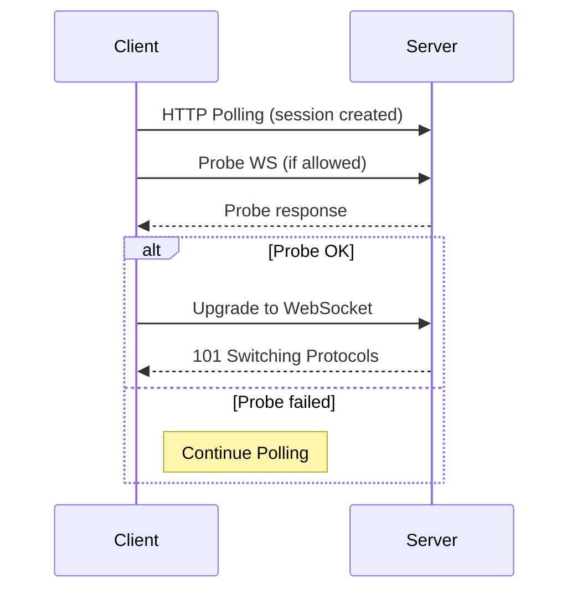
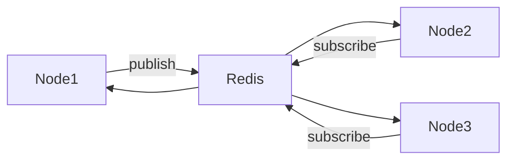

# ✅ **WHAT IS A WEB SOCKET? (Proper Definition)**

A **WebSocket** is a communication protocol that creates a **persistent, bi-directional, full-duplex connection** between a client (usually browser/app) and a server.
Unlike HTTP — where the client must send a request for every piece of data — a WebSocket keeps the connection open so **both** the client and the server can send messages to each other **at any time**, without repeated handshakes.

This makes WebSockets ideal for **real-time applications** such as chat apps, multiplayer games, live dashboards, trading platforms, and IoT systems.

---

# 📘 **Main Concept of WebSockets — In One Paragraph**

The main concept is: after one initial HTTP handshake, the connection “upgrades” to a WebSocket, which becomes a **continuous channel**. From that moment, communication is **instant**, **event-driven**, and **stateful**. The server doesn’t wait for requests — it can push updates whenever they happen. The client doesn’t need to reconnect for every message. This dramatically reduces latency and makes real-time communication smooth.

---

# 🧠 **Mermaid Diagram — WebSocket Lifecycle**



---

# 🟦 **ASCII Diagram — How WebSockets Differ from HTTP**

```
HTTP (Request/Response):
Client ---> Server : Request
Client <--- Server : Response
(Ends immediately)

WebSocket (Persistent Channel):
Client ========OPEN CHANNEL======== Server
      <------ Messages Both Ways ------>
```

---

# 🔄 **Bidirectional Communication**

Both client and server can **send messages anytime** without waiting for each other.
Examples:

* Server → Client: “New chat message arrived”
* Client → Server: “User is typing…”

HTTP cannot do this without hacks like long polling.

---

# ♾ **Persistent Connection**

After the handshake, the connection stays open until:

* client disconnects
* server disconnects
* network breaks
* heartbeat/ping fails
* server restarts
* idle timeout kills the connection

No repeated handshakes → **low overhead** → faster messaging.

---

# ⚡ **Real-Time Communication**

Because the connection is always open, events can be delivered instantly.
This is how:

* WhatsApp Web
* Trading websites
* Live dashboards
* Multiplayer games

achieve real-time behavior.

---

# ⚡ **Lower Latency: Why WebSockets Are Faster**

Latency is reduced because:

1. No repeated HTTP handshakes
2. No TCP reconnect overhead
3. No HTTP headers for every message
4. Messages are small and event-driven
5. Communication flows both ways immediately

Typical latency: **< 10ms** for local networks.

---

# 📉 **When WebSockets Go Down (Failure Scenarios)**

A WebSocket connection breaks when:

* WiFi/mobile network switches
* Internet momentarily drops
* Server load balancer closes idle connections
* Heartbeat/ping-pong timeout
* Server restarts
* Browser tab sleeps
* Firewall kills long connections

WebSocket clients usually **auto-reconnect** to solve this.

---

# 🏢 **What Big Tech Companies Use Instead of Plain WebSockets**

Most big companies **don’t use raw WebSockets directly** — they use **higher-level real-time frameworks** built **on top of WebSockets**, because they offer reliability, scaling, fallback protocols, and load balancing.

---

## **1) Netflix**

Uses **WebSockets + Server-Sent Events + Custom TCP** depending on features.
Their real-time telemetry uses **WS** internally.

---

## **2) WhatsApp Web (Meta)**

Uses **WebSocket-based binary protocol** for real-time message sync.

---

## **3) Discord**

Massive real-time system built on **WebSockets** with heartbeat, resume tokens, and sharding for scale.

---

## **4) Slack**

Uses WebSockets for message delivery ("RTM API").

---

## **5) Binance / Coinbase / Stock Exchanges**

Use **WebSockets** for market feeds (extremely low latency).

---

## **6) YouTube Live / Twitch**

Use combinations of WebSockets + WebRTC for real-time chat & low-latency streaming.

---

## **7) Games (Fortnite, PUBG, Roblox)**

Use **custom UDP protocols**, but WebSockets for cross-platform features.

---

## **8) Microsoft Azure / AWS**

Provide managed WebSocket services:

* **Amazon API Gateway WebSockets**
* **Azure Web PubSub**

---

# 🔧 **Popular WebSocket Libraries Used by Developers**

* **Socket.IO** (WebSocket + fallback + rooms + auto-reconnect)
* **ws** (pure WebSocket for Node.js)
* **uWebSockets.js** (ultra-fast WebSocket server)
* **SignalR (Microsoft)** (enterprise WebSocket abstraction)
* **Primus** (multi-protocol abstraction layer)

Big companies use **custom frameworks inspired by these**.

---

# Express + Socket.IO — Deep, exhaustive reference (theory, internals, production patterns, code snippets, diagrams)

---

## Core idea (one-line summary)

Socket.IO = an evented realtime engine built on top of transport layers (WebSocket primary, polling fallback) with features for reconnection, rooms/namespaces, ack callbacks, binary support, and scaling adapters — tightly pluggable into an Express HTTP server so REST + realtime coexist.

---

## Internal stack & components

* **HTTP server (Node)** — created from Express app (`http.createServer(app)`). Handles standard HTTP and upgrades.
* **Engine.IO** — transport layer used by Socket.IO. Manages low-level transports (polling, websocket), upgrade logic, ping/pong heartbeats, and reconnection state.
* **Socket.IO server** — builds on engine.io; provides higher-level features: events, namespaces, rooms, middleware, ack callbacks, broadcasting, binary transports.
* **Socket (server-side)** — per-connection object (`socket`) with `id`, `handshake`, `rooms`, `emit/on`, and methods `join/leave/broadcast`.
* **Client socket** — `io()` client library that handles reconnection/backoff, fallback transports, and event API.
* **Adapter** — module used for horizontal scaling (default: in-memory). For clusters use `socket.io-redis` adapter (or `@socket.io/redis-adapter`) to publish/subscribe events across nodes.

---

## Connection lifecycle (sequence)

```mermaid
sequenceDiagram
    participant C as Client Browser
    participant LB as Load Balancer
    participant S as HTTP Server + Express + Socket.IO
    C->>S: HTTP GET /socket.io/?EIO=4&transport=polling
    S->>C: HTTP 200 (polling transport established)
    C->>S: Poll with upgrades
    C->>S: WebSocket upgrade request (if supported)
    S->>C: 101 Switching Protocols (upgrade accepted)
    Note over C,S: Engine.IO handles ping/pong, upgrade, session id
    C->>S: socket.io "connect" event
    S->>C: handshake completed (socket object created)
    C<->S: bidirectional events (emit/on)
```

---

## Transport strategy & fallback (how it works)

* **Initial transport** is often XHR-polling (HTTP long-poll). Client sends polling request; server replies asynchronously.
* **Upgrade**: once the WebSocket handshake is possible, Engine.IO performs upgrade (probe + switch). After successful upgrade, polling stops and WebSocket is used.
* **Fallbacks**: if WebSocket fails due to proxies/firewalls, Socket.IO continues with polling. This guarantees connectivity across restrictive networks.
* **Why necessary**: many corporate networks block raw WebSocket or terminate long-lived TCP; fallback ensures resilient connectivity.

---

## Ping / Pong (heartbeats)

* Engine.IO sends periodic pings; client must reply (`pong`). If pongs stop, server marks socket as disconnected and triggers reconnection logic on client. Default intervals/timeouts configurable (`pingInterval`, `pingTimeout`).

---

## Namespaces vs Rooms

* **Namespace** (`io.of('/chat')`): logical separation — different connection endpoints with their own middleware/events. Useful to split domain logic (e.g., `/notifications`, `/game`).
* **Room** (`socket.join('room-123')`): grouping inside a namespace for targeted broadcasting. A socket can join multiple rooms. Rooms are ephemeral, exist only in-memory unless adapter replicates them.

---

## Acknowledgements (acks) & Binary support

* **Acks**: when emitting, you can pass a callback as the last argument; server calls it when done (`socket.emit('event', data, (response) => {})`). Guarantees request/response semantics over events.
* **Binary**: Socket.IO supports binary payloads (ArrayBuffers, Buffers, Blobs) — it automatically switches to binary frames when needed.

---

## Middleware & Authentication

* **Server-side middleware** runs on handshake: `io.use((socket, next) => { /* validate */ next(); })`. Use to authenticate JWT/cookies. `socket.handshake` contains headers, auth info, and cookies.
* **Sharing Express session**: store sessions in a shared store (Redis) and access sessionId from cookies in `socket.handshake.headers.cookie` (parse with `cookie` or `cookie-parser`) then fetch session data from store.
* **Example (JWT auth in handshake)**:

```js
io.use((socket, next) => {
  const token = socket.handshake.auth?.token;
  if (!token) return next(new Error("Auth error"));
  try {
    const user = jwt.verify(token, process.env.JWT_SECRET);
    socket.user = user;
    next();
  } catch (err) {
    next(new Error("Auth error"));
  }
});
```

---

## Example: Express + Socket.IO integration (robust pattern)

```js
const express = require('express');
const http = require('http');
const { createServer } = http;
const { Server } = require('socket.io');
const cookie = require('cookie');
const jwt = require('jsonwebtoken');

const app = express();
const httpServer = createServer(app);
const io = new Server(httpServer, {
  cors: { origin: 'https://yourdomain.com', methods: ['GET','POST'] },
  pingInterval: 25000,
  pingTimeout: 60000,
  maxHttpBufferSize: 1e6 // limit payload
});

// Handshake auth example (JWT)
io.use((socket, next) => {
  const rawCookie = socket.handshake.headers.cookie;
  // custom: token could be in auth or cookie
  const token = socket.handshake.auth?.token || (rawCookie && cookie.parse(rawCookie).token);
  if (!token) return next(new Error('Auth error'));
  try {
    const user = jwt.verify(token, process.env.JWT_SECRET);
    socket.user = user;
    next();
  } catch (e) {
    next(new Error('Auth error'));
  }
});

io.on('connection', (socket) => {
  // ready: socket.user available
  socket.join(`user:${socket.user.id}`);
  socket.on('msg', (payload, ack) => {
    // handle message; ack optional
    ack?.({ status: 'ok' });
  });
});
httpServer.listen(3000);
```

---

## Client-side connection & reconnection options

```js
import { io } from "socket.io-client";
const socket = io("https://api.yourdomain.com", {
  transports: ["websocket", "polling"],
  reconnection: true,
  reconnectionAttempts: 10,
  reconnectionDelay: 1000,
  reconnectionDelayMax: 5000,
  auth: { token: YOUR_JWT }
});
socket.on("connect", () => console.log(socket.id));
socket.on("connect_error", (err) => console.error(err));
```

* **reconnectionDelayMax** and **randomization** produce jitter to avoid thundering herd.

---

## Rooms & Broadcasting patterns

* `io.to(room).emit('event', data)` → send to everyone in room.
* `socket.to(room).emit('event', data)` → send to everyone except sender.
* `socket.broadcast.emit('event', data)` → broadcast to all except sender.
* **Efficient pattern**: minimize broadcast scope (target rooms) to reduce network and CPU overhead.

---

## Scaling: clustering, adapters, and sticky sessions

* **Problem**: multiple Node instances each hold in-memory sockets. Broadcasting to a room must reach sockets on all nodes.
* **Solution**: use an adapter (Redis adapter) — it uses Pub/Sub to propagate events across nodes.

### Redis Adapter Example

```js
const { createAdapter } = require("@socket.io/redis-adapter");
const { createClient } = require("redis");
const pubClient = createClient({ url: "redis://..."});
const subClient = pubClient.duplicate();
await pubClient.connect(); await subClient.connect();
io.adapter(createAdapter(pubClient, subClient));
```

### Sticky sessions / Load balancer

* For the initial WebSocket upgrade, the handshake must route to the same node for subsequent connection frames (unless adapter used for resuming). Usually configure LB with **session affinity** (sticky) or use a proxy that supports WebSockets (Nginx, ELB with sticky). Without sticky, reconnections might land on different servers and require token/session validation.

### Architecture diagram (scale)

```mermaid
flowchart LR
  Client1 --> LB[Load Balancer]
  Client2 --> LB
  LB --> NodeA[Node A (Socket.IO)]
  LB --> NodeB[Node B (Socket.IO)]
  NodeA <--> Redis[Redis Pub/Sub]
  NodeB <--> Redis
```

ASCII:

```
Client1  -> LB -> NodeA -> Redis
Client2  -> LB -> NodeB -> Redis
Broadcast from NodeA -> Redis -> NodeB -> deliver
```

---

## Load balancer & proxy notes (Nginx, AWS ALB)

* Use `proxy_set_header Upgrade $http_upgrade; proxy_set_header Connection "Upgrade";` for Nginx.
* For AWS ALB, enable **TCP** or HTTP/1.1 with sticky sessions that support WebSocket.
* Timeouts: increase proxy timeouts (to avoid idle socket close): `proxy_read_timeout`, `proxy_send_timeout`, `keepalive_timeout`.
* TLS termination: often at LB; ensure `ws` vs `wss` configured correctly.

---

## Message durability, ordering, and QoS

* Socket.IO does not provide guaranteed delivery semantics beyond connection acknowledgement and ack callbacks.
* Ordering: messages over a single socket are ordered. Across nodes with adapter and Pub/Sub, ordering is best-effort and can interleave; design for idempotency.
* QoS: implement application-level retries and deduplication (message IDs, idempotency tokens) for crucial operations (payments, critical commands).

---

## Backpressure & rate-limiting

* High-frequency events can overwhelm server or network. Implement:

  * Client-side throttling/debouncing (e.g., typing events).
  * Server-side rate-limiting per-socket (count events per second).
  * Drop or sample low-value events.
* Use `maxHttpBufferSize` to limit size of inbound payloads.

---

## Persistence and session integration

* If you need to persist chat history, store every message to DB (Mongo/Postgres) upon reception; short-term memory (in-memory) for context plus persisted store for long-term.
* For auth/session sharing: store sessions in Redis (connect-redis) and read session inside handshake to authorize socket.

---

## Security considerations

* **Auth**: never accept unauthenticated sockets; validate tokens in handshake.
* **CSRF/XSS**: token-based auth (JWT) preferred for sockets; cookies require CSRF protection in HTTP endpoints.
* **Injection**: avoid eval’ing socket payloads; sanitize input.
* **Access control**: validate user-room membership on every join/emit.
* **Rate-limiting**: prevent DoS from a single socket.
* **Transport security**: use TLS (wss).
* **Resource limits**: limit simultaneous connections per user/IP, enforce max rooms/sockets per user.

---

## Observability & monitoring

* Track metrics: active connections, events/sec, avg latency, reconnection rate, failed connections, dropped messages.
* Integrate with Prometheus/Grafana.
* Use logs: connect/disconnect reason (`socket.on('disconnect', (reason) => {})`), handshake errors.
* Health checks: monitor ping/pong timeouts; expose metrics endpoint.

---

## Practical patterns & anti-patterns

**Patterns**

* Use rooms for targeted broadcast (game rooms, chat rooms).
* Use namespaces to separate logic and enforce different auth rules.
* Use Redis adapter for multi-node scaling.
* Persist important events to DB immediately (append-only log).
* Use ack callbacks for confirmation of critical messages.

**Anti-patterns**

* Broadcasting globally without limits.
* Keeping huge in-memory message histories (memory leaks). Use sliding window + DB.
* Relying on single node in production (no redundancy).
* Storing sensitive info inside handshake without encryption.

---

## Example patterns: rooms, namespaces, ack, join/leave

```js
// namespace
const chat = io.of('/chat');
chat.use((socket, next) => { /* namespace auth */ next(); });

chat.on('connection', (socket) => {
  socket.on('joinRoom', (roomId, ack) => {
    // server-side room membership check (ACL)
    if (!allowed(socket.user, roomId)) return ack({error: 'forbidden'});
    socket.join(roomId);
    ack({ok: true});
    chat.to(roomId).emit('userJoined', {userId: socket.user.id});
  });

  socket.on('sendMessage', async ({roomId, text}, ack) => {
    // save to DB
    const msg = await saveMessage({roomId, userId: socket.user.id, text});
    // broadcast with msgId for dedupe
    chat.to(roomId).emit('message', msg);
    ack({status: 'sent', id: msg.id});
  });
});
```

---

## When to use Socket.IO vs alternatives

* **Socket.IO**: best for general realtime apps needing robust fallback, rooms/namespaces, reconnection, and simple scaling. Excellent developer ergonomics.
* **Raw WebSocket**: lower-level, less overhead, good if you control environment and don’t need fallback or extra features.
* **SSE (Server-Sent Events)**: uni-directional (server→client), simple, good for live feeds where client doesn’t need to push often.
* **WebRTC**: peer-to-peer, low-latency audio/video and large binary streams; uses signaling that can be implemented via Socket.IO.
* **Managed services**: AWS AppSync, Azure Web PubSub, Pusher — pick when you want managed scaling and less infra.

---

## Advanced: integrating with WebRTC (signalling example)

* Use Socket.IO for signaling (offer/answer/ICE candidates), then establish direct P2P WebRTC for media.

```js
socket.on('webrtc-offer', ({to, offer}) => {
  io.to(to).emit('webrtc-offer', { from: socket.id, offer });
});
```

---

## Debugging checklist

* Check handshake response and headers.
* Confirm `Upgrade` header and `Connection: Upgrade` in upgrade request.
* Inspect `socket.handshake` server-side for auth fields.
* Monitor ping/pong and reconnect events.
* Verify LB supports WebSocket and sticky sessions or use adapter.
* Use browser devtools > Network > WS frames to view messages.

---

## Diagrams

### WebSocket upgrade + engine.io probes



### Scaling with Redis adapter (message broadcast across nodes)

```mermaid
flowchart LR
  subgraph Clients
    C1[Client A] --> LB
    C2[Client B] --> LB
  end
  LB --> Node1
  LB --> Node2
  Node1 -->|emit('room')| RedisPubSub
  Node2 -->|sub| RedisPubSub
  RedisPubSub --> Node2
  Node2 --> ClientB
```

### ASCII: sticky sessions vs adapter

```
Without adapter:
ClientA -> LB -> Node1 (joins room)
ClientB -> LB -> Node2
Node1emit -> only Node1 sockets get it (ClientA)
=> missing ClientB

With Redis adapter:
Node1publish -> Redis -> Node2 -> Node2deliver to ClientB
```

---

## Production checklist (must-dos)

* Use HTTPS/WSS (TLS).
* Configure LB/proxy for WebSocket and sticky sessions or use adapter.
* Use Redis adapter for horizontal scaling.
* Authenticate in handshake and re-validate on sensitive actions.
* Persist important events to DB.
* Implement rate-limiting and max buffer sizes.
* Monitor metrics, logs, pings, and reconnection rates.
* Limit number of rooms per user and connection count per IP.
* Use token rotation and short-lived tokens where possible.

---

## Common pitfalls & mitigation

* **Connection storm on deploy**: clients reconnect simultaneously → use exponential backoff and random jitter.
* **Memory growth**: leak via references to sockets/rooms — audit `Map`s and caches.
* **Message duplication**: design idempotent handlers and dedupe by messageId.
* **Dropped messages during scaling**: ensure adapter configured and events are published reliably (Redis persistence optional).

---

## Useful libraries & tooling

* `socket.io` (server), `socket.io-client` (browser/node client).
* `@socket.io/redis-adapter` or `socket.io-redis` for scaling.
* `uWebSockets.js` (ultra-high performance alternative, but not socket.io-compatible).
* `Prometheus` / `Grafana` for metrics.
* `nginx` / `haproxy` / cloud LB for proxying.
* `pm2` / `kubernetes` for process management.

---

## Short sample checklist for implementing a robust Socket.IO service

1. Deploy Express + Socket.IO on HTTP server.
2. Authenticate via JWT in `io.use()`.
3. Store user session in Redis and read it in handshake if needed.
4. Use Redis adapter for multi-node pub/sub.
5. Configure LB for WebSocket upgrades or sticky sessions.
6. Harden: TLS, rate limits, input validation.
7. Persist messages/events to DB.
8. Monitor metrics & add alerting for high disconnect/reconnect rates.

---


## **1) `io` vs `socket` (core meaning)**

### **`io`**

* Represents the **Socket.IO server**
* Knows **ALL connected clients**
* Used for **broadcasting**, **global events**, **room events**
* Exists **once** per server

### **`socket`**

* Represents **ONE connected client**
* Created **per user connection**
* Used for **listening to that user** and **replying to that user**
* Has a **unique `socket.id`**

### **Mental picture**

```
io  = whole post office
socket = one letter / one customer
```

### **ASCII**

```
Clients
  |   |   |
  v   v   v
+------------------+
|        io        |   (server)
|  socket A        |
|  socket B        |
|  socket C        |
+------------------+
```

---

## **2) Event types in Socket.IO**

### **A) Built-in events (system events)**

These are fired automatically by Socket.IO.

| Event           | Where    | When it fires          |
| --------------- | -------- | ---------------------- |
| `connection`    | `io`     | A new client connects  |
| `disconnect`    | `socket` | Client disconnects     |
| `connect_error` | client   | Connection fails       |
| `reconnect`     | client   | Client reconnects      |
| `error`         | both     | Transport or app error |

#### Example

```js
io.on("connection", (socket) => {
  console.log("User connected:", socket.id);

  socket.on("disconnect", () => {
    console.log("User disconnected:", socket.id);
  });
});
```

---

### **B) Custom events (application events)**

These are **user-defined events**.
You decide:

* event name
* payload structure
* direction (client → server, server → client)

Examples:

* `"chat-message"`
* `"typing"`
* `"join-room"`
* `"order-update"`

---

## **3) `on()` vs `emit()` (absolute rules)**

### **`on(event, handler)`**

→ **LISTEN**
→ Waits for an event

### **`emit(event, data)`**

→ **SEND**
→ Triggers an event

---

## **4) Who uses `on` and `emit` and WHEN**

### **Client → Server**

**Client**

```js
socket.emit("chat-message", "hello");
```

**Server**

```js
socket.on("chat-message", (msg) => {
  console.log(msg);
});
```

📌 Use when:

* user sends message
* user clicks button
* user performs action

---

### **Server → Same Client**

```js
socket.emit("reply", "hi back");
```

📌 Use when:

* private reply
* confirmation
* personal notification

---

### **Server → All Clients**

```js
io.emit("announcement", "Server restarting");
```

📌 Use when:

* system-wide message
* broadcast event

---

### **Server → All EXCEPT Sender**

```js
socket.broadcast.emit("user-joined", socket.id);
```

📌 Use when:

* notify others
* exclude sender

---

### **Server → Room**

```js
io.to("room1").emit("message", msg);
```

📌 Use when:

* group chat
* game lobby
* live session

---

## **5) Rooms (important distinction)**

### Join room

```js
socket.join("room1");
```

### Send to room

```js
io.to("room1").emit("msg", data);
```

### Leave room

```js
socket.leave("room1");
```

Rooms are **server-side only**, clients don’t know rooms exist.

---

## **6) Full event flow (step-by-step)**

### Chat example

```
Client emits "send-msg"
      |
Server listens using socket.on()
      |
Server processes message
      |
Server emits "new-msg"
      |
Clients receive using socket.on()
```

### ASCII

```
Client A ----emit----> Server
Server ----emit----> Client B
Server ----emit----> Client C
```

---

## **7) Acknowledgement events (important)**

Used when confirmation is required.

```js
// client
socket.emit("save", data, (ack) => {
  console.log(ack.status);
});

// server
socket.on("save", (data, callback) => {
  callback({ status: "saved" });
});
```

📌 Use when:

* payment
* critical state change
* DB write confirmation

---

## **8) When to use WHAT (quick table)**

| Goal                      | Use                       |
| ------------------------- | ------------------------- |
| Listen for event          | `on()`                    |
| Send event                | `emit()`                  |
| Reply to same user        | `socket.emit()`           |
| Send to all users         | `io.emit()`               |
| Send to all except sender | `socket.broadcast.emit()` |
| Send to group             | `io.to(room)`             |

---

## **9) Common mistakes (very important)**

❌ Using `io.on("message")` instead of `socket.on`
❌ Emitting from client using `io.emit`
❌ Broadcasting sensitive data globally
❌ Forgetting rooms for scalability

---

## **10) Final mental model (lock this)**

```
io        → server-wide control
socket    → single user connection
on()      → listen
emit()    → send
built-in  → system lifecycle
custom    → app logic
```


## **1) What is an Adapter in Socket.IO**

An **adapter** is the **internal message-routing layer** of Socket.IO.

Its job is to:

* Track **which sockets are in which rooms**
* Deliver **events to the correct sockets**
* **Propagate events across servers** when the app is scaled

👉 In short:
**Adapter = “How messages reach the right users.”**

---

## **2) Why Adapters Exist (The Core Problem)**

### **Single server**

* All sockets live in one process
* Broadcasting is easy

### **Multiple servers (scaling)**

* Each server knows **only its own sockets**
* Without an adapter:

  * Room broadcasts break
  * Users miss messages

---

## **3) Default Adapter (In-Memory Adapter)**

### What it does

* Stores:

  * socket ↔ room mappings
* Lives **inside one Node.js process**

### Properties

| Feature              | Status |
| -------------------- | ------ |
| Fast                 | ✅      |
| Simple               | ✅      |
| Multi-server support | ❌      |
| Persistent           | ❌      |

### ASCII

```
Node Server
  ├─ socket A → room1
  ├─ socket B → room1
  └─ socket C → room2
```

📌 Works only for **single-instance apps**

---

## **4) What Breaks Without an Adapter in Scaling**

### Scenario

```
Client A → Node 1 → room1
Client B → Node 2 → room1
```

Node 1 emits:

```js
io.to("room1").emit("msg")
```

### Result (NO adapter)

* Client A receives
* Client B MISSES ❌

Because Node 1 doesn’t know about sockets on Node 2.

---

## **5) Redis Adapter (Most Common Production Adapter)**

### What it does

* Uses **Redis Pub/Sub**
* Synchronizes events across all servers

### Flow

1. Node 1 emits event
2. Adapter publishes event to Redis
3. Redis broadcasts to all nodes
4. Each node delivers to local sockets

---

### Mermaid — Redis Adapter Flow



---

### ASCII

```
Node1 emit -> Redis -> Node2 deliver
                  -> Node3 deliver
```

---

## **6) Redis Adapter Setup (Minimal)**

```js
const { createAdapter } = require("@socket.io/redis-adapter");
const { createClient } = require("redis");

const pubClient = createClient({ url: "redis://localhost:6379" });
const subClient = pubClient.duplicate();

await pubClient.connect();
await subClient.connect();

io.adapter(createAdapter(pubClient, subClient));
```

📌 After this:

* Rooms work globally
* Broadcasts work across servers

---

## **7) What the Adapter Actually Synchronizes**

| Thing             | Synced?        |
| ----------------- | -------------- |
| Room membership   | ✅              |
| Broadcast events  | ✅              |
| Socket IDs        | ❌ (local only) |
| In-memory data    | ❌              |
| Application state | ❌              |

👉 Adapter **does not** sync:

* your variables
* DB state
* user sessions

---

## **8) Adapter ≠ Load Balancer**

| Adapter            | Load Balancer        |
| ------------------ | -------------------- |
| Syncs sockets      | Routes traffic       |
| Message layer      | Network layer        |
| Pub/Sub            | HTTP/TCP             |
| Required for rooms | Required for scaling |

You usually need **both**.

---

## **9) Sticky Sessions vs Adapter**

### Sticky sessions only

* Client always hits same server
* Still fails on server crash ❌
* No cross-server broadcast

### Adapter only

* Broadcast works
* Reconnect may hit another node
* Needs auth re-validation

### Best practice

✔ Sticky sessions **+** Redis adapter

---

## **10) Other Adapter Types**

| Adapter          | Use case                 |
| ---------------- | ------------------------ |
| Redis adapter    | Standard production      |
| Mongo adapter    | Rare, slower             |
| Postgres adapter | Rare                     |
| Custom adapter   | Research / special infra |

Redis dominates due to **low latency**.

---

## **11) Failure modes**

| Issue            | Result                 |
| ---------------- | ---------------------- |
| Redis down       | Cross-node events stop |
| Network lag      | Message delay          |
| Pub/Sub overload | Event loss             |
| No adapter       | Partial delivery       |

📌 Critical apps add:

* Redis clustering
* Retry logic
* Message persistence (DB)

---

## **12) Mental model (lock this)**

```
Socket emits event
        |
     Adapter
        |
     Redis
        |
Other nodes
        |
Local sockets
```

---

## **13) One-line definition (interview-ready)**

> **A Socket.IO adapter is the internal message-distribution mechanism that enables room-based broadcasting and synchronization across multiple server instances, typically implemented using Redis Pub/Sub in production.**

---

# **1) Sticky Sessions vs Adapter (Deep Dive)**

## **Sticky Sessions (Session Affinity)**

**What it is**
Sticky sessions mean:
👉 once a client connects, the **load balancer always routes that client to the same server**.

### How it works

* Load balancer hashes:

  * IP
  * Cookie
  * Session ID
* Routes every request / WebSocket frame to **one fixed node**

### What sticky sessions solve

* Prevents socket jumping between servers
* Keeps in-memory state usable

### What sticky sessions DO NOT solve

* ❌ Cross-server broadcasts
* ❌ Server crash recovery
* ❌ Horizontal message synchronization

### Failure example

```
Client A -> Node 1 (sticky)
Client B -> Node 2 (sticky)

Node 1 emits to roomX
Client B misses the message ❌
```

---

## **Adapter (Redis Adapter)**

**What it is**
Adapter synchronizes **events and rooms across all servers**, regardless of where the client is connected.

### What adapter solves

* ✅ Cross-server broadcasting
* ✅ Room-wide delivery
* ✅ Multi-node chat consistency

### What adapter does NOT solve

* ❌ Initial routing
* ❌ Authentication
* ❌ Session persistence

---

## **Sticky vs Adapter — Truth Table**

| Feature              | Sticky Only | Adapter Only | Sticky + Adapter |
| -------------------- | ----------- | ------------ | ---------------- |
| Connection stability | ✅           | ❌            | ✅                |
| Room broadcast       | ❌           | ✅            | ✅                |
| Crash resilience     | ❌           | ⚠️           | ✅                |
| Horizontal scale     | ❌           | ✅            | ✅                |

### **Production rule**

> **Sticky sessions keep users stable. Adapters keep users synchronized.**

You need **both**.

---

# **2) Why Raw WebSockets Don’t Have Adapters**

## **Raw WebSocket reality**

Raw WebSocket (`ws`):

* Is **connection-based**
* Has **no concept of rooms**
* Has **no global socket registry**
* Has **no built-in broadcast**

### Raw WebSocket server

```js
wsServer.clients.forEach(client => {
  client.send(msg)
});
```

This only works:

* Inside **one process**
* On **one machine**

---

## **Why adapters are missing**

Adapters exist only because **Socket.IO abstracts connections**.

Raw WebSocket:

* Only knows TCP connections
* No logical grouping
* No server-wide message bus

👉 Therefore:

* **You must build adapters manually**
* Usually via Redis / Kafka / NATS

---

## **How people emulate adapters with raw WS**

```
WebSocket Server A -> Redis Pub/Sub -> Server B
```

But:

* You write everything yourself
* Error handling is harder
* Reconnection logic is manual
* No room abstraction

That’s why Socket.IO exists.

---

## **Key insight**

> **Adapters are not a WebSocket concept. They are a Socket.IO abstraction.**

---

# **3) How WhatsApp-Scale Systems Handle This**

WhatsApp **does NOT use Socket.IO** — but the principles are identical.

---

## **WhatsApp architecture (simplified)**

```
Client
  |
Edge Gateway (TLS, Auth)
  |
Connection Server (keeps socket)
  |
Message Broker (Kafka / Custom)
  |
Delivery Server
```

---

## **What replaces Adapter at WhatsApp scale**

| Socket.IO Concept | WhatsApp Equivalent    |
| ----------------- | ---------------------- |
| Socket            | Persistent TCP session |
| Adapter           | Message broker         |
| Redis Pub/Sub     | Kafka / custom queue   |
| Rooms             | Chat IDs / Group IDs   |

---

## **Message flow**

```
User A sends message
      |
Connection Server
      |
Publish to Broker
      |
All servers subscribed
      |
Deliver to recipients
```

---

## **Why Redis alone is not enough**

Redis Pub/Sub:

* No persistence
* Messages can be lost

WhatsApp uses:

* Persistent queues
* Delivery receipts
* Retry mechanisms
* Offline storage

---

## **Lesson**

> Socket.IO + Redis Adapter = **mini WhatsApp pattern**, simplified.

---

# **4) Adapter Internals (What Actually Happens Under the Hood)**

This is the **most important conceptual part**.

---

## **Internal responsibilities of an Adapter**

An adapter maintains:

```txt
room → socketIds
socketId → rooms
```

---

## **Emit flow (single node)**

```
io.to("room1").emit("msg")
   |
Adapter finds socketIds in room1
   |
Send to local sockets
```

---

## **Emit flow (multi-node with Redis adapter)**

```
Node A emits
   |
Adapter publishes event to Redis
   |
Redis broadcasts to all nodes
   |
Each node:
   - checks local sockets
   - delivers to matching ones
```

---

## **Why socket IDs are NOT global**

Socket IDs:

* Are **process-local**
* Cannot be shared meaningfully
* Only room names are global

That’s why:

```js
io.to(socketId) ❌ across servers
io.to(roomName) ✅ across servers
```

---

## **Critical rule**

> **Cross-node messaging must target ROOMS, not socket IDs.**

---

## **Adapter ≠ State Synchronizer**

Adapters DO NOT sync:

* Memory
* User objects
* Counters
* Game state

They sync **events only**.

---

## **ASCII mental model**

```
Socket.emit
   |
Adapter (local)
   |
Redis Pub/Sub
   |
Adapter (remote)
   |
Socket.receive
```

---

## **Why adapters are fast**

* Pub/Sub
* No DB writes
* No blocking
* Fire-and-forget

Latency: **milliseconds**

---

# **Final Lock-In Summary**

```
Sticky sessions = routing stability
Adapter = message synchronization
Raw WS = no adapter abstraction
Socket.IO = adapter built-in
WhatsApp = same idea, bigger tools
```

---
