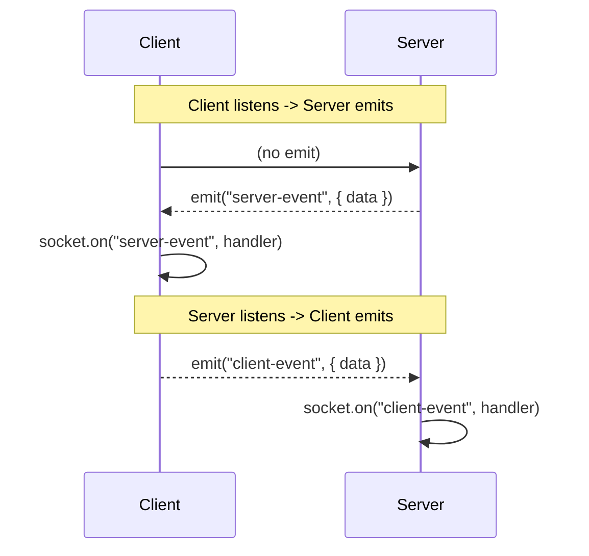
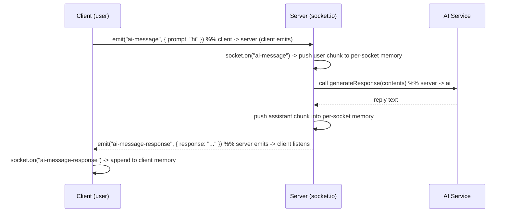

Good — clear, compact, and actionable. Below you get:

1. the **absolute rule** (one line)
2. two **diagrams** (mermaid) that show who emits vs who listens + full chat/AI flow
3. **payload rule** (who sends data)
4. **short-term memory** pattern for a single user (client-side) — rules and pitfalls
5. a **small React + socket.io-client example** that keeps per-user short-term memory for an AI chatbot (rendering + memory management)
6. a **minimal server snippet** showing the matching listeners/emits
7. a couple of **practical notes** (trimming, persistence, ack option)

No fluff.

---

### 1) Absolute rule

**Where `on()` is defined → the other side calls `emit()`; the emitter is the one that sends the data.**

---

### 2) Diagrams

#### A. Listener/Emitter simple diagram



#### B. Full AI-chat short-term-memory flow (client ↔ server ↔ AI)



---

### 3) Payload rule (exact)

When you call `emit(eventName, payload)` **the payload is sent by the emitter**. Common schemas:

* Client → Server: `{ prompt: string, meta?: {...} }`
* Server → Client: `{ response: string, sources?: [...], meta?: {...} }`

Example:

```js
socket.emit("ai-message", { prompt: "Explain RAG in 2 lines" });
socket.emit("ai-message-response", { response: "Retrieve + generate." });
```

---

### 4) Short-term memory (single user) — concept & rules

* **Location:** keep it on the client for UI context and a per-socket array on the server for server-side context.
* **Type:** an array of message objects:
  `{ role: "user"|"assistant", text: string, ts: number }`
* **Isolation:** do **not** use a global array on server for all sockets — use per-socket storage (e.g., `socket.chatHistory` or `Map<socketId,[]>`).
* **Size control:** always trim or summarize when exceeding N messages or token budget.
* **Sync:** append locally immediately (optimistic UI); update when server confirms.
* **Security:** never store secrets in memory arrays.

---

### 5) React + Socket.IO example (short, copy-paste ready)

```jsx
// ChatAI.jsx (React, functional)
import React, { useEffect, useRef, useState } from "react";
import { io } from "socket.io-client";

const SOCKET_URL = process.env.REACT_APP_SOCKET_URL || "http://localhost:3000";

export default function ChatAI() {
  const [input, setInput] = useState("");
  const [renderList, setRenderList] = useState([]); // for UI
  const socketRef = useRef(null);
  const chatHistoryRef = useRef([]); // short-term memory (per user) -> useRef to avoid re-renders
  const MAX_MESSAGES = 30; // trimming policy

  useEffect(() => {
    socketRef.current = io(SOCKET_URL, {
      transports: ["websocket"],
      autoConnect: true,
    });

    // Client listens: server will emit "ai-message-response"
    socketRef.current.on("ai-message-response", ({ response }) => {
      // append assistant reply to short-term memory
      const assistantMsg = { role: "assistant", text: response, ts: Date.now() };
      chatHistoryRef.current.push(assistantMsg);

      // trim
      if (chatHistoryRef.current.length > MAX_MESSAGES) {
        chatHistoryRef.current = chatHistoryRef.current.slice(-MAX_MESSAGES);
      }

      // update UI render (derive from ref)
      setRenderList([...chatHistoryRef.current]);
    });

    // optional: listen for normal chat broadcast
    socketRef.current.on("message", (msg) => {
      // handle generic message
      const msgObj = { role: "system", text: msg, ts: Date.now() };
      chatHistoryRef.current.push(msgObj);
      setRenderList([...chatHistoryRef.current]);
    });

    return () => {
      socketRef.current.disconnect();
    };
  }, []);

  const sendToAI = () => {
    if (!input.trim()) return;

    const userMsg = { role: "user", text: input.trim(), ts: Date.now() };
    // optimistic local append
    chatHistoryRef.current.push(userMsg);
    if (chatHistoryRef.current.length > MAX_MESSAGES)
      chatHistoryRef.current = chatHistoryRef.current.slice(-MAX_MESSAGES);
    setRenderList([...chatHistoryRef.current]);

    // Emit to server -> server listens on "ai-message"
    socketRef.current.emit("ai-message", { prompt: input.trim() });

    setInput("");
  };

  return (
    <div style={{ maxWidth: 720, margin: "0 auto" }}>
      <div style={{ minHeight: 300, border: "1px solid #ddd", padding: 12 }}>
        {renderList.map((m, i) => (
          <div key={i} style={{ margin: "6px 0" }}>
            <b>{m.role}:</b> <span>{m.text}</span>
          </div>
        ))}
      </div>

      <div style={{ display: "flex", marginTop: 8 }}>
        <input
          value={input}
          onChange={(e) => setInput(e.target.value)}
          onKeyDown={(e) => e.key === "Enter" && sendToAI()}
          style={{ flex: 1, padding: 8 }}
          placeholder="Ask AI..."
        />
        <button onClick={sendToAI} style={{ marginLeft: 8 }}>Send</button>
      </div>
    </div>
  );
}
```

**Why use `useRef` for memory?**

* `chatHistoryRef` holds the authoritative short-term memory without forcing re-renders on every push. `renderList` is derived when UI must update.

---

### 6) Minimal server-side snippet (matching events)

```js
// server.js (minimal)
const { createServer } = require("http");
const express = require("express");
const { Server } = require("socket.io");
const generateResponse = require("./src/services/ai.service"); // returns string

const app = express();
const httpServer = createServer(app);
const io = new Server(httpServer, { cors: { origin: "*" } });

io.on("connection", (socket) => {
  console.log("connected", socket.id);

  // per-socket short-term memory
  socket.chatHistory = [];

  // server listens -> client emits "ai-message"
  socket.on("ai-message", async ({ prompt }) => {
    // push user's chunk
    socket.chatHistory.push({ role: "user", text: prompt });

    // call AI with structured contents (depends on your AI service API)
    const response = await generateResponse({ contents: socket.chatHistory });

    // push assistant chunk
    socket.chatHistory.push({ role: "assistant", text: response });

    // server emits -> client listening for "ai-message-response"
    socket.emit("ai-message-response", { response });
  });

  socket.on("disconnect", () => {
    console.log("disconnect", socket.id);
    // optional cleanup
    socket.chatHistory = null;
  });
});

httpServer.listen(3000);
```

---

### 7) Practical notes (short)

* **Trim** memory (messages or tokens) to avoid context overflow.
* **Summary** old history server-side if needed (summarize and replace older messages).
* **Acks**: if you need guaranteed delivery/DB-write confirm, use callback ack pattern:

  ```js
  socket.emit("save", data, (ack) => { /* ack.status */ });
  // server: socket.on("save", (d, cb) => { cb({ status: "ok" }) })
  ```
* **Scaling**: keep per-socket memory in process only; if multiple nodes must share context, store in Redis keyed by socketId (but prefer sticky sessions + adapter).
* **Security**: validate incoming prompts and rate-limit to prevent abuse.

---

