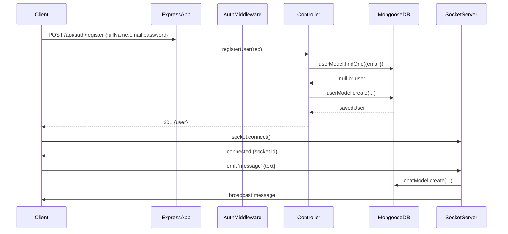
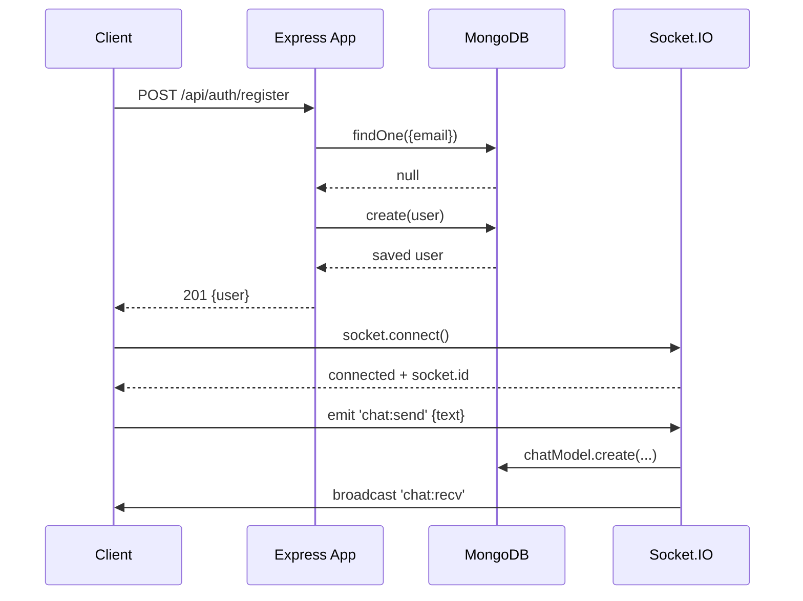
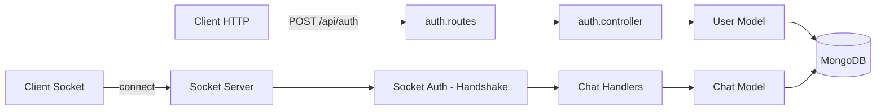
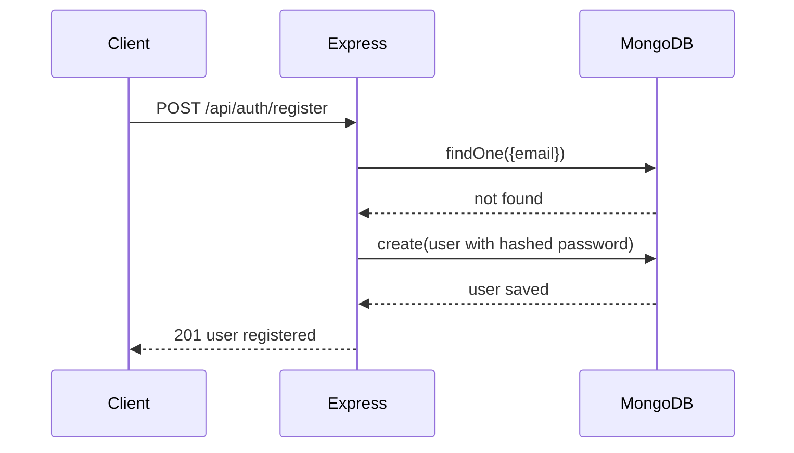
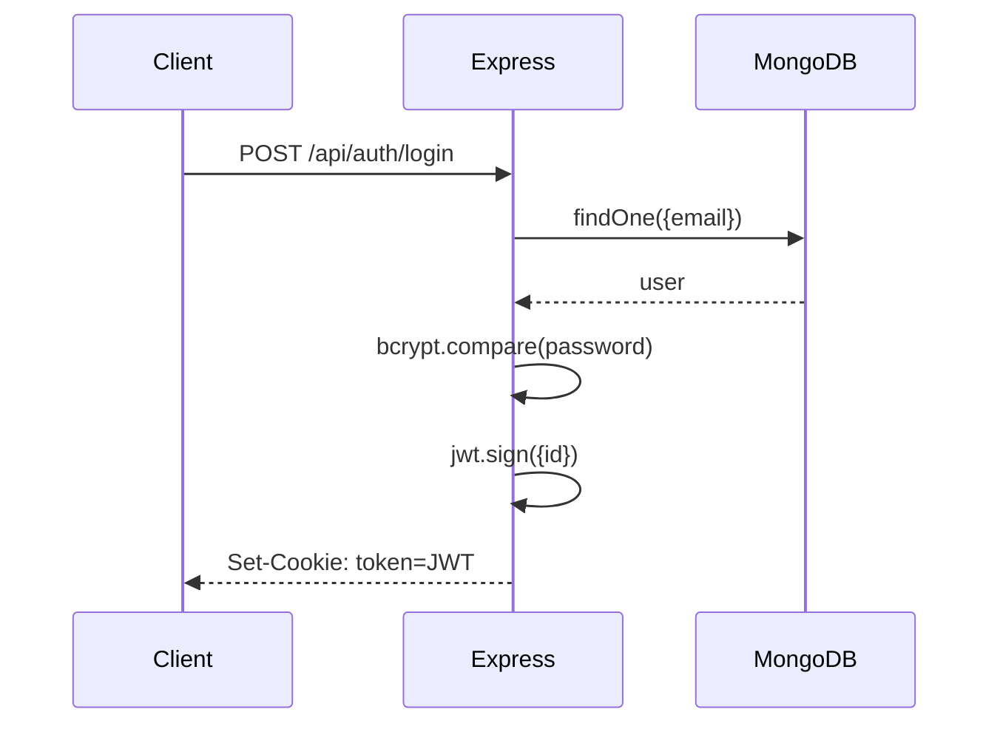
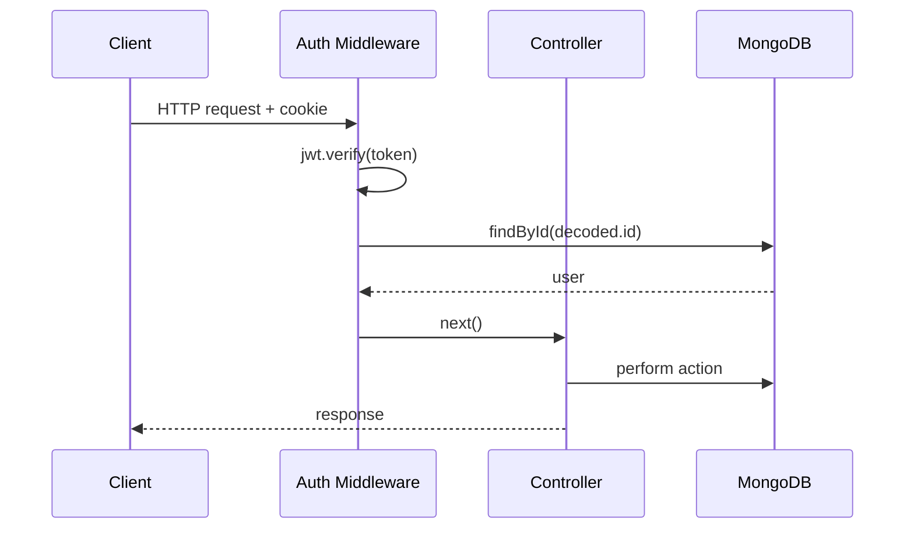
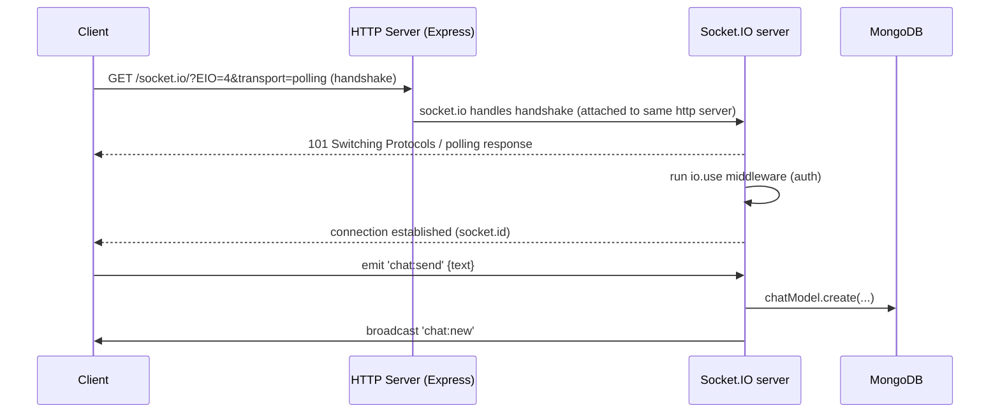
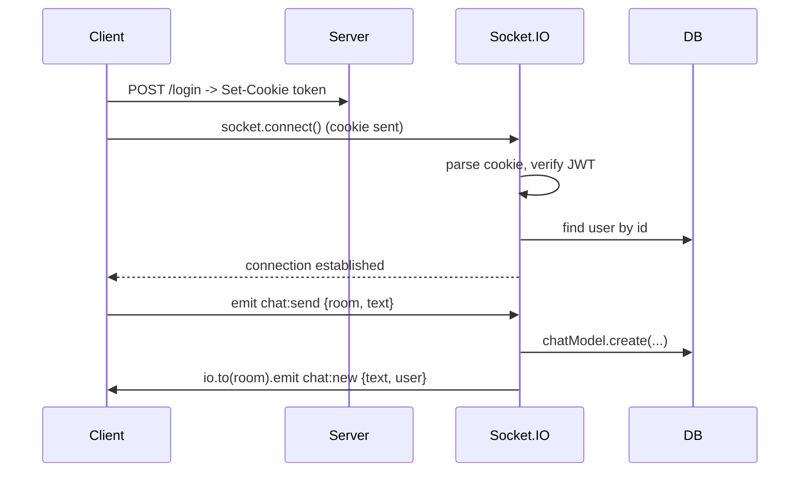

### Server Startup

The application entry point is `server.js`.  
In development mode, the server is executed using **nodemon** through an npm script defined in `package.json`.

Running the command:

`npm run dev`

starts `server.js` via `npx nodemon`, enabling automatic server restarts whenever source files change. This setup ensures a faster and more efficient development workflow without requiring manual restarts after each code modification.


# PART 1 — Project Overview, Architecture & Project Map

## 1 — Short project summary

**Project name:** `cohortGPT`
**Purpose:** Backend service for user authentication + real-time chat.
**Core features:**

* User register / login / logout (JWT stored in cookie)
* Protected HTTP routes (middleware)
* Real-time chat using Socket.IO
* MongoDB for persistence via Mongoose

**Primary runtime:** Node.js (Express)
**Key packages:** `express`, `mongoose`, `jsonwebtoken`, `cookie-parser`, `bcryptjs`, `socket.io`

---

## 2 — High-level architecture (conceptual)

* HTTP (REST) endpoints handle registration, login, and chat creation / retrieval.
* JWT is issued on login and stored in a cookie.
* Auth middleware reads cookie → verifies JWT → attaches `req.user`.
* Socket.IO provides a real-time channel; it must use the *same* HTTP server as Express.
* Controllers contain business logic; models contain schema/DB logic.

Flow overview:

.png)



---

## 3 — Top-level file & folder map (what each file is for)

```
cohortGPT/
├─ node_modules/
├─ src/
│  ├─ controller/
│  │  ├─ auth.controller.js     # registerUser, loginUser, logoutUser
│  │  └─ chat.controller.js     # createChat, (optionally getChats, etc.)
│  ├─ db/
│  │  └─ db.js                  # connectDB() — mongoose.connect
│  ├─ middlewares/
│  │  └─ auth.middleware.js     # authUser(req,res,next) — cookie -> jwt -> req.user
│  ├─ models/
│  │  ├─ user.model.js          # mongoose model export (User)
│  │  └─ chat.model.js          # mongoose model export (Chat)
│  ├─ routes/
│  │  ├─ auth.routes.js         # routes: /api/auth/register, /login, /logout
│  │  └─ chat.routes.js         # protected chat routes
│  ├─ sockets/
│  │  └─ socket.server.js       # initSocketServer(httpServer)
│  ├─ app.js                    # build express app, middleware, routes, export app
│  └─ server.js                 # create httpServer from app, attach socket, listen
├─ .env
├─ package.json
└─ package-lock.json
```

### Responsibilities — quick guide

* **`app.js`:** configure Express (body parser, cookie parser, route mounting). Do **not** call `.listen()` here.
* **`server.js`:** the single entrypoint that creates `http.createServer(app)` and `httpServer.listen(PORT)`; attach Socket.IO to `httpServer` here.
* **`db/db.js`:** initialize Mongoose connection; expose `connectDB()` that logs connection status and handles errors.
* **`models/*.js`:** define schemas and `module.exports = mongoose.model('Name', schema)` — export the model (not the schema).
* **`middlewares/auth.middleware.js`:** read cookie, verify JWT, attach `req.user`, call `next()`.
* **`controller/*.js`:** business logic; create/find users, hash password, create token, set cookie, create chats.
* **`routes/*.js`:** map HTTP paths to controller functions and attach middleware.
* **`sockets/socket.server.js`:** init `new Server(httpServer, options)`, listen for `connection`, implement auth for sockets using the cookie or a token handshake, then register socket events.

---

## 4 — Important constraints & conventions you must follow

1. **One HTTP server only:** create `httpServer = http.createServer(app)` and call `httpServer.listen(...)`. Do not call `app.listen()` if you use Socket.IO.
2. **Cookie parser must be invoked:** `app.use(cookieParser());` (not `app.use(cookieParser)`).
3. **Model exports:** export Mongoose models directly:

   ```js
   module.exports = mongoose.model('User', userSchema);
   ```

   Wrong exports lead to `findOne is not a function`.
4. **Middleware must call `next()`** (or return a response). Missing `next()` makes handlers hang.
5. **Route handlers must be functions:** If `require()` returns `undefined` the router will throw `argument handler must be a function`.
6. **Case sensitive keys:** destructuring mistakes like `LastName` vs `lastName` produce silent `undefined` and Mongoose validation errors.
7. **Cookie options consistency:** if you set a cookie with options, clear it with the same options.

---

## 5 — Environment variables (common `.env` entries)

```
PORT=3000
MONGO_URI=mongodb://localhost:27017/cohortgpt
JWT_SECRET=very_long_random_secret_here
NODE_ENV=development
```

* Use a strong `JWT_SECRET` in production; avoid committing `.env` to git.

---

## 6 — How to start the app (dev)

```bash
# install
npm install

# environment ready (.env created)

# start (use nodemon for dev)
node server.js
# or with nodemon
nodemon server.js
```

**Why `server.js`?** Because it creates `httpServer` and attaches `socket.server` before listening.

---

## 7 — Merlin (Mermaid) diagrams to paste in README

### 7.1 Sequence (register + socket connect)
.png)


### 7.2 Flowchart (HTTP + Socket)
.png)


---

## 8 — Quick examples of what to check when something fails

* `req.cookies` undefined → check `app.use(cookieParser());` and order of middleware.
* `userModel.findOne is not a function` → open `models/user.model.js` and confirm `module.exports = mongoose.model(...)`.
* `ValidationError: fullName.lastName is required` → log `req.body` and check destructuring typos (`LastName` vs `lastName`).
* `argument handler must be a function` → `console.log(authMiddleware)` and `console.log(chatController)` in the route file to see what you actually imported.
* Socket handshake 404 → ensure `httpServer.listen(PORT)` used (not `app.listen()`).

---

## 9 — Summary (short)

Part 1 establishes the project purpose and structural rules you must follow to avoid the common runtime mistakes you’ve already hit. The most crucial rule to remember: **Socket.IO must share the same HTTP server that is listening**. The next parts will dig into auth lifecycle, socket handshake and authentication, and an extended errors + fixes catalogue.

---

# PART 2 — Request Lifecycle, Authentication Flow & Middleware Design

This part explains **how a request moves through your system**, how **JWT + cookies** work together, and how **middleware controls access**. This is the core logic of your backend.

---

## 1 — Full HTTP Request Lifecycle (Step-by-Step)

Let’s trace a **protected request** (e.g. creating a chat):

```http
POST /api/chat
Cookie: token=eyJhbGciOiJIUzI1NiIsInR5cCI6IkpXVCJ9...
```

### Step-by-step flow

1. Client sends HTTP request with cookie
2. Express receives request (`app.js`)
3. Route matches (`chat.routes.js`)
4. Auth middleware runs (`auth.middleware.js`)
5. JWT is verified
6. User is attached to `req.user`
7. Controller executes (`chat.controller.js`)
8. Database operation via model
9. Response sent to client

---

## 2 — Auth Flow: Register → Login → Authenticated Request

### 2.1 Register flow



**Key points**

* Password is hashed with `bcrypt`
* No token is required to register
* Registration does NOT log in the user automatically (unless you explicitly do so)

---

### 2.2 Login flow (JWT issuance)
.png)


**What happens**

* Email is verified
* Password hash is compared
* JWT is created with `user._id`
* JWT is stored in cookie

**Why cookie-based JWT?**

* Automatically sent by browser
* Not exposed to JS (if `httpOnly`)
* Cleaner than manual headers

---

### 2.3 Authenticated request flow




---

## 3 — JWT + Cookies (Deep Explanation)

### 3.1 Why JWT?

JWT is used because it is:

* Stateless
* Self-contained
* Fast to verify
* Does not require server-side session storage

Payload example:

```js
{
  id: "64ff9a...",
  iat: 1700000000
}
```

---

### 3.2 Why Cookies (not localStorage)?

| Method                | Problem           |
| --------------------- | ----------------- |
| localStorage          | Vulnerable to XSS |
| JS-accessible cookies | Vulnerable to XSS |
| HTTP-only cookies     | Safest for JWT    |

Recommended cookie config:

```js
res.cookie("token", token, {
  httpOnly: true,
  sameSite: "strict",
  secure: process.env.NODE_ENV === "production"
});
```

---

## 4 — Auth Middleware (Critical Design)

### 4.1 What the middleware does

`auth.middleware.js` responsibilities:

1. Read token from cookie
2. Verify JWT
3. Load user from DB
4. Attach user to `req.user`
5. Call `next()`

### 4.2 Why `req.user` matters

Once middleware runs:

```js
req.user = {
  _id,
  email,
  fullName,
  ...
}
```

Controllers can now:

* Know *who* is making the request
* Avoid trusting client-sent user IDs
* Enforce authorization rules

---

## 5 — Middleware Failure Scenarios (What you faced)

### Case 1: No cookie

```js
if (!token) {
  return res.status(401).json({ message: "unauthorized" });
}
```

Client result:

```http
401 Unauthorized
```

---

### Case 2: Invalid / expired JWT

```js
jwt.verify(token, secret) // throws
```

Handled in `catch` → 401 response

---

### Case 3: Forgot `next()`

**Symptom**

* Request never finishes
* Controller never executes
* No error shown

**Fix**

```js
next();
```

This was one of your **hardest bugs** because it fails silently.

---

## 6 — Controllers: Proper Responsibility Boundaries

### Controllers SHOULD:

* Read validated data from `req`
* Use `req.user` if authenticated
* Call models
* Return responses

### Controllers SHOULD NOT:

* Parse cookies manually
* Verify JWT
* Handle routing logic
* Access raw sockets

---

## 7 — Error Handling Philosophy (Your Style)

You used:

```js
try { ... } catch (err) { ... }
```

This is correct for now.

### Important pattern

Always `return` after sending a response:

```js
return res.status(400).json(...)
```

Why?

* Prevents “Cannot set headers after they are sent”
* Stops execution flow cleanly

---

## 8 — Typical Auth Bugs You Hit (Summary)

| Bug                     | Root Cause                  |
| ----------------------- | --------------------------- |
| `req.cookies` undefined | Forgot `cookieParser()`     |
| Always unauthorized     | Cookie not set / wrong name |
| JWT verify fails        | Wrong `JWT_SECRET`          |
| Auth middleware hangs   | Missing `next()`            |
| User undefined          | `findById` returned null    |

---

## 9 — Mental Model to Keep

> **Routes decide WHO can enter.**
> **Middleware decides IF they can enter.**
> **Controllers decide WHAT happens inside.**
> **Models decide HOW data is stored.**

If you keep this separation, debugging becomes easy.

---

# PART 3 — Socket.IO (Realtime) — lifecycle, auth, patterns, errors & fixes

---

## 1 — Socket.IO lifecycle (high level)

1. Client starts socket connection to the same domain (or allowed origin).
2. Client sends an HTTP handshake request to `/socket.io/?EIO=4&transport=polling` then upgrades to websocket.
3. Server accepts connection, runs any `io.use(...)` middleware (authentication, rate-limit).
4. Server emits `connection` event with `socket` object.
5. Client and server exchange custom events; each event can have an acknowledgement callback.
6. On disconnect, `disconnect` event fires.

Mermaid sequence (handshake + message):
.png)



---

## 2 — Server: attach Socket.IO correctly (reminder of the common 404 bug)

**Problem you saw:** `GET /socket.io/?EIO=4&transport=websocket → 404`
**Root cause:** You attached Socket.IO to `httpServer` but started `app.listen()` (different server). Socket.IO’s server must be the one listening.

**Correct server entrypoint (`server.js`)**

```js
require('dotenv').config();
const http = require('http');
const app = require('./src/app');            // exported express app
const initSocketServer = require('./src/sockets/socket.server');
const connectDB = require('./src/db/db');

const httpServer = http.createServer(app);

connectDB();
initSocketServer(httpServer);                // attach socket.io to httpServer

httpServer.listen(process.env.PORT || 3000, () => {
  console.log('server + socket.io running on', process.env.PORT || 3000);
});
```

---

## 3 — Server: minimal socket.server.js (correct package: `socket.io`)

Install server package:

```bash
npm install socket.io
```

Example `src/sockets/socket.server.js` (basic):

```js
const { Server } = require('socket.io');

function initSocketServer(httpServer) {
  const io = new Server(httpServer, {
    cors: { origin: true, credentials: true } // configure properly for your frontend origin
  });

  io.on('connection', (socket) => {
    console.log('New socket connection:', socket.id);

    socket.on('chat:send', async (payload, ack) => {
      // payload: { text, room? }
      // persist message, broadcast
      // ack can be used to confirm receipt
      // await chatModel.create({...});
      socket.broadcast.emit('chat:new', payload);
      if (typeof ack === 'function') ack({ status: 'ok' });
    });

    socket.on('disconnect', (reason) => {
      console.log('socket disconnected', socket.id, reason);
    });
  });
}

module.exports = initSocketServer;
```

---

## 4 — Socket authentication (handshake) — common approaches & code

**Problem scenarios you hit earlier**

* Socket connects but is unauthorized (401) or `connect_error` (because cookie not parsed / cookie missing / using app.listen)
* You installed `socket.io-client` only on server (wrong package)
* You forgot to parse cookies for socket handshake

### Approach A — Use cookie + JWT (recommended when you already use cookie-based HTTP auth)

#### Server-side socket auth middleware (`io.use(...)`)

```js
// src/sockets/socket.server.js (extended)
const { Server } = require('socket.io');
const cookie = require('cookie');           // npm i cookie
const jwt = require('jsonwebtoken');
const userModel = require('../models/user.model');

function initSocketServer(httpServer) {
  const io = new Server(httpServer, {
    cors: { origin: 'http://localhost:5173', credentials: true }
  });

  // auth middleware for sockets
  io.use(async (socket, next) => {
    try {
      const cookieHeader = socket.handshake.headers.cookie;
      if (!cookieHeader) return next(new Error('Authentication error: no cookie'));

      const parsed = cookie.parse(cookieHeader || '');
      const token = parsed.token;
      if (!token) return next(new Error('Authentication error: token missing'));

      const decoded = jwt.verify(token, process.env.JWT_SECRET);
      const user = await userModel.findById(decoded.id);
      if (!user) return next(new Error('Authentication error: user not found'));

      socket.user = user; // attach user to socket
      return next();
    } catch (err) {
      return next(new Error('Authentication error'));
    }
  });

  io.on('connection', (socket) => {
    console.log('Authenticated socket connected', socket.id, 'user:', socket.user.email);
    // ...
  });
}

module.exports = initSocketServer;
```

**Important notes**

* You cannot use Express `cookieParser()` directly inside `io.use`. Handshake is not an Express request — parse `socket.handshake.headers.cookie` manually (use `cookie.parse`).
* If `next(new Error('msg'))` is called, the client receives a `connect_error` event with the message.

#### Client-side (browser) — connect with cookies

If cookie is same-origin and was set by login, browser will send it automatically. If cross-origin, ensure `withCredentials: true`.

```js
// client-side
import { io } from 'socket.io-client';

const socket = io('http://localhost:3000', {
  withCredentials: true,
  transports: ['websocket']
});

socket.on('connect', () => console.log('socket connected', socket.id));
socket.on('connect_error', (err) => console.log('connect_error', err.message));
```

If the token cookie was set by server with `httpOnly`, the client cannot read it — that’s fine; the browser will still send it.

---

### Approach B — Send token as query param on connect (not preferred)

```js
const socket = io('http://localhost:3000', {
  query: { token: localStorage.getItem('token') } // exposes token to JS => XSS risk
});
```

Server-side read:

```js
io.use(async (socket, next) => {
  const token = socket.handshake.query?.token;
  // verify...
});
```

**Security note:** this requires exposing token to JS — riskier than cookie+httpOnly.

---

## 5 — Client-side notes (cookies, CORS, withCredentials)

* If frontend and backend are on different origins, set backend CORS and allow credentials:

  * Socket server: `{ cors: { origin: 'http://localhost:5173', credentials: true } }`
  * Express (if you use CORS): `app.use(cors({ origin: 'http://localhost:5173', credentials: true }))`
* Client must use `withCredentials: true` if cross-origin cookies are required.

---

## 6 — Rooms, broadcasting, private messages, acknowledgements

### Rooms & join/leave

* `socket.join(room)` — put socket in room
* `io.to(room).emit('event', data)` — send to all sockets in a room
* `socket.to(room).emit('event', data)` — send to all except sender in that room

Example:

```js
socket.on('join', (room) => {
  socket.join(room);
});

socket.on('message', (msg) => {
  // broadcast to room
  io.to(msg.room).emit('message', msg);
});
```

### Private message (one-to-one)

* Use `io.to(socketId).emit('private', data)` or maintain mapping userId→socketId.

```js
// server: emit to a specific socket id
io.to(targetSocketId).emit('private', { text: 'hello' });
```

### Acknowledgements (confirmations)

Client:

```js
socket.emit('chat:send', {text}, (response) => {
  console.log('ack from server', response);
});
```

Server:

```js
socket.on('chat:send', (payload, ack) => {
  // do work
  if (typeof ack === 'function') ack({ status: 'ok' });
});
```

---

## 7 — Error handling and events

* Handle `connect_error` on client to detect handshake failures.
* On server, `io.use` can call `next(new Error('msg'))` to reject connection; client receives `connect_error`.

Client example:

```js
socket.on('connect_error', (err) => {
  console.error('Socket connect failed:', err.message);
  // handle by showing login screen or retrying
});
```

Server example:

```js
io.on('connection', (socket) => {
  socket.on('error', (err) => {
    console.error('socket error', err);
  });
});
```

---

## 8 — Common Socket errors you experienced (and fixes)

### A) `Unexpected server response: 404` on handshake

* Cause: Socket.IO was not attached to the server that is listening (you used `app.listen` but attached to `httpServer`).
* Fix: use `httpServer.listen(...)` where you passed `httpServer` to `new Server(httpServer)`.

### B) `connect_error: Authentication error`

* Cause: Handshake cookie missing or not parsed, JWT expired/invalid, or `io.use` threw error.
* Fix: Ensure cookie is set on login, parse cookie correctly in `io.use` (use `cookie.parse`), verify JWT secret matches, and ensure `httpOnly` cookie still sent.

### C) `Server is not a constructor` or `require(...)` errors

* Cause: you installed `socket.io-client` only and tried `const { Server } = require('socket.io')`.
* Fix: `npm install socket.io` (server) and `npm install socket.io-client` on client.

### D) `CORS` / cookie not sent in cross-origin

* Cause: missing `credentials: true` on both server and client.
* Fix: set `cors` options on server + `withCredentials: true` on client.

### E) Connection works but messages not received

* Cause: wrong `io` instance used (e.g., you created multiple `io` instances) or emitting to a room that socket did not join.
* Fix: centralize `io` instance, ensure socket joins rooms or use correct target socket id.

### F) Socket auth middleware forgets `next()`

* Cause: forgetting `next()` or not returning it leads to client connect pending or connect_error.
* Fix: always call `next()` on success; on failure call `next(new Error(...))`.

---

## 9 — Scaling & production considerations

### Sticky sessions vs adapters

* Socket.IO connections are stateful. If you run multiple Node instances behind a load balancer, you need sticky sessions **or** use a message adapter (Redis adapter recommended).
* Use `socket.io-redis` adapter:

```bash
npm install @socket.io/redis-adapter ioredis
```

Server:

```js
const { createAdapter } = require('@socket.io/redis-adapter');
const { createClient } = require('redis');

const pubClient = createClient({ url: process.env.REDIS_URL });
const subClient = pubClient.duplicate();
await Promise.all([pubClient.connect(), subClient.connect()]);
io.adapter(createAdapter(pubClient, subClient));
```

### Horizontal scaling checklist

* Use Redis adapter for broadcasting/rooms across nodes
* Use sticky session if you cannot use adapter
* Ensure session/cookie domain and path are consistent across instances

---

## 10 — Debugging tips

* Turn on verbose logs: `DEBUG=socket.io* node server.js` (server) — helpful for development.
* `console.log(socket.handshake)` to inspect headers and cookies during handshake.
* Use Postman / browser to check that `/socket.io/` returns 200/polling during handshake attempt.
* Validate cookie existence: open browser devtools → Application → Cookies → check `token`.
* Check network tab handshake request and response to see 404/401 and headers.

---

## 11 — Practical socket utilities (small helpers)

**Get socket by userId** (maintain mapping):

```js
const userSockets = new Map(); // userId -> socketId(s)

io.on('connection', (socket) => {
  const userId = socket.user._id.toString();
  userSockets.set(userId, socket.id);

  socket.on('disconnect', () => userSockets.delete(userId));
});
```

**Emit to user by userId**

```js
function emitToUser(userId, event, data) {
  const socketId = userSockets.get(userId);
  if (socketId) io.to(socketId).emit(event, data);
}
```

---

## 12 — Example: secure chat flow (summary)

* Login: server sets `httpOnly` cookie `token`.
* Client connects socket (browser sends cookie automatically).
* `io.use` parses cookie, verifies JWT, attaches `socket.user`.
* On `chat:send`, server stores message in DB and emits `chat:new` to room or broadcast.
* Use acknowledgements to confirm delivery.

Mermaid for the above:
.png)



---

# PART 4 — Full error catalogue, debugging playbook, production hardening & prioritized TODOs

This final part gives the **deep dive** into every runtime error you saw, exact fixes (copy-paste), a focused debugging checklist and commands, production hardening checklist, monitoring/logging + testing suggestions, and a concise prioritized TODO list you can act on next.

---

## A — Deep error catalogue (each error, cause, exact fix)

> Copy any code snippets exactly into your files to fix the issue described.

### 1) `app.use(cookieParser)` — cookies not parsed

**Symptom**

* `req.cookies` is `undefined` → auth always fails.

**Cause**

* You registered middleware incorrectly: `app.use(cookieParser)` (forgot `()`).

**Fix**

```js
const cookieParser = require('cookie-parser');
app.use(cookieParser()); // must call it
```

**Test**

```js
// in any route
app.get('/debug-cookies', (req, res) => {
  res.json({ cookies: req.cookies });
});
```

Call `/debug-cookies` after setting a cookie.

---

### 2) `userModel.findOne is not a function`

**Symptom**

* `TypeError: userModel.findOne is not a function` when calling model methods.

**Cause**

* `models/user.model.js` exported the schema or an object, not the model.

**Fix**

```js
// user.model.js
const mongoose = require('mongoose');
const userSchema = new mongoose.Schema({ /* ... */ });
module.exports = mongoose.model('User', userSchema);
```

**Import**

```js
const userModel = require('../models/user.model'); // no destructuring
```

**Test**

```js
console.log(typeof userModel); // should print 'function'
```

---

### 3) `ValidationError: fullName.lastName is required`

**Symptom**

* Mongoose validation error although request body contains lastName.

**Cause**

* Case-sensitive destructuring bug: `LastName` (capital L) instead of `lastName`, or you manually constructed an object and omitted `lastName`.

**Fix**
Prefer safe pattern:

```js
// inside controller
const { fullName, email, password } = req.body;
await userModel.create({ fullName, email, password: hash });
```

Or correct destructuring:

```js
const { fullName: { firstName, lastName }, email, password } = req.body;
```

**Test**
`console.log(req.body)` before using it.

---

### 4) `res.statu is not a function` (typo)

**Symptom**

* Crash or exception when sending a response.

**Cause**

* Typo: `res.statu(400)`.

**Fix**

```js
return res.status(400).json({ message: 'invalid' });
```

**Test**
Run the route that triggers that branch.

---

### 5) `TypeError: argument handler must be a function` (router)

**Symptom**

* Crash at server start when defining routes.

**Cause**

* One of the handlers passed to `router.METHOD` is `undefined` (export/import mismatch).

**Fix**

* Check exports:

```js
// auth.middleware.js
async function authUser(req,res,next){/*...*/}
module.exports = { authUser }; // correct
```

* Or if you exported the function directly:

```js
module.exports = authUser;
```

then import accordingly:

```js
const authUser = require('../middlewares/auth.middleware');
router.post('/', authUser, chatController.createChat);
```

**Debug tip**

```js
console.log('authMiddleware:', authMiddleware);
console.log('chatController:', chatController);
```

---

### 6) Middleware missing `next()`

**Symptom**

* Request hangs; controller never runs; no error thrown.

**Cause**

* `authUser` sets `req.user` but does not call `next()`.

**Fix**

```js
req.user = user;
return next(); // call next on success
```

**Test**
Add `console.log('middleware passed')` then check route runs.

---

### 7) Socket.IO handshake 404 / `Unexpected server response: 404`

**Symptom**

* Browser console: `GET /socket.io/?EIO=4&transport=websocket 404`.

**Cause**

* You attached Socket.IO to `httpServer` but you started the app using `app.listen()` — sockets attached to non-listening server.

**Fix**

```js
// server.js
const http = require('http');
const app = require('./src/app');
const httpServer = http.createServer(app);
initSocketServer(httpServer);
httpServer.listen(PORT, () => console.log('listening'));
```

**Test**
Open client and watch server `New socket connection: <id>`.

---

### 8) Installed `socket.io-client` instead of `socket.io` on server

**Symptom**

* `Server is not a constructor` or require errors when doing `const { Server } = require('socket.io')`.

**Cause**

* Wrong package installed.

**Fix**

```bash
npm uninstall socket.io-client
npm install socket.io
# keep socket.io-client for frontend only
```

---

### 9) Logout cookie not clearing

**Symptom**

* `res.clearCookie('token')` does not remove cookie in browser.

**Cause**

* Cookie was set with options (`path`, `domain`, `secure`, `sameSite`) and clearCookie did not match them.

**Fix**
Either set and clear without options, or clear with the same options:

```js
// when setting
res.cookie('token', token, { httpOnly: true, sameSite: 'strict' });
// when clearing
res.clearCookie('token', { httpOnly: true, sameSite: 'strict' });
```

**Test**
Check DevTools > Application > Cookies before & after logout.

---

### 10) `findOne` returns `null` unexpectedly

**Symptom**

* `user` is `null` although you think user exists.

**Causes & checks**

* Wrong DB URI (connected to a different DB)
* Data not inserted (check collection)
* Query value mismatch (case sensitivity, whitespace)
* Model `collection` name mismatch

**Fix / Checks**

```js
// verify DB connection
console.log(mongoose.connection.db.databaseName);
// inspect data with mongo shell or Compass
db.users.find().pretty();
```

---

## B — Debugging playbook (step-by-step checklist)

When something breaks, follow this checklist in order:

1. **Read error message** — copy stack trace. Note file & line.
2. **Log the types** — `console.log(typeof suspiciousExport)`; show values of imports.
3. **Confirm running server** — `lsof -i :3000` (Linux/mac) or check logs.
4. **Check middleware order** — body parser, cookie parser must run before routes/middleware that use them.
5. **Check exports/imports** — ensure `module.exports = { something }` matches `require()` usage.
6. **Log incoming request** — `console.log(req.method, req.path, req.body, req.cookies)`.
7. **Validate DB** — `console.log(mongoose.connection.readyState)` and run `db.users.find()` in mongo shell.
8. **Socket debug** — inspect `socket.handshake`, `socket.handshake.headers.cookie`.
9. **Try simple curl** to reproduce minimal request:

   ```bash
   curl -v -X POST http://localhost:3000/api/auth/login -H "Content-Type: application/json" -d '{"email":"x","password":"y"}'
   ```
10. **Reproduce locally** with minimal code—strip middleware and see if base issue still occurs.
11. **Add temporary console.log** to follow execution path, then remove.

---

## C — Useful commands & one-line checks

* Start server with debugging:

  ```bash
  DEBUG=socket.io* nodemon server.js
  ```
* Check Node process ports:

  ```bash
  lsof -i :3000
  ```
* Quick curl login (get cookie):

  ```bash
  curl -i -X POST http://localhost:3000/api/auth/login \
    -H "Content-Type: application/json" \
    -d '{"email":"sayantan@qwe.qwe","password":"123456"}'
  ```
* Check Mongo connection status inside code:

  ```js
  console.log('mongoose ready state', mongoose.connection.readyState); // 1 = connected
  ```
* Inspect a model in runtime:

  ```js
  const userModel = require('./src/models/user.model');
  console.log(userModel.modelName); // User
  ```

---

## D — Production hardening checklist

Apply these before exposing to the public:

1. **Environment**

   * Use strong `JWT_SECRET` and keep `.env` out of Git.
   * Set proper `NODE_ENV=production`.

2. **HTTPS**

   * Serve via HTTPS (terminate TLS at reverse proxy like Nginx or use managed TLS).
   * Set `secure: true` in cookie options for production.

3. **Cookie security**

   ```js
   res.cookie('token', token, {
     httpOnly: true,
     secure: true,
     sameSite: 'lax',
     maxAge: 7 * 24 * 60 * 60 * 1000
   });
   ```

4. **Input validation**

   * Use `express-validator` or `Joi` on all incoming request bodies and query params.

5. **Rate limiting**

   * `express-rate-limit` on auth endpoints (e.g., max 5 login attempts per IP per minute).

6. **Security headers**

   * `helmet()` middleware to set common headers.

7. **CORS**

   * Configure `cors` with explicit origin list and `credentials: true` if using cookies.

8. **Logging & monitoring**

   * Use structured logs (winston/pino).
   * Integrate error tracking (Sentry) and metrics (Prometheus/Grafana).

9. **Password & tokens**

   * bcrypt with salt rounds 10–12.
   * Use `expiresIn` for JWT (e.g., 1h) and implement refresh tokens if needed.

10. **Session invalidation**

    * Consider server-side blacklist if you must revoke tokens immediately (rare for stateless systems—use refresh tokens).

11. **Process management**

    * Use PM2 or systemd to keep processes alive and enable graceful restarts.

12. **Scaling sockets**

    * Use Redis adapter (`@socket.io/redis-adapter`) for multi-instance broadcasting.

13. **CI/CD**

    * Run linting (`eslint`), tests, and static analysis in pipeline before deploy.

---

## E — Monitoring & logging suggestions

* **Error tracking:** Sentry or LogRocket for capturing exceptions and stack traces.
* **Metrics:** Expose Prometheus metrics with `express-prom-bundle` or custom collector.
* **Structured logs:** use `pino` with JSON output so logs can be parsed in ELK/Graylog.
* **Uptime:** Health check endpoint (`/healthz`) for load balancer.

---

## F — Testing & CI suggestions

* **Unit tests:** controllers and utility functions with Jest.
* **Integration tests:** Supertest for HTTP endpoints (login/register), use in-memory MongoDB (`mongodb-memory-server`).
* **Socket tests:** use `socket.io-client` in test mode to connect to a test server and assert events.
* **End-to-end:** Cypress or Playwright for UI flows (if you have frontend).
* **CI:** GitHub Actions → run `npm test`, `npm run lint`, and build steps.

---

## G — Useful local test snippets (copy-paste)

### 1) Quick socket client (node) — test connection & auth

```js
// test-socket.js
const { io } = require('socket.io-client');

const socket = io('http://localhost:3000', {
  transports: ['websocket'],
  withCredentials: true
});

socket.on('connect', () => console.log('connected', socket.id));
socket.on('connect_error', (err) => console.error('connect_error', err.message));
socket.on('chat:new', (msg) => console.log('new chat', msg));
```

Run after login in browser (cookie must exist) or manually set cookie in client.

### 2) Minimal curl for register

```bash
curl -X POST http://localhost:3000/api/auth/register \
  -H "Content-Type: application/json" \
  -d '{"fullName":{"firstName":"Sayantan","lastName":"Bharati"},"email":"say@example.com","password":"123456"}'
```

---

## H — Prioritized TODO list (short, actionable, ordered)

1. **Fix critical bugs (must-do)**

   * Ensure `app.use(cookieParser());`
   * Ensure `httpServer.listen()` is used, not `app.listen()`
   * Export models correctly (`module.exports = mongoose.model(...)`)
   * Add `next()` in `auth.middleware`

2. **Stability & security (high)**

   * Set `httpOnly`, `secure`, `sameSite` cookies in production
   * Add input validation (register/login)
   * Add rate limiting on auth endpoints

3. **Sockets improvements (medium)**

   * Add `io.use()` socket auth based on cookie parse
   * Implement rooms and user→socket mapping
   * Add Redis adapter if you plan multiple server instances

4. **Testing & CI (medium)**

   * Add unit tests for controllers
   * Add integration tests for auth endpoints using `mongodb-memory-server`
   * Add socket integration tests

5. **Observability & deploy (lower)**

   * Integrate logging (pino) + Sentry
   * Add health check, readiness probes, and Dockerfile
   * Add PM2 or use managed platform (Heroku, Vercel for static + separate backend)

---

## I — Minimal security checklist to apply now (copy these into code)

1. Set cookie with secure flags:

```js
res.cookie('token', token, {
  httpOnly: true,
  secure: process.env.NODE_ENV === 'production',
  sameSite: 'lax',
  maxAge: 7 * 24 * 60 * 60 * 1000
});
```

2. Add helmet and rate limit in `app.js`:

```js
const helmet = require('helmet');
const rateLimit = require('express-rate-limit');

app.use(helmet());
app.use(rateLimit({ windowMs: 60_000, max: 100 })); // 100 requests / minute
```

3. Validation (example with `express-validator`):

```js
const { body, validationResult } = require('express-validator');

router.post('/register',
  body('email').isEmail(),
  body('password').isLength({ min: 6 }),
  (req,res,next) => {
    const errors = validationResult(req);
    if (!errors.isEmpty()) return res.status(400).json({ errors: errors.array() });
    next();
  },
  authController.registerUser
);
```

---
