# Best viewed in GitHub, VS Code (Markdown Preview), or Mermaid Live.

## **Diagram 1: Complete AI Memory Ecosystem**
- [Click here to see the Diagram](https://mermaid.ink/svg/pako:eNp9VFFv2jAQ_iuRH6ZNou2SEijRVAmI16GRliUBtpk9GHINUYmNjLOWVf3vc2xoA2nrJ39399nf3fn8iBY8AeShGbtd8fvFkgppxf6MWWptinkq6Hppdcl4A8IaMAnili7AGtItiD8mqlzjwT5iXcizHwWI7c4LLJmxo-N6JICci60VUEZTyIHJ2olBcBhU9b3sXo609-Hxdg2bSnC5ojgg0ZILeRKDyC0T-WUuzi77XOX0IK1pxhJ-f0QbKtqQs7TGmsBCcmH5VNI53cARbRqQKRd3GUsPbiqEKBONYLPJOKtwdIney83Z53azBkGlYtcTvAkxiZQo2N15FBDiOBzgCSYhSJHB3zfCxiO_G2MyXidUvhHi4373116QDwu6fS2V19reJzifQ5KUhfmg6kDFYlnrO64EBeppriq-SUR2ld-RMUszVi1_WCZ4Iii7O-a_Jsgn3xm_X0GSgtVTfayJ8Xvk41GvP1XfKI67qhKSqmpRS1e_4h1c-_gn-XYdTc8Gk69qNBJ4eEcMJsNhUFOgbGRIRVpqY2mhBqFWlVF4E4xiMhI8X8tdSUCo_CsxV_iaXAHbvZ66ivHAOjm5VENnYBBo2LMPoWNgz9EQG4Q1mEQGTSINw50zNF4j0ZjMXptVcsZWZl4alExjUBttGA8Mrl7l9wzyexrqMh9YyrYYgx6LA9J-Dp5FowZKRZYg75auNtBAuRp1WmL0WDJmSC7VBzVDntomVNzN1E_5pEhryn5zniNPikLRBC_S5fMhhZ4fP6OqtfmzVY1_AqLPCyaR17T1Gch7RA_Is93Wqeu6TdtpNdvOeaflNtAWeY7tnF447Wanc3Hu2p1Os_XUQP_0tfZpq926cD87brPdtktiA0GSqTcYmA9d_-tP_wHddbYO)

## **Diagram 2: RAG Pipeline Step-by-Step**

- [Click here to see the Diagram](https://mermaid.ink/svg/pako:eNptU8tu2zAQ_BWC11pG9LZ0CGDZfQSI0bRNeyiVAy2uJSESKVBUa8fxv3ctoq7ghidxd2a4MxSPtFACaEp3jfpdVFwb8rjOJcHVD9tS864iDxXvwWV3soTe1EraAnHI592uqSU8Wfx5LV22VsXQgjRkpZoGijPhiTjOLVl67BH2WK8G-VzLckrzLMJn79stCIFd8hEkaD7SJ0DfAgP2A6WVJndSwP5KLLCYkG3AcMENJ8u-V0U9FQMpcvmWT499BaNr-MWbfz7llc3MZd970OTLAPpg3WUeG3fk4mCKt_4y_-_Y34DropoirLEsYJ8OW10L8qFuDOgrGessC3FGR_PrFLPQtiO2UtKco0bf0G6bwxQUWVDM7u83b4ecxRaywGP6TknM4B1Z1WbE9f8HaP-PkWMjtOUljjN3bl8fNDid6oaGGxCv6DSXdEZLNEnTHW96mNEWdMvPe3o8c3NqKmghpyl-Cq6fc5rLE5I6Ln8q1dLU6AFpWg1ldREZOrxrWNccb7O9VDUOCnqlBmloGoSjBk2PdE9TN4zmYRgGrhcFsecnEXYPNPVcb77w4iBJFn7oJkkQnWb0ZTzWnUdxtAhvsBph48abURA1XujGPqLxLZ3-AJVQ_mk)

## **Diagram 3: Memory Storage & Retrieval Architecture**

- [Click here to see the Diagram](https://mermaid.ink/svg/pako:eNqFVdtymzAQ_RWNnp1MIbYT89AZ24CTyfgSoH6o3AcFNrYakBghcmkm_94Fik0ct9WLrd2js0d7EW80VglQhz6k6jnecW1I5G4kwVWU91vN8x25kXlp2BwypV-bzY8GUa3pcrFmUyWfQBfcCCXJtSgMIjsYfzyNQnYr1XMKyRaIz2NTdPyrwPPZtwI0WWl4AA0yhq7fW3sLJPByUahExMR7ArknAJls5JHilVbIUAi5bWUfLB3eaHnrLVikHkGKX7X4btD5xHOZl91DkuAxMgMJ-hi0WAZztlA64-kJhkVwM71GBYYn3HDiSS3iXYba_yE9xNzxLbS6_2w7rHvk2p2wNcQIIC7S3_OiC6vW2mpp9tcojiE2C0UmUq6FqYqbwEsHUQtsNyckzL1ofLjfX1TMLRaJDArDs_w4_Nxm47gqDJmqUppP7gt2k-VKG44dQcJYafgE6bMQMi4N9kXEP9zvf-pnwXh13WZoVpmOuGcW1jaBwiFt8xvIjgXMbOZhUyMogLRugWIn8pM6TtU7AKMFPPG0FbI3dBju2F0JOFLk7OwrufOa3aGoXaRXY9Zh2xqd6obAddy94zqswYHPUDqGrJLsi9SA_kga-DUuclkEVTl4SlyIeXfEI7eGjCdtPSdKFd13YjypAX7IfCGRoCrmxyh-oyZarnAk87PbJukCTgx6_QjV6MNcN57Dvnb_GZ_Gt8_sZxcGrY3L0lRvHb5nBl4MxvmJWWymmvboVouEOg88LaBHM8Cpr_b0reLYULODDDbUwb8J148bupHveCjn8rtSGXWMLvGYVuV2tycpc5wccAXHZsj2VnwAE9D1RFCnP6o5qPNGX6hjDYbng8Ggb9nD_qV9MRoOevSVOrZln1_Zl_3R6OpiYI1G_eF7j_6qw1rnw8vh1eALWofowN8ehUTg7efNy19_AN5_AxgH1iw)

## **Diagram 4: Embedding Model Architecture**

- [Click here to see the Diagram](https://mermaid.ink/img/pako:eNqNVFFv2jAQ_iuWH_YErDEkQDRVgiaoaEBQCWVamCqDDWQkNnIcUVr1v89xoKQBtfNLfPfd3Xeffc4rXHJCoQ1XEd8vN1hI4DtzBtRK0sVa4N0G9NkulQN8oCIHsuW7v_zgAe-BT59lHvGngHo_A59vKQtfqPjof-o7OQT6TlKAxt4kGPMklCFnwGWqq5CtTwGUkTkrdeXGC0qyoFJnMzeYcUHO-AcWt0ByLWDiBhO6jimTBfzHQny_7boPPuAsOhSjp8NgksYxzgp-0qsvMEtWXMRUdCO-3CbnEueYrhEU4oAOBEaBLVvD-44RDNNIhtV7ignoSKl6PbOfVsdxjKBDCPgGRqpeCe31RkbQo5SAHhd7LMhlNrqerdWdjKsq0BUVqFarjS6VoP9UUv9UCfpCSeMLJdcuzEvl5cyPPW-gxodHaiaAxgrlHHekZsehLKFgLPhfuixpGXkPwydv6gcDpFvBUfiCSzGP7l2QU4NHVYCLy5nKHh6oVm-zt3T6qjd1BPVeu2du7lLvStvjoz1ztakm94iX7EnJPnqnw5ysaxyZusbRgU4OlPOoQypmZrYG9AHp3ekktKEkwwpci5BAe4WjhFagmpsYZzZ8zWrModzQmM6hrbYEi-0cztmbStph9pvzGNpSpCpN8HS9eS-S7giW1AmxutD43SvUSVJxx1MmoW3WdQ1ov8JnaBumVTNNs2Egq9FE9bZlVuAB2shAtRZqNtrtVt002u2G9VaBL5rWqFlNq2XeKK-lAPWtQEpCdW3D_J-qf61v_wBBuIs0?type=png)

## **Diagram 5: Vector Database Architecture**

- [Click here to see the Diagram](https://mermaid.ink/svg/pako:eNp9VG2PojAQ_iukn9WcruDKh0uQ1dUETwSzJlc3ly7MYnPYmlLu9iX737ct6MFqrgkzMM90-sxLeUcJTwG56Dnnf5M9EdIKoh2z1CrKp0yQ497ycwpM4kpZ3vGY04RIylnxWHnq5YVhH2_hSeNt8wAv-RPN4RK5wV64sGIQf2gCNQQs3bEvBJSX8QzIK4hGiGgab7AW2qNhv49CH2dKXNi9cL4O8L2Oug4a6LVT1yWIV2ykFQqeQFFQljXCrcMTSkTRIrZe1cjqKOmBvrVA3_Pn0xr3SbL_X-YLlsILNvIi-6aTql_xD9Fr_iPeYi0sk-1jG108zLB6qvhfsHCNVbppmUhVAsIkfTPN_uI1C7wNnuVEXsQweZw-rtBdgiQpkaQdb7IRAHjS1eoqrUmwWi3xJOf8YM1oLlu1OJ95rYix5IJkgGttTVlGGTR2P0z9zSqK8QMkyuXk33BYTjcePvG-gm-9AG8FldD19kBSK-DZZVPr-9PtfteDZ7QZggqt5kEbTfKVsWq8NtZnVuaL-1kWqhy41mpIra6ZPM5I3mAZz73oDsfqkqftQY6mYbDwPRzB-Wo30GDl3f2aqAwDrlKbkJyw5Fz8c-EreSpxt6c413xQB2WCpsh9JnkBHXQAcSD6G73rTTsk93CAHXLVa0rE7x3asQ-16UjYT9Vs5EpRqm2Cl9n-HKQ8qlbAHSWqBIezVSg6IHxeMolce2RiIPcdvSC3bzs927aH_YEzHA1uxo7dQa_IHfQHvdvBaDge397Y_fF46Hx00Js5tt9zRs6t_U1ZHQUo3UGQUpXhsvplmj_nxyfNTI_-)

## **Diagram 6: HNSW (Hierarchical Navigable Small World) Index**

- [Click here to see the Diagram](https://kroki.io/mermaid/svg/eNqVU7Fu2zAU3P0Vb0wGoyVlyR6KAIGNJIPtoWzRgehAiUxERCYFirLrvy9F0rEsWynK5VG6e093R-q10oeiZMbCj9UE3Gra_M2wuoSlVo01bWGlVvRlS35dvPntyd1aIkpsN-AgbQliV9sj-Ak9CqZP2oBgRQl7UVi33_fQJA5gFqyuoWJHYWDdI8zok1QclGBGNNZV-Vbm2jQ9SkqXRjAroNBKCS-x-ZabLw879gc2ULuJfm6vJaMbvRfA9UGBVuIKn9PvonYzoVVWVlHW1x5hQR85d5KBVREOn_RB1EbnLJeVdHHUoUkoPpmEyGA6fXCxhJKEMgslDSULZR7KYnJ5OMRFUZThWML-rIugG3l6YUJZ49RoqWyPjumzEYIfofGD4FUH9jDuXkvyeXRkRn82AvKuu2CKS-5Oxs9kDdwWkf4jbJI5gm2NgvfTPYgiL-7CR8QkRExCxCRETELEJERMsmGo_nK3RoRcny9fnrV8NKwTuvZC3XggNTNNj9WtbYLu7raai_t798mpe8an5wEPRzy5wjtLp_0NCThKcANgI7hsdwMJeCABj0jAUQJORvAk4rMRfBbx9H8toGjBHRmshLoKEQ0coBEHKDpAIw5QdIBGHKDoAKUjeBrxbATPIj4fwecRX4zgi4ijz5Nbdz5g5X6-AzMcKqneG3-j1_jMwWMcdPpR_gJFY4QR)

## **Diagram 7: Memory Retrieval & Scoring Algorithm**

- [Click here to see the Diagram](https://mermaid.ink/svg/pako:eNptlE1O20AUgK8ymhVVE4pDbIgXlQKECkFKiAOVGrMY7IftYs-YmXFLirhA1QqkIhaoUruohKqq-0q9A4fgAu0R-sYOkCC8iOL3vu_N3xsf00CEQF26n4p3QcykJoMVnxN8tob_vl59I9sKJNkqQI52Sb3-nGx1MH7-ibwADpJpqHKkk-1BGCY82h3bnZLe8ZD-_JHsQKCFJF6SJSmTiR4RD5gM4jFd_e54pdO3jHNJ-qBlAm-BLDMeJqEZqwuZwJia0lSxF0mWx8QLMMkjYvQz0i1SndRXWTVwlRp75vGsoU89yBjXSTAxMd_ngVAzh7XsiU8n-QbyA8hyIVlKViBgBoWjfKZ-_ef6XD-g55FuBwEoRVYlHBbAA8OnIpqxngai4A-FJgprprpmPIBywoBCgdtfZ0olEYdw2rDR6ENgKpMlIZRG3HqG5e9mM7nacmu97e7w5vLi7-9T8gqSKNYQEq_IppZ5C04u5pFY85GYPR0DHk6eU388h-ooJjNoVCfffrluDu8D6TN-8PC0TbbEVtc2Bp0-gpc_STvP0xEZxBJULNJwjFZECQ82e8ObX2fYbyn2IBmIvL7-eB8hWRptz-t0lzZMn1_9IG2lINtLsQsF13Ckx8otVBq9_ma3NxjefDk1O7vG35iREq4F6UmR5bdOhZXGxkYXy3-_uL9GGMGOV7ngCpCnNRrJJKTuPksV1GgGMmPmnR6bYj7VMWTgUxf_hkwe-NTnJyjljL8WIqOulgVqUhRRfFekyM0tWkkY3pd7BI8J5LJpSeo6dlmCusf0iLqW7czatt20Gk5zoTHfMtkRdRtWY3axsdBstRbnbavVajonNfq-HNWadRacRXsOow4m5iynRiFM8Ap2q-9M-bk5-Q9hoGrr)

```mermaid
flowchart TD
    Q[🧠 User Query] --> QE[🔍 Generate Query Embedding]
    QE --> VS[📌 Vector Similarity Search]
    
    VS --> R1[📚 Retrieve Candidate Memories]
    
    subgraph Scoring [📐 Multi-Factor Scoring]
        S1["Semantic Similarity\ncos(q,m)"]
        S2["Temporal Decay\nexp(-λΔt)"]
        S3["Access Frequency\nlog(1+count)"]
        S4["Importance Score\nuser-assigned"]
        S5["Recency Boost\n1/(1+Δt)"]

        S1 --> SUM[⚖️ Weighted Sum]
        S2 --> SUM
        S3 --> SUM
        S4 --> SUM
        S5 --> SUM
    end
    
    R1 --> Scoring
    
    SUM --> RANK[📊 Rank Memories]
    RANK --> FILTER[🚫 Apply Threshold]
    FILTER --> TOP[⭐ Select Top-K Memories]
    
    TOP --> ASSEMBLE[🧩 Assemble Context]
    ASSEMBLE --> PROMPT[✏️ Inject into Prompt]
    PROMPT --> LLM[🤖 Generate LLM Response]
```

## **Diagram 8: Complete Conversation Memory System**

- [Click here to see the Diagram](https://mermaid.ink/svg/pako:eNqVVV1zokAQ_Ctb-6ypAz8SebgqTzGxTqMHJHe5NQ8oo1LCrrVAEs_4329YImDEh1BlFW5P7_bM9gx7uhAeUIMuA_G6WLsyJk5_xgk-UTJfSXe7Jj3BX0BGbuwLPsCwDE6fB9u02EMEkowhitwVPJN6_Tvpjbq2PRw8sV7gRpG_3JEhj4HHzwWzeDsGK-bw3jHvnX0WTpzdFg5VnCwsZbwP3EWcuAH5lYDcvZNBt-cwC2LpwwuQFIyeK3lTzEjwgjg1LbsgHtELXCkW4CWyxLYmvRL7A4cLZ5uhSGtZ0M3xpKQ6hyvrlWaoamWZjjU0H7ujAkuTuIihxEtYen4VBtzLXj45Ig9jYwiF3JEP7ZiRyj0qJ25pTKVJzLetyyPMrAzqzAzn4Hk-X5Fb4CCVzcoRDfYIi1hIYoMrF-sy1GR3u7n0PTLwgxgk7lFGW1jSunT5pli_lNAYK2A9HbOx8bTUzMVeeWD_h8ZSV5EstBSi7kZjWQ4B-cnFawDeyS4qRGd9Ebo-PzOnQtNkpb_0F6oMxBaJXJzYKM_g1BUlgTrLvV0pcqqxqYQlSOCnWytQZ3d-FFewGljNQKmK1v72a5IarNQy1aLQJfbGD4IzQeiQO_FajwW5TXzvXDD647eQm3R-fU1UkxV9WKnJREk4hvzwdHQpSC-R7diNz3SZDeYIns6CqlLn6j4ZMm8s1Y2ZK6uQ3gSnyR-HdaMIwnkA6YyO4e0o8wNWoaPRmOHvvLnSxazn7enk3jbxfqMt3u7RscdzM1SF2s7EMlnaHkDQwSdVU1hJNq3RFbYmNZZuEEGNhiDR9vif7lPCjMZrCGFGDXz1XLmZ0Rk_IAlnxF8hQmrEMkGaFMlqnW-SbD2sdd938RLDfBXL64HsiYTH1Gh31B7U2NM3amit9lWr1Wpqert5rTc67VaN7qiha_rVjX7d7HRuGi2t02m2DzX6Tx2rXbWv2zetb7jaRuCbXqPg-ZjyOPtQqu_l4T9VlBrW)

## **Diagram 9: Vector Similarity Metrics Comparison**

- [Click here to see the Diagram](https://mermaid.ink/svg/pako:eNqNlFFv2jAQx7-K5WdaNSEJJBKTUEK3VqNEQF9m9mCSA9wlNnNsNlr1u8_gkAbWavPLOf7_fPZd7vyCM5EDjvCqEL-yDZUKzZMFX3BkRqWXa0m3GzQGJVlW2dXDiCezu4cRiUXFOKAZK1lBJVP772_I6DH-epeMhg9kpLOC5UA5SlilKM-ghSWTeTqdJI_xnCRCoVSKXGeqBYyHD1-G87nxM6Z8Q5V638_9MI6H04Tc0yyjMv_7TsBzO7mI7VbIUhe0FdytQzIb2ADl5k4525nr52i5R9zAVevUW5dAE90ASWHwSpdIrFD1U1MJZ3CXHNxtbYgGr8l64Qz1SNlE24B0WYlCK0A7Wuhz1z55qgMfIMYVyAoyxQRHYgcSaW6m_8iDyfwWpGLQykTqkCnla4hQybiukDA5UeJgWmen7gl6BikOOuMrxs-rIe2eoFp8J4jU-x9H_iV0fpsWGZAhXxeAlrQyf6881nDbU4-c6uhDpE9MWp7qVH4EheSzZPmHsnNDZqDeky9-hW0qdHX1yZTg0aS1CSzQtJRlXCvWpmeZt36yUNeqtelbqOkpy3hWrE1ombqhLOFbqTbODe7gtYkZRytaVNDBJciSHr7xy2H3AqsNlLDAkZnmVP5Y4AV_NZu2lH8TosSRktpsk0KvN40Tvc2pgoRRU5BlsypNlkDGQnOFo1736ANHL_g3jhw_uPZ933PcwOu53TDwO3iPI9dxr_tuzwvDftd3wtALXjv4-Xiscx30gr5_Y1YDIxjbwZAzJeTYPoPH1_D1D2YmgeI)

## **Diagram 10: Embedding Space Geometry**

- [Click here to see the Diagram](https://mermaid.ink/svg/pako:eNqFlF1v2jAUhv-K5dtC1JgkQKROoqETSHRUbbWLmWoyyVliFduZ47SjiP8-hzAIVWC-iX3e8_HEPvYGxyoBHOJUszxDz-OFRHYU5bI2zNT7mIvaWI3Z2KV3rOCrNfrOi5Kt-AdbruCl6UHojAtuIEERy1nMzfpE7tEHpTR6gpxpZriSJ6pH75m0edFUGtC5BtP0AZnUk0-YE55mJ5wTy_lNmXOQEwtZxbQRTizhI4-zdsKJJbwToFOQBkWrsrCUxX_o9m7HJJFLR5IL-5d7qVEgIvQZ4qxN6dGnmIOMoU2ssFQF2yIeZ0cm9-fUgCiOUg02oolK0RvERmnHcV4-67c0ZuaCHtFM6QJaPQ77c46JtDKREY2VyEv7T-cLk1uaZ0rCBY-ImqoNzGW2c4c4z6FuhgbevGoyLaoG-1e4kXJO6ChJ9vaiKdiDLJdGs9i0qR4dvdlaKbSIDTefvnKZoi4STKIr9K6q7w36XQI0G3Ye0AemeWEdv2pWNc8VmhpmL_ANelQC2nt3f6FQt_vltH33i51w3BLcsQ8IT3D4i60K6GB7QQSr1nhThS2wyUDAAod2mjD9usALubVBOZM_lBI4NLq0YVqVaXZIUuYJMzDmzB6AOFi1JQUdqVIaHPb7uxw43OA_OHT9wPF933NJ4PVJbxj4HbzGIXGJMyB9bzgc9Hx3OPSCbQd_7Mq6TtAPBv61tQZWuCYdDAm3e35fv4q7x3H7F4pRgeA)

## **Diagram 11: Memory Decay & Forgetting Mechanism**

- [Click here to see the Diagram](https://mermaid.ink/svg/pako:eNp9VE1v2zAM_SuCzmlQfzYxsAFBsmIFFgxId5qzgyLTtjBbMiQ5a1b0v4-2k1jugvpiiXokHx8pvVKuMqAJzSv1h5dMW_Jjs5cEP9MeCs2akjxJYQWrBmv3bb10C7XSJ7LWwCxkxHCl4ZM3v__loPz0h6jhitGAoAwyFxKkT3WjtGWSA2HGiEJOAWG64hyMIWvVSksu8UFme_mO5gY4O42uGy_tLclAjmTAkYgBQ9QRNLFIzUm08dMdsiQVqw8ZI1xJq1VliGlgQmgTDEUZ0THuIlqhJGnNFBWmX1mVk0rkQA6YdFBIyOID_jsQMleaQw3SjrF23kWCg1LGmqEcJ9kOqbuuxFgNsrCliwkuQZD3WQbeKepiwvQbM5acgW2TdW37gPCj0gVYi1WNQR699LmX25YaTKmqru-1OrLKyfTop2vWMC7s6azODUyQrpXMK8HtrdMw3TLZsorkVxIfMF1pXoojjP4rD6PXDVLssj9bpVnharryccItQwUY-S6rk3sUoNyMW3EcWs8qvDm3dDpfG3J399mdzX7ZG280fNrIDvRe5HHfH08q-2-gOJJzGrzG5qDsvd4NWNHxdwdg7acrYxQXQ2VWi6IAbSaQvi0WXrqujCpMIGH6pVadFYs3rBKAV8WVZ6R6Zk_u5r0cI91hfbFPZKIzWmiR0SRnlYEZrUHXrNvT1853T22JyD1NcJkx_XtP9_INnRomfypV08TqFt20aovyGmQY9o1gqFx9teI1ykD3Lw9NFl4fgyav9IUmXhTPoygKPT8OH_xgGUczeqKJ7_nzhf8QLpeLIPKWyzB-m9G_fVpvHj_Ei-gerTEe4H9GIRM4etvhBe4f4rd_a5m_Hw)

## **Diagram 12: Complete System Data Flow**

- [Click here to see the Diagram](https://kroki.io/mermaid/svg/eNqFVMtu2zAQvPcreAmQHlxAlnwN4FhKY0B-51GAyIGWNrJgiRRIKrGLfHxJ6kHaFVoBtswd7-xwuMv3gn0mB8IlirffkHpEvc84qQ5ox2qegMAhkaRbvJm_6Gfn4ZAldQlUutExnjH6AVwQmTPqIj6eruduIMDPAjia06qWTniCo5METkmBdOU9EV1ZoKl5X8qc0wyELtYI7ZeWcu7h2aGmx5xmTlApLYDQy6CPl4yXpMh_kyuOAC9AklSXUPo4SSw-rCsq95Cmih73v9A6r6DIKVjeyMNP7Aj0r4LR2MlbsBQKB_PxCySScfQTKPDrzGBoE8Mid4qEZNDRtUvL9RLe49sW7E7ju-PKMox-4cfl7lX5nsLJIovoaYpve8vCeydrNp09RnhGkgOgmJyB_0vhpgZ-xuYbrTlTPSgujmzjteAWEsg_IHWgcQtNVTOdRe4038Z33B0ycRP0ngDhycFBJngLoi4kmmYZh-y_HsfxAquPckhCdl0n9vTASDgpOiGg3BdnBxxjteWykiiimWob4Bdbj33DOyQ_DrTISk0goAfdDFL2qcMqV7VUc4ibFwpVm6opdrSsvJ7RCaohyuX1qK98vaf3PAWaANoljLsXx0pPUsnUsTxXqjcGh7u9bdBodGcH2iD9ymD9GRrMnqjG2l62pE0vXEM2qrw0Ee2pXjdW2PzWGgNNzN31ZsGbG_QAkO5JckQxY1WTMUGjH6O7ryV8mun56jbWoEGDNjagxpSvTtwfEv-blw)

---
