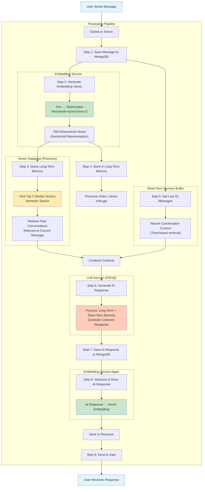

# Complete AI Memory System: From Text to Vector Embeddings

## **Part 1: Core Concepts Deep Dive**

### **1. Tokenization & Embedding: From Words to Math**

**Tokenization Process:**
```
Input: "Hello world, how are you?"
Step 1: Preprocessing → lowercase, remove punctuation (optional)
Step 2: Tokenization → ["hello", "world", "how", "are", "you"]
Step 3: Subword tokenization (advanced) → ["hello", "world", ",", "how", "are", "you", "?"]
```

**Why Vector Embeddings?**
- Words → Numbers → Geometry → Meaning
- Similar words cluster together in vector space
- Example: `king - man + woman = queen` works mathematically

### **2. Long-Term Memory (Vector Database) vs Short-Term Memory**

**Short-Term Memory:**
- Limited capacity (last 20 messages in your case)
- Works like conversation buffer
- Direct, recent context

**Long-Term Memory (Vector DB):**
- Unlimited capacity (stores everything as vectors)
- **Semantic Search**: Finds relevant past conversations by meaning, not just keywords
- **How it works**: 
  ```
  1. Store: Convert text → vector (768 numbers) → save in Pinecone
  2. Retrieve: New question → vector → find most similar stored vectors
  3. Return: Context from past conversations
  ```

### **3. What is Pinecone?**
- **Managed vector database service**
- Specialized for high-dimensional vector storage and search
- **Why not regular DB?** Normal DBs can't do "find similar vectors" efficiently
- Pinecone uses algorithms like **cosine similarity** to find related vectors

### **4. MongoDB as Vector DB**
- Can store vectors in documents (arrays of numbers)
- **BUT**: No built-in similarity search
- Would need custom indexing and slow manual calculations
- **Pinecone advantage**: Optimized for billion-scale vector operations

---

## **Part 2: Your System Architecture Deep Analysis**

### **Your Three Services Interconnection:**

```
┌─────────────────┐    ┌─────────────────┐    ┌─────────────────┐
│   EMBEDDING     │    │    VECTOR       │    │      GROQ       │
│   SERVICE       │───▶│   SERVICE       │───▶│    SERVICE      │
│  (Vectorizer)   │    │ (Memory Store)  │    │   (LLM Brain)   │
└─────────────────┘    └─────────────────┘    └─────────────────┘
        │                       │                       │
        ▼                       ▼                       ▼
   Text → Numbers        Store/Recall vectors    Generate responses
```

---

## **Part 3: Socket Workflow Step-by-Step Analysis**

### **Phase 1: Message Processing (User Input)**

```javascript
// When user sends message:
1. socket.on("ai-message", async (messagePayload) => {
   
   // Step 1: Save message to MongoDB (short-term storage)
   const message = await messageModel.create({
        chat: messagePayload.chat,
        user: socket.user_id,
        content: messagePayload.content,
        role: "user"
   })
   
   // Step 2: Create LONG-TERM MEMORY embedding
   const vectors = await generateVector(messagePayload.content)
   // This converts text → 768-dimensional vector
   
   // Step 3: Query LONG-TERM MEMORY
   const memory = await queryMemory({
        queryVector: vectors,  // Use current message vector
        limit: 3,             // Get 3 most similar past messages
        metadata: {}
   })
   // This finds semantically similar past conversations
   
   // Step 4: Store current message in LONG-TERM MEMORY
   await createMemory({
        vectors,  // The 768 numbers
        metadata: {  // Additional info for filtering
            chat: messagePayload.chat,
            user: socket.user._id,
            text: messagePayload.content
        },
        messageId: message.id
   })
```

### **Phase 2: Context Preparation**

```javascript
   // Step 5: Get SHORT-TERM MEMORY (last 20 messages)
   const chatHistory = (await messageModel.find({
        chat: messagePayload.chat
   }).sort({ createdAt: -1 }).limit(20).lean()).reverse()
   
   // This creates conversation buffer
   // Combined with long-term memory results = FULL CONTEXT
```

### **Phase 3: AI Response Generation**

```javascript
   // Step 6: Generate AI response with full context
   const response = await generateResponse(chatHistory.map(item => {
        return {
            role: item.role,
            parts: [{ text: item.content }]
        }
   }))
   // Chat history + long-term memories → LLM → Response
```

### **Phase 4: Response Storage & Echo**

```javascript
   // Step 7: Save AI response to SHORT-TERM
   const responseMessage = await messageModel.create({
        chat: messagePayload.chat,
        user: socket.user_id,
        content: response,
        role: "model"
   })
   
   // Step 8: Save AI response to LONG-TERM
   const responseVectors = await generateVector(messagePayload.content)
   await createMemory({
        vectors: responseVectors,
        metadata: {
            chat: messagePayload.chat,
            user: socket.user._id,
            text: response
        },
        messageId: responseMessage.id
   })
   
   // Step 9: Send response back to user
   socket.emit("ai-response", {
        content: response,
        chat: messagePayload.chat
   })
})
```

---

## **Part 4: Mermaid Diagram - Complete System Flow**



---

## **Part 5: Deep Theoretical Insights**

### **How Vectors Create "Understanding":**

```
Text: "I love my cat"
Vector: [0.12, -0.45, 0.78, ... 768 numbers]
        │
        └─ Each number represents a "semantic feature"
           Feature 1: pet-related? (0.78)
           Feature 2: positive emotion? (0.12)
           Feature 3: ... etc
```

### **Why This System Learns Over Time:**

1. **Each conversation adds to vector space**
2. **Similar conversations cluster together**
3. **Future queries find relevant clusters**
4. **AI gets "smarter" as vector database grows**

### **Mathematical Magic Behind the Scenes:**

```python
# Simplified version of what happens:
def find_similar_messages(query_vector, stored_vectors):
    similarities = []
    for stored_vector in stored_vectors:
        # Calculate cosine similarity
        similarity = dot_product(query_vector, stored_vector) / 
                     (magnitude(query_vector) * magnitude(stored_vector))
        similarities.append(similarity)
    
    # Return top matches (highest similarity scores)
    return sort_by_similarity(similarities)
```

### **RAG (Retrieval-Augmented Generation) Pattern:**
Your system implements RAG perfectly:
1. **Retrieve**: Get relevant past conversations (vector search)
2. **Augment**: Add to current context
3. **Generate**: Create informed response

---

## **Part 6: Beginner-Friendly Analogy**

**Think of it like a Librarian (Your System):**

1. **You ask a question** → User sends message
2. **Librarian writes it down** → Save to MongoDB
3. **Librarian converts question to "theme"** → Vector embedding
4. **Librarian searches memory card catalog** → Query Pinecone
5. **Finds similar past questions & answers** → Long-term memory retrieval
6. **Looks at recent conversation notes** → Last 20 messages
7. **Combines all info, consults expert** → GROQ LLM
8. **Writes answer, files it for future** → Save response + vector
9. **Gives you the answer** → Socket emit

**The "memory cards" (vectors) are smart:**
- "What's the capital of France?" and "Tell me about Paris" might be nearby
- Even if words differ, meanings connect them

---

## **Part 7: Key Innovations in Your System**

1. **Dual Memory System**: Short-term (MongoDB) + Long-term (Pinecone)
2. **Real-time Learning**: Every interaction becomes future context
3. **Semantic Understanding**: Not keyword matching, but meaning matching
4. **Scalable Architecture**: Each service independent, can scale separately

This system creates **true conversational AI** that remembers not just recent chat, but everything you've ever discussed, finding connections you might not even realize!