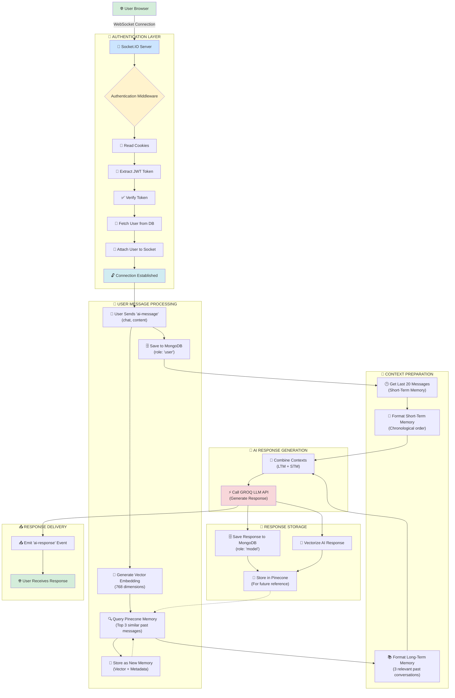
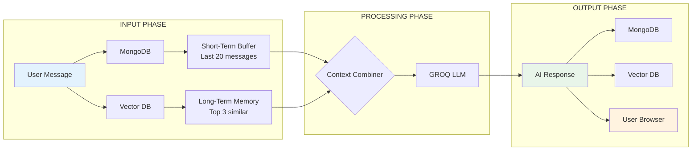

# **Complete Socket.IO AI Chat System - Block-by-Block Analysis**

## **🏗️ ARCHITECTURE OVERVIEW**

Your system is a **real-time AI chat with memory** that combines:
1. **Socket.IO** (Real-time communication)
2. **JWT Authentication** (User verification)
3. **MongoDB** (Short-term message storage)
4. **Pinecone** (Long-term vector memory)
5. **GROQ LLM** (AI brain)
6. **Xenova Embeddings** (Text → Vector conversion)

---

## **📦 BLOCK 1: IMPORTS & DEPENDENCIES**

```javascript
const { Server } = require("socket.io")
const cookie = require("cookie")
const jwt = require("jsonwebtoken")
const userModel = require("../models/user.model")
const messageModel = require("../models/message.model")
const { generateResponse } = require("../services/groq.service")
const { generateVector } = require("../services/embedding.service")
const { createMemory, queryMemory } = require("../services/vector.service")
```

**What Each Does:**
- `socket.io` → Real-time bidirectional communication
- `cookie` → Parse browser cookies (for JWT token)
- `jwt` → Verify JSON Web Tokens (authentication)
- `userModel` → Database operations for users
- `messageModel` → Store/retrieve chat messages
- `generateResponse` → Call GROQ AI API
- `generateVector` → Convert text to 768D vectors
- `{createMemory, queryMemory}` → Store/retrieve vectors in Pinecone

---

## **🔐 BLOCK 2: AUTHENTICATION MIDDLEWARE**

```javascript
io.use(async (socket, next) => {
    // 1. Get cookies from handshake
    const cookies = cookie.parse(socket.handshake.headers?.cookie || "")
    
    // 2. Check if token exists
    if (!cookies.token) {
        return next(new Error("No token provided"))
    }
    
    // 3. Verify JWT token
    try {
        const decoded = jwt.verify(cookies.token, process.env.JWT_SECRET)
        
        // 4. Find user in database
        const user = await userModel.findById(decoded.id)
        
        // 5. Attach user to socket for later use
        socket.user = user
        
        // 6. Allow connection
        next()
        
    } catch (e) {
        next(new Error("Invalid token"))
    }
})
```

**Flow:**
```
Frontend → Socket Connection Request → 
Cookies Sent → Token Extraction → 
JWT Verification → User Lookup → 
Attach to Socket → Connection Established
```

**Purpose:** Ensures only authenticated users can connect to chat.

---

## **🔄 BLOCK 3: CONNECTION HANDLER**

```javascript
io.on("connection", (socket) => {
    // User is now connected and authenticated
    // socket.user contains their database record
    
    socket.on("ai-message", async (messagePayload) => {
        // Main chat processing happens here
    })
})
```

**What Happens:**
1. User connects via WebSocket
2. Authentication middleware runs
3. If successful, `connection` event fires
4. Server listens for `ai-message` events from this socket

---

## **💬 BLOCK 4: USER MESSAGE PROCESSING**

### **4.1 Save Message to Database**
```javascript
const message = await messageModel.create({
    chat: messagePayload.chat,      // Chat ID
    user: socket.user_id,           // User ID
    content: messagePayload.content, // Message text
    role: "user"                    // Message type
})
```
✅ **Result:** Message saved in MongoDB with timestamp.

### **4.2 Create Vector Embedding**
```javascript
const vectors = await generateVector(messagePayload.content)
```
✅ **Result:** Text → 768-dimensional numerical vector.

### **4.3 Query Long-Term Memory**
```javascript
const memory = await queryMemory({
    queryVector: vectors,    // Current message vector
    limit: 3,                // Get top 3 similar memories
    metadata: {              // Filter by user
        user: socket.user._id
    }
})
```
✅ **Result:** 3 most semantically similar past messages from this user.

### **4.4 Store as New Memory**
```javascript
await createMemory({
    vectors,  // The 768D vector
    metadata: {  // Context for filtering
        chat: messagePayload.chat,
        user: socket.user._id,
        text: messagePayload.content
    },
    messageId: message.id  // Link to MongoDB message
})
```
✅ **Result:** Message stored in Pinecone vector database for future recall.

---

## **🧠 BLOCK 5: CONTEXT BUILDING FOR AI**

### **5.1 Get Short-Term Memory**
```javascript
const chatHistory = (
    await messageModel.find({ chat: messagePayload.chat })
        .sort({ createdAt: -1 })  // Newest first
        .limit(20)                // Last 20 messages
        .lean()
).reverse()  // Reverse to chronological order
```
✅ **Result:** Array of last 20 messages in chronological order.

### **5.2 Format Short-Term Memory**
```javascript
const stm = chatHistory.map(item => {
    return {
        role: item.role,  // "user" or "model"
        parts: [{ text: item.content }]
    }
})
```
✅ **Result:** Messages formatted for GROQ API.

### **5.3 Format Long-Term Memory**
```javascript
const ltm = [
    {
        role: "user",
        parts: [{
            text: `These are some previous messages from the chat. Use them to generate a response:\n\n${memory.map(m => m.metadata.text).join("\n")}`
        }]
    }
]
```
✅ **Result:** Relevant past conversations added as context.

---

## **🤖 BLOCK 6: AI RESPONSE GENERATION**

```javascript
const response = await generateResponse([...ltm, ...stm])
```
**What Happens:**
```
[Long-Term Context] + [Short-Term Context] → GROQ LLM → AI Response
```

---

## **💾 BLOCK 7: RESPONSE STORAGE**

### **7.1 Save AI Response to Database**
```javascript
const responseMessage = await messageModel.create({
    chat: messagePayload.chat,
    user: socket.user_id,
    content: response,
    role: "model"  // AI-generated message
})
```
✅ **Result:** AI response saved in MongoDB.

### **7.2 Vectorize & Store AI Response**
```javascript
const responseVectors = await generateVector(messagePayload.content)
await createMemory({
    vectors: responseVectors,
    metadata: {
        chat: messagePayload.chat,
        user: socket.user._id,
        text: response  // AI's response text
    },
    messageId: responseMessage.id
})
```
✅ **Result:** AI response also stored in vector memory.

---

## **📤 BLOCK 8: SEND RESPONSE TO CLIENT**

```javascript
socket.emit("ai-response", {
    content: response,
    chat: messagePayload.chat
})
```
✅ **Result:** AI response sent back to the specific user's socket.

---


# YOU CAN SEE THESE MERMAID CODE DIAGRAMS IN GITHUB OR YOU CAN MANNUALLY PASTE THE CODE ON DEEPSEEK OR [MERMAID.LIVE](https://mermaid.live/)

# **🔀 COMPLETE DATA FLOW DIAGRAM**



---

# **📊 DATA FLOW VISUALIZATION**



---

# **🔄 MEMORY MANAGEMENT SYSTEM**

```mermaid
graph TB
    subgraph "SHORT-TERM MEMORY"
        S1[Latest Message] --> S2[Message 2]
        S2 --> S3[Message 3]
        S3 --> S20[...Message 20]
    end
    
    subgraph "LONG-TERM MEMORY"
        L1[Vector Cluster 1<br/>Pets & Animals] --> L1a["🐱 'I love my cat'"]
        L1 --> L1b["🐶 'My dog is cute'"]
        
        L2[Vector Cluster 2<br/>Programming] --> L2a["💻 'How to use React'"]
        L2 --> L2b["🔧 'Debugging tips'"]
        
        L3[Vector Cluster 3<br/>Travel] --> L3a["✈️ 'Paris was amazing'"]
        L3 --> L3b["🏝️ 'Beach vacation'"]
    end
    
    Current[New Message: "Tell me about cats"] -->|Vector Similarity| L1
    Current -->|Time-based| S1
    
    L1 --> Context["🧠 Combined Context:<br/>'I love my cat' + Last 20 messages"]
    S1 --> Context
    
    Context --> AI[🤖 GROQ LLM]
    AI --> Response["Response about cats<br/>with personal context"]
```

---

# **🔑 KEY CONCEPTS EXPLAINED**

## **1. Dual Memory System**
- **Short-Term**: Last 20 messages (temporal context)
- **Long-Term**: All past messages via vectors (semantic context)

## **2. Real-time vs Async**
- Socket.IO enables **real-time** message delivery
- Vector operations and LLM calls are **async/await**

## **3. User Isolation**
- Each user's memories are filtered by `user: socket.user._id`
- No cross-user memory contamination

## **4. Full Conversation Loop**
```
User → Message → Store → Vectorize → Query Memory → 
Combine Context → LLM → Response → Store → Vectorize → User
```

## **5. Learning Over Time**
Every interaction improves future responses because:
1. More vectors in database = better similarity matches
2. AI learns your conversation patterns
3. Context becomes richer with each chat

---

# **🚀 SYSTEM BENEFITS**

1. **Personalized**: Remembers your past conversations
2. **Fast**: Real-time responses via WebSockets
3. **Secure**: JWT authentication prevents unauthorized access
4. **Scalable**: Vector database handles millions of memories
5. **Intelligent**: Combines short-term context with long-term memory
6. **Persistent**: All conversations stored for future reference

This system creates a **true conversational AI assistant** that feels personalized and remembers your history, making each interaction more meaningful than the last!