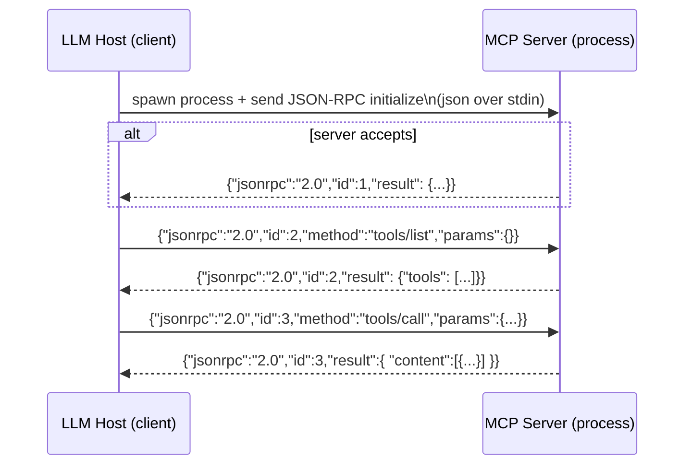
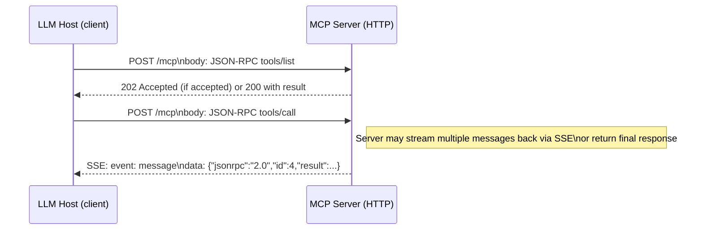

# TL;DR (one-paragraph summary)

MCP (Model Context Protocol) is a lightweight **JSON-RPC 2.0** protocol + SDKs that lets LLM hosts (clients) discover and call “tools”, read resources and prompts from external processes (servers) in a standardized way. Servers expose named **tools/resources/prompts** and implement JSON-RPC methods (`tools/list`, `tools/call`, `resources/read`, `initialize`, etc.). Communication uses either **STDIO** (local process stdin/stdout) for single-client local servers or **Streamable HTTP** (POST + optional SSE streaming) for multi-client remote servers. The TypeScript SDK gives you `McpServer` (or `Server`) objects, `server.registerTool(...)` helpers, transports like `StdioServerTransport`, and helpful types; you typically validate tool inputs with **Zod** schemas. ([Model Context Protocol][1])

---

# 1 — The big picture (ELI5)

* Imagine an LLM (Claude, a chat agent, or your app) needs to “use” external tools (a search engine, database query, calculator, calendar). MCP gives the LLM a clean, standard way to **discover** what tools exist and to **call** them — like a universal API for AI tools.
* The host (LLM application) acts as **client**. Your app/library implements an **MCP server** that advertises tools and does the work when a tool is called.
* Communication = **JSON-RPC 2.0** messages. That means every message is JSON with `"jsonrpc": "2.0"`, a `method`, optional `params`, and an `id` to match requests/responses.

Key authoritative docs (useful to bookmark): the MCP site and the TypeScript SDK repo. ([Model Context Protocol][1])

---

# 2 — The ONE JSON you must remember (canonical skeleton)

Memorize this skeleton — everything else is a specialization of this pattern.
**Client → Server (request)** — example `tools/call`:

```json
{
  "jsonrpc": "2.0",
  "id": 123,
  "method": "tools/call",
  "params": {
    "name": "search_web",
    "arguments": { "query": "latest AI news", "limit": 3 }
  }
}
```

**Server → Client (response)** for a successful call:

```json
{
  "jsonrpc": "2.0",
  "id": 123,
  "result": {
    "content": [
      { "type": "text", "text": "Top AI story: ..." }
    ]
  }
}
```

**Notifications** (no `id`) — one-way messages like progress updates or events:

```json
{
  "jsonrpc": "2.0",
  "method": "$/progress",
  "params": { "requestId": 123, "progress": 0.5 }
}
```

That’s it — `jsonrpc`, `id` (for pairing), `method`, `params`, `result`. All MCP messages are JSON-RPC under the hood. Many MCP examples and the transport spec emphasize this JSON-RPC framing. ([Model Context Protocol][2])

---

# 3 — Common MCP methods you’ll see (incoming & outgoing)

**Incoming to server (client → server):**

* `initialize` — handshake / capability negotiation
* `tools/list` — ask the server “what tools do you expose?”
* `tools/call` — ask the server to run a specific tool with given args
* `resources/list`, `resources/read`, `resources/subscribe` — discover and read server resources
* `prompts/get` — request prompt templates or expanded prompt text
* `ping` / `$/cancelRequest` / `$/progress` — health and control

**Outgoing from server (server → client)**

* `result` responses to requests
* notifications (progress, resource updates, etc.)

(You’ll find the exact names and shapes in the MCP spec and SDK docs.) ([Portkey][3])

---

# 4 — Transports (how messages actually move) — STDIO vs Streamable HTTP vs SSE

## Quick conceptual summary

* **STDIO**: client spawns the server process; messages flow over `stdin`/`stdout`. Use for local tools, desktop apps, quick dev/testing. It's the most common local transport. ([Model Context Protocol][2])
* **Streamable HTTP**: server runs as an HTTP endpoint. Client POSTs JSON-RPC request; server can respond immediately with 202 or stream multiple messages back using **Server-Sent Events** (SSE) or streaming HTTP responses. Use for remote servers that serve many clients. ([Model Context Protocol][2])
* **SSE (legacy-style)**: older servers/clients may use SSE for server→client streaming. Streamable HTTP is the modern recommended pattern; SSE remains for compatibility. ([Model Context Protocol][2])

### When to pick which:

* Local CLI / Desktop integrations / plugin processes → **STDIO** (simple, spawn + pipe). ([MCP Framework][4])
* Remote, multi-client, cloud-hosted server → **Streamable HTTP** (POST requests + SSE/streaming) — scaled, multi-tenant. ([Model Context Protocol][2])
* If you need streaming "server-sent" updates to many clients and compatibility with older hosts → SSE.

---

# 5 — Mermaid diagrams (visual flows you requested)

### A. STDIO (simple) — sequence of messages



### B. Streamable HTTP (client → server POST + optional SSE)



(These diagrams match the transports described in the MCP spec; STDIO messages are newline-delimited JSON, Streamable HTTP uses POST with `Accept: application/json, text/event-stream`.) ([Model Context Protocol][2])

---

# 6 — How an MCP server is structured (conceptual stack)

1. **Protocol layer** — parses JSON-RPC messages and dispatches them to handlers (initialize, tools/list, tools/call).
2. **Registry** — a registry of tools, resources, prompt templates the server exposes.
3. **Tool handlers** — functions that implement each tool’s logic; they receive validated input and return a standardized `content` array result (text, attachments, etc.).
4. **Validation** — input schemas (Zod commonly used) validate tool params at runtime.
5. **Transports** — `StdioServerTransport` or HTTP/SSE wiring that moves JSON messages in/out.
6. **Lifecycle** — connect(), listen(), and proper shutdown handling.

The TypeScript SDK gives you prebuilt classes for many of these pieces so you rarely implement the raw JSON-RPC parsing yourself. See the TypeScript SDK repo and server docs for concrete APIs. ([GitHub][5])

---

# 7 — TypeScript SDK: common code flow + example (ELI5 and explicit)

**Typical steps to build a simple MCP server (TypeScript):**

1. `import { McpServer } from "@modelcontextprotocol/sdk/server/mcp.js";`
2. Create server metadata: `const server = new McpServer({ name: "weather", version: "1.0.0" });`
3. Register tools: `server.registerTool("get_forecast", {...metadata...}, handlerFunction)` or `server.tool(...)` depending on SDK version.
4. Add resources or prompts if needed.
5. Create a transport and connect: `const transport = new StdioServerTransport(); await server.connect(transport);`
6. Keep process alive, handle graceful shutdown.

**Minimal illustrative example (TypeScript, simplified):**

```ts
import { McpServer } from "@modelcontextprotocol/sdk/server/mcp.js";
import { StdioServerTransport } from "@modelcontextprotocol/sdk/server/stdio.js";
import { z } from "zod";

const server = new McpServer({ name: "hello", version: "1.0.0" });

// register a tool named 'echo'
server.registerTool(
  'echo',
  {
    title: 'Echo',
    description: 'Returns the same text back',
    inputSchema: z.object({ text: z.string() })
  },
  async (args, ctx) => {
    // args validated already (if SDK wires zod)
    return { content: [{ type: 'text', text: `You said: ${args.text}` }] };
  }
);

const transport = new StdioServerTransport();
await server.connect(transport);
console.log('MCP server connected (stdio)');
```

Notes:

* Some SDK variants use `server.tool(...)` or `server.registerTool(...)` — check the exact version you installed. Tutorials and examples in the TypeScript SDK repo use both names in various places. ([GitHub][5])

---

# 8 — `server.registerTool(...)` and what it does (step-by-step)

`server.registerTool(name, metadata, handler)` does 3 things:

1. **Registers metadata** so `tools/list` returns the tool name, title, description and input schema (so the model/client can show/choose it).
2. **Records the input schema** (e.g., a Zod schema) to validate incoming arguments before executing your handler.
3. **Wires the handler** so when `tools/call` arrives with `params.name === name` the server:

   * validates `params.arguments` against the input schema (returns JSON-RPC error if invalid),
   * calls your handler with parsed `args` and a context object (logger, session, cancellable token),
   * catches errors and returns a JSON-RPC error result if something fails,
   * returns `result` with `content: [...]` that the host understands (text, structured blocks, etc.).

**Why validation at the server?**

* prevents garbage from the client/model,
* produces clear structured errors the host can display,
* gives typesafety when writing handler code (Zod infers types).

(See SDK docs & examples of `registerTool` usage.) ([DEV Community][6])

---

# 9 — Zod — short & ELI5 (why we use it here)

* **Zod** is a TypeScript-first runtime schema validator. It lets you define the expected shape of tool input easily and get both runtime validation and TypeScript type inference. Example:

```ts
import { z } from "zod";
const SearchSchema = z.object({ query: z.string().min(1), limit: z.number().int().min(1).max(20) });
```

* If the MCP server receives `params.arguments`, it runs `.parse()` (or `.safeParse()`) to ensure the structure is right. If invalid, it returns a JSON-RPC error to the caller — preventing a bad or insecure execution.
* Zod is widely used in MCP TypeScript examples and SDK snippets. Use `parse` for synchronous validation or `parseAsync` for async refiners. ([Zod][7])

---

# 10 — Example `tools/list` and `tools/call` fleshed-out JSON examples

**Client → Server `tools/list`**

Request:

```json
{
  "jsonrpc": "2.0",
  "id": 11,
  "method": "tools/list",
  "params": { "cursor": null }
}
```

Server Response:

```json
{
  "jsonrpc": "2.0",
  "id": 11,
  "result": {
    "tools": [
      {
        "name": "search_web",
        "title": "Web search",
        "description": "Search the web for a query",
        "inputSchema": { /* encoded schema or reference */ }
      }
    ],
    "cursor": null
  }
}
```

**Client → Server `tools/call`**

Request:

```json
{
  "jsonrpc": "2.0",
  "id": 12,
  "method": "tools/call",
  "params": {
    "name": "search_web",
    "arguments": { "query": "latest AI news", "limit": 3 }
  }
}
```

Server Response (success):

```json
{
  "jsonrpc": "2.0",
  "id": 12,
  "result": {
    "content": [
      { "type": "text", "text": "Result 1 summary..." },
      { "type": "text", "text": "Result 2 summary..." }
    ]
  }
}
```

If validation fails (bad args) the server returns a JSON-RPC error with an appropriate code and message, e.g. `-32602` (invalid params) style error with details. The spec and SDK show error shapes. ([Portkey][3])

---

# 11 — Transport API & typical functions you’ll call (SDK-level)

* `new McpServer({ name, version, ...capabilities })` — create server object.
* `server.registerTool(name, metadata, handler)` or `server.tool(...)` — register tools.
* `server.resource(...)` — register resources; `server.prompt(...)` — register prompts.
* `const transport = new StdioServerTransport()` — create STDIO transport.
* `await server.connect(transport)` — start listening on chosen transport (bind I/O).
* `transport.listen()` / `transport.close()` — depending on implementation (some transports are passive).
* `server.disconnect()` / graceful shutdown.

**Examples in tutorials** use `StdioServerTransport` and `await server.connect(transport)` to bind the server to `stdin`/`stdout`. For HTTP you attach server handlers to express routes that call `server.handleRequest(req.body)` or use built-in `HttpServerTransport` providers. ([MCP Protocol][8])

---

# 12 — Why MCP (advantages) and what it is *not*

**What MCP actually *is*:**

* A standard protocol (JSON-RPC) + conventions + SDKs for exposing *tools, resources, and prompts* to LLM hosts.
* A way to separate concerns: your service logic -> a server; the LLM host -> client + orchestrator.

**Why it’s useful (advantages):**

* **Reusability:** Once you expose a tool via MCP, any host supporting MCP can use it — no vendor lock-in. (Think: one API works with many LLM hosts.)
* **Discoverability:** Hosts can call `tools/list` to get capabilities and input schemas programmatically.
* **Safety & validation:** Input schemas (Zod) let you validate before executing.
* **Multiple transports:** STDIO for local apps, HTTP/SSE for networked servers.
* **Standardized streaming:** using Streamable HTTP + SSE you can stream messages/results to the host.

**What MCP is *not*:**

* It’s not a UI framework (not like React hooks), not an Express middleware replacement, and not a client-side library on its own. MCP is a **protocol for inter-process service invocation for LLMs**, not a UI state manager. Comparing to React hooks or Express middleware is apples-to-oranges:

  * React hooks manage component state in UI; MCP standardizes LLM↔tool calls.
  * Express middleware handles HTTP request/response pipelines; MCP transports may use HTTP, but MCP's scope is LLM tool discovery & invocation semantics.

Use MCP when you want **language-model-driven** tool access across different hosts and clients, with clear discovery, schemas, and streaming semantics. ([Model Context Protocol][1])

---

# 13 — Practical server examples, variants & when to choose each transport

### STDIO server (local plugin)

* Use when: plugin for a desktop app (Claude Desktop), CLI tools, quick dev.
* Behavior: client launches your server process and pipes JSON lines. Server reads stdin and writes JSON to stdout.
* Pros: simple, no network config, secure (local only).
* Cons: single-client, process lifecycle tied to client.

### Streamable HTTP server (remote / multi-client)

* Use when: cloud service, multiple hosts will talk to your server, want HTTP auth, monitoring.
* Behavior: client POSTs a JSON-RPC request; server may return 202 and then stream the result via SSE or long-lived stream.
* Pros: scalable, manageable, can use standard HTTP infrastructure (TLS, load balancers).
* Cons: more infra overhead, must implement auth, rate limits, scaling.

### SSE (older)

* Use when: compatibility with older clients that expect pure SSE; sometimes used inside Streamable HTTP setups.

(Examples in docs/tutorials show both STDIO and HTTP approaches and give sample code for each.) ([Model Context Protocol][9])

---

# 14 — Error handling, progress & streaming semantics

* Tool execution may be long-running. MCP supports progress notifications (`$/progress`) and streaming multiple messages in response (especially with Streamable HTTP & SSE).
* If a tool errors: server returns JSON-RPC error with code/message and optional `data` with diagnostics.
* For cancellable operations: the client can send `$/cancelRequest` (or similar) to ask the server to abort the running handler — the SDK usually provides cancellation tokens in the handler context.

SDK examples and the spec show how to surface progress or partial results to the host. ([Pradeep Loganathan's Blog][10])

---

# 15 — Security & best practices (practical checklist)

1. **Validate all inputs** with Zod (or equivalent) — never assume model input is safe.
2. **Restrict sensitive tools** — treat tools that access secrets as guarded; require auth for remote servers.
3. **Rate-limit & throttle** on server side in cloud deployments.
4. **Log & monitor** for unusual tool calls (audit trail).
5. **Design result shapes** carefully: return small, structured `content` blocks rather than huge text blobs.
6. **Graceful shutdown**: respond to SIGTERM and stop accepting requests, finish current tool runs or cancel.
7. **Avoid prompt injection**: when your tools return text used as model input later, sanitize or label it clearly.

(Many community posts and the spec highlight security and privacy concerns — treat MCP servers like any public API.) ([Model Context Protocol][1])

---

# 16 — Where to look in the TypeScript SDK & examples (quick map)

* `@modelcontextprotocol/sdk/server/mcp.js` — server entrypoint (create `McpServer`). ([MCP Protocol][8])
* `@modelcontextprotocol/sdk/server/stdio.js` — Stdio transport implementation examples. ([Medium][11])
* `examples/` in the TypeScript SDK repository — real runnable servers (math tool, weather, SWAPI toy servers). ([GitHub][5])

---

# 17 — Full minimal example (TypeScript) — everything together (commented)

```ts
// src/index.ts (minimal MCP server)
import { McpServer } from "@modelcontextprotocol/sdk/server/mcp.js";
import { StdioServerTransport } from "@modelcontextprotocol/sdk/server/stdio.js";
import { z } from "zod";

async function main() {
  const server = new McpServer({ name: "hello", version: "1.0.0" });

  // register a simple tool (echo)
  server.registerTool(
    "echo",
    {
      title: "Echo",
      description: "Return the text you pass me",
      inputSchema: z.object({ text: z.string().min(1) })
    },
    async (args, ctx) => {
      // ctx might contain diagnostics / cancellation token
      return { content: [{ type: "text", text: `Echo: ${args.text}` }] };
    }
  );

  // now connect to STDIO transport (used by local clients)
  const transport = new StdioServerTransport();
  await server.connect(transport);

  // server connected and now listening to stdin/stdout for JSON-RPC messages
  console.log("MCP server started (stdio)");
}

main().catch((err) => {
  console.error("Server failed:", err);
  process.exit(1);
});
```

Notes about the example:

* `registerTool` wires input validation (Zod) and the handler. The SDK will likely auto-validate before calling the handler and return JSON-RPC error if invalid.
* `StdioServerTransport` handles reading newline-delimited JSON from `stdin` and writing to `stdout`. ([MCP Protocol][8])

---

# 18 — Extra: orchestration & multi-tool flows (how models chain calls)

Typical LLM orchestration examples:

1. Model realizes it needs data → calls `tools/list`, selects `search_web`.
2. Model calls `tools/call` with search args.
3. Server returns results.
4. Model synthesizes and decides to call a second tool `database/query`.
5. Repeat until solution complete.

The MCP host (client) and the model may call multiple tools sequentially or in parallel; the SDK and spec are built for both patterns. Community guides show patterns for sequential/parallel/iterative tool orchestration. ([Medium][12])

---

# 19 — Common gotchas (dev pain points & how to avoid them)

* **Top-level await issues**: many tutorial snippets assume top-level `await`; wrap in `async main()` for Node versions that don’t allow TLA. (SDK issues mention this explicitly.) ([GitHub][13])
* **Privileged transports**: If your host expects streaming, ensure `Accept` headers include `text/event-stream` per the spec when using Streamable HTTP. ([Model Context Protocol][2])
* **Newlines in STDIO JSON**: spec expects newline-delimited JSON objects without embedded newlines. Don’t print debug logs to stdout — use `stderr` for logs. ([Model Context Protocol][2])

---

# 20 — Where to read / useful links (official and SDK)

* Model Context Protocol home / docs (intro & architecture). ([Model Context Protocol][1])
* MCP Transports spec (STDIO / Streamable HTTP / SSE details). ([Model Context Protocol][2])
* TypeScript SDK (repo + examples). ([GitHub][5])
* Build server tutorial (step-by-step example). ([Model Context Protocol][14])
* Zod docs (schema validation). ([Zod][7])

---

# Final micro-checklist (copy/paste for your project)

* [ ] Install SDK and Zod: `npm i @modelcontextprotocol/sdk zod`
* [ ] Create `McpServer({ name, version })`
* [ ] Register tools with `registerTool(name, { title, description, inputSchema }, handler)`
* [ ] Use `StdioServerTransport()` for local / `HttpServerTransport` (or SSE) for remote
* [ ] `await server.connect(transport)` to start listening
* [ ] Validate inputs with Zod (schema on registration)
* [ ] Return `result` objects with `content: [{ type: "text", text: "..." }]`
* [ ] Use logs on `stderr` for STDIO servers; keep `stdout` clean as JSON-RPC only
* [ ] Implement graceful shutdown and rate limits

---

[1]: https://modelcontextprotocol.io/?utm_source=chatgpt.com "What is the Model Context Protocol (MCP)? - Model Context ..."
[2]: https://modelcontextprotocol.io/specification/2025-06-18/basic/transports?utm_source=chatgpt.com "Transports"
[3]: https://portkey.ai/blog/mcp-message-types-complete-json-rpc-reference-guide?utm_source=chatgpt.com "MCP Message Types: Complete MCP JSON-RPC ..."
[4]: https://mcp-framework.com/docs/Transports/stdio-transport/?utm_source=chatgpt.com "STDIO Transport"
[5]: https://github.com/modelcontextprotocol/typescript-sdk?utm_source=chatgpt.com "modelcontextprotocol/typescript-sdk"
[6]: https://dev.to/glaucia86/from-zero-to-mcp-building-a-model-context-protocol-server-with-typescript-and-the-star-wars-api-1kdi?utm_source=chatgpt.com "From Zero to MCP: Building a Model Context Protocol ..."
[7]: https://zod.dev/?utm_source=chatgpt.com "Zod: Intro"
[8]: https://modelcontextprotocol.info/docs/quickstart/server/?utm_source=chatgpt.com "For Server Developers"
[9]: https://modelcontextprotocol.io/legacy/concepts/transports?utm_source=chatgpt.com "Transports"
[10]: https://pradeepl.com/blog/model-context-protocol/mcp-protocol-mechanics-and-architecture/?utm_source=chatgpt.com "MCP - Protocol Mechanics and Architecture"
[11]: https://medium.com/%40kenzic/getting-started-build-a-model-context-protocol-server-9d0362363435?utm_source=chatgpt.com "Getting Started: Build a Model Context Protocol Server"
[12]: https://abvijaykumar.medium.com/model-context-protocol-deep-dive-part-3-1-3-hands-on-implementation-522ecd702b0d?utm_source=chatgpt.com "Model Context Protocol—Deep Dive (Part 3.1/3)—Hands-on ..."
[13]: https://github.com/modelcontextprotocol/typescript-sdk/issues/202?utm_source=chatgpt.com "stdio example broken · Issue #202"
[14]: https://modelcontextprotocol.io/docs/develop/build-server?utm_source=chatgpt.com "Build an MCP server"
